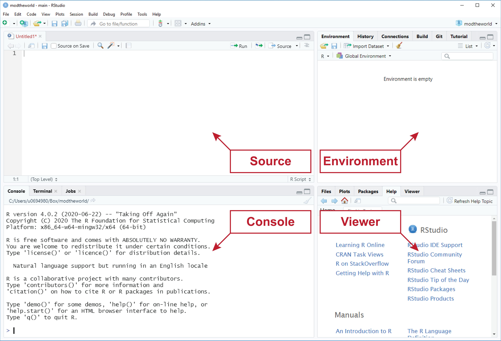

# R and RStudio {#r-and-rstudio}

```{r, include = FALSE, echo = FALSE, child = "R/before_chunk.Rmd"}
```

```{r 03-rfoot, echo = FALSE, out.width = '100%', fig.cap = "R in the wild.", fig.link = 'https://en.wikipedia.org/wiki/Patterson%E2%80%93Gimlin_film'}

knitr::include_graphics("images/r-foot.jpg")

```


## What is R? 

R is variously described as a programming *language* for statistical computing and as a programming *environment* [@hornik2020faq]. In fact, if you use R to conduct any statistical analysis that will likely end up in a scientific publication, you will want to refer to it as such -- to say something like "All analyses were conducted in the R Programming Environment" or "All analyses were conducted with the R Programming Language" -- and then to cite it! For example,

> Statistical analysis was performed in `r gsub("\\s*\\([^\\)]+\\)", replacement = "", sessionInfo()$R.version$version.string)` [@rcoreteam2020language].

And the full citation you can now see in the References below.

### The R Environment

According to the R Core Team [-@rcoreteam2020introduction], referring to R as an environment "is intended to characterize it as a fully planned and coherent system, rather than an incremental accretion of very specific and inflexible tools." Now, on its face, this is a somewhat strange claim, as the word 'environment' would seem to suggest a physical surrounding composed of *unplanned* and *incremental* accretions. What is more, the R Programming Environment is not immune, as the quote would suggest, to constraints imposed by its history and evolution. Nowhere is this more apparent than in the myriad syntactic inconsistencies that have proliferated over the last 25 years of R's development [@Wickham2015advanced].

Still, the word 'environment' is a good one, for R really is an environment that one can *enter into*, so to speak, and there do lots of very fun, very interesting, and very meaningful things, like complex data manipulations, fancy statistics, and data visualization (see [The Whole Shebang](#example) for an example workflow!). In this sense, you can think of it as a literal terminal or console on your computer that you type commands into. You can also think of the R environment as the place where the objects you make _live and breath and have their being_. In this sense, it is like a digital zoo or menagerie because the environment has (or _should_ have, anyway) a lot more order to it than, say, a natural landscape unadulterated by human action. For more on the R environment, see [Chapter 9: Workspace Management](#workspace-management).  

### The R Language

R is also a functional programming *language* [@hornik2020faq] in the sense that it has a well-defined syntax and semantics, which together define rules for combining symbols into complex strings and interpreting their meaning. This is partially what they meant, I think, when the R Foundation described R as a "coherent system." It is a coherent set of *rules* that govern the writing of code and its execution. I mean, you can't just type *anything* into the R console and expect to get a result. For example,

```{r}

5 - "blargh!"

```

is just gibberish and as you see, R protests. But

```{r}

mean(1:5)

```

is not. This string of symbols is simply requesting the mean of the numbers 1 through 5. R understands this and thus returns the desired output.

## Why R?

Actually, 'R' is a play on 'S', the name of the language R is based on, which John Chambers developed at Bell Labs in 1976. 'R' is also a reference to its authors, Ross Ihaka and Robert Gentleman, who began working on R at the University of Auckland in New Zealand, releasing it piecemeal into the digital wilds starting in 1993 [@hornik2020faq].

But, maybe you want to know why you should *use* R. Well...

### It's Free!

R is free software under the terms of the [Free Software Foundation's](http://www.gnu.org/) GNU General Public License.

### It's Statistics Made Easy, or Easier

Using R lets you exploit the awesome computing powers of the modern world. Just try to do maximum likelihood estimation on, say, 10,000 observations of a half-dozen variables by hand. It is *NOT* worth it. But it is with R! And, what is more, R provides an elegant and concise syntax for writing these complex statistical operations.

```{r, eval = FALSE}

# fit a generalized linear model with a Gaussian error distribution to the data
glm(formula = y ~ x1 + x2 + x3 + x4 + x5, 
    family  = gaussian,
    data    = my_ten_thousand_observations)

```

### It's Pretty Figures

One of the most powerful features of R is its ability to produce publication-quality plots. For instance, R's native graphics engine allows you to plot this normal distribution:

```{r, echo = FALSE}

x <- seq(from = -5, 
         to = 5, 
         length = 100)

y <- dnorm(x)

windowsFonts(A = windowsFont("Arial"))

par(family = "A",
    pty = "s")

plot(y ~ x, 
     type = "l",
     xlab = "X",
     ylab = "Y")

grid(lty = 1)

box()

dark_red <- rgb(red = 0.52, 
                green = 0, 
                blue = 0)

dark_red_transparent <- rgb(red = 0.52, 
                           green = 0, 
                           blue = 0, 
                           alpha = 0.35)

polygon(x, y, 
        border = NA,
        col = dark_red_transparent)

lines(x, y, col = dark_red)

mtext(text = "A Pretty Gaussian!",
      side = 3, 
      line = 0.3, 
      adj = 0, 
      cex = 1.5)

```

### It's Reproducible

R also facilitates reproducible research. It does this in two ways. First, it forces you to declare explicitly each step in your analysis.

```{r, eval = FALSE}

set.seed(12345)

my_data <- sample(1:1000, size = 100)

mu <- mean(my_data)

std_dev <- sd(my_data)

```

We see here that someone has set the seed for R's random number generator, sampled one hundred numbers between 1 and 1000, then taken the mean of that sample and its standard deviation. Everyone can now see this process and repeat it verbatim for themselves. Crucially, _everyone_ also includes future-you, that stranger who might one day look back and wonder, "How did I do this?"

The second way that R promotes reproducible research is by making R code like this _shareable_. In the simplest case, we use R _scripts_, which are text-based files containing R code that you or someone else with an R installation can run. Alternatively, we can use [R Markdown](https://rmarkdown.rstudio.com/), a much more flexible tool for not only writing and saving R code, but for explaining in detail what you are doing alongside the code itself.

### It's an Active Community

R is also an incredibly active and growing community, with lots of rich and informative documentation, and forums where one can go to get help trouble-shooting problems. There are a lot of ways to visualize this idea, but here is one, the number of downloads of R from the online RStudio CRAN mirror (not necessary to know what that is) from 2015 to the present.

```{r r-downloads, echo = FALSE, fig.width = 5, fig.height = 4}

load("r-downloads.Rda")

ggplot(bob, aes(x = month, y = count)) +
  geom_line(color = dark_red) +
  theme_bw() +
  labs(title = "R Downloads From RStudio CRAN Mirror")

```

## RStudio

If you are going to do anything with R, [RStudio](https://rstudio.com/) is hands-down the best place to do it. RStudio is an open-source integrated development environment (or IDE) that makes programming in R simpler, more efficient, and most importantly, more reproducible. Some of its more user-friendly features are syntax highlighting (it displays code in different colors depending on what it is or does, which makes it easier for you to navigate the code that you've written), code completion (it will try to guess what code you are attempting to write and write it for you), and keyboard shortcuts for the more repetitive tasks. By far, though, the best feature RStudio offers is a customizable workbench or visual interface for R programming (described in the next section).  

### Pane Layout

When you first open RStudio, you should see three window panes: the Console, the Environment, and the Viewer. If you open an R script, a fourth Source pane will also open. The default layout of these panes is shown in Figure \@ref(fig:02-rstudio-layout).  

```{r 02-rstudio-layout, echo = FALSE, out.width = "90%", fig.cap = "RStudio Default Four Pane Layout"}

```

- __Source__. The Source pane provides basic text editing functionality, allowing you to create and edit R scripts. To open an R script in RStudio, just click the green and white plus-sign button  displayed below File and select "R Script." Note that you can also achieve this by using the RStudio keyboard shortcut Ctrl+Shift+N. Importantly, you cannot execute the code in these scripts directly, but you can save the scripts that you write as simple text files. A dead give away that you have an R script living on your computer is the _.R_ extension, for example, _my_script.R_. For some directions on how to properly format your R scripts and code to make them more human-readable, see [Chapter 5: R Style Guide](#r-style-guide). For more on how to use R scripts, specifically how to execute the code they contain, see [Chapter 6: R Basics](#r-basics).  

- __Console__. The Console pane, as its name suggests, provides an interface to the R console, which is where your code actually gets run. While you can type R code directly into the console, you can't save the R code you write here into an R script like you can with the Source editor. That means you should reserve the console for _non-essential_ tasks, meaning tasks that are not required to replicate your results. For more on the R console, see [Chapter 6: R Basics](#r-basics).  

- __Environment__. The Environment pane is sort of like a census of your digital zoo, providing a list of its denizens, i.e., the objects that you have created during your session. This pane also has the History tab, which shows the R code you have sent to the console in the order that you sent it.  

- __Viewer__. The Viewer pane is a bit of a catch-all in terms of its functionality, though I suspect the primary use you will make of it is to view the graphical output of your R code, hence calling it the _Viewer_ pane. At any rate, the four tabs most relevant for the topics discussed in this book are the Files tab, the Plots tab, the Help tab, and the Viewer tab. 
    (i) The Files tab works like a file explorer. You can use it to navigate through folders and directories. By default, it is set to your working directory.  
    (ii) The Plots tab displays any figures you make with R.  
    (iii) The Help tab is where you can go to find helpful R documentation, including function pages and vignettes. For more on how to access help documentation and other sources of R support, see [Chapter 4: Looking for Help](#looking-for-help).  
    (iv) The actual Viewer tab provides a window to visualize R Markdown (anything generated by `knitr`, really) and Shiny output.  
