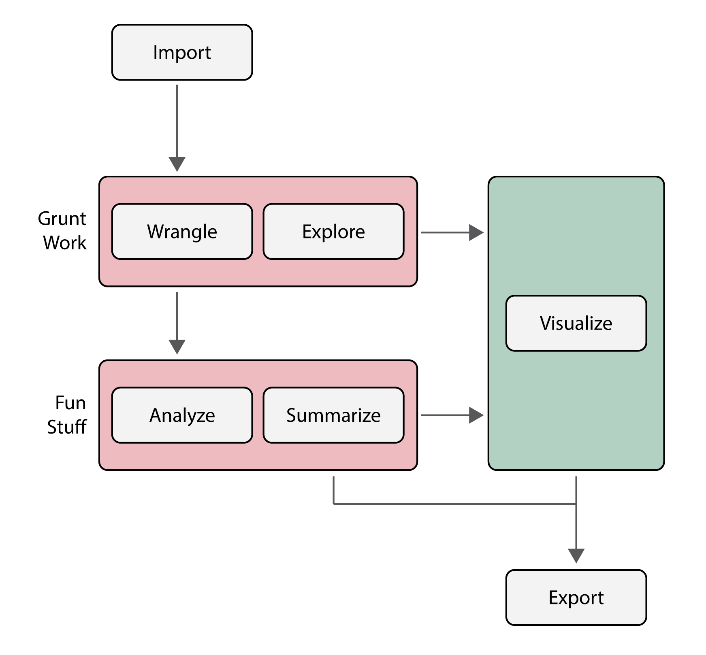
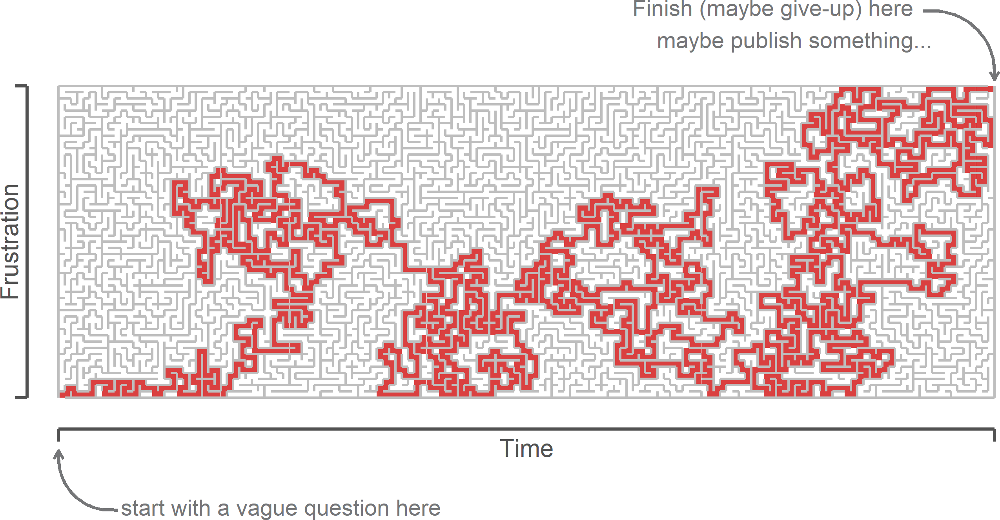

# An Example Workflow {#example-workflow}

```{r, include = FALSE, echo = FALSE, child = "R/before_chunk.Rmd"}
```

```{r 04-workflow, echo = FALSE, out.width = '60%', fig.cap = "An idealized workflow in R"}



```

## In fits and starts

To give you a feel for what all can be done with R, let's walk through an example workflow, as shown in Fig. \@ref(fig:04-workflow). This typically involves importing data, reshaping and/or subsetting it to get it into a format necessary for analysis, doing some preliminary descriptive statistics to explore general properties of the data, doing some inferential statistics to investigate trends in the data, and summarizing the results of the analysis. At various stages, visualizing the data will be extremely helpful, either to explore the data further or to help communicate the results to others. A lot of the output of this process, we will also want to save for later, perhaps to include in a publication (like a figure or model summary), but maybe also to avoid repetition of difficult and time-consuming tasks.

Now, obviously, the diagram in Figure \@ref(fig:04-workflow) is meant to give you a feel for what a typical workflow _should_ look like, at least ideally. As you can see, it is very austere and organized, almost linear, with cool, pleasant colors. You might even call it inviting. Do not be fooled, however. For what you will actually encounter with your work will often look like this:  

<br>

```{r 04-rmaze, echo = FALSE, out.width = '80%', fig.cap = "The often circuitous and sometimes painful maze of statistical analysis in R."}

 

```

<br>

The path traversed through the maze in this figure has a disorienting, almost chaotic, feel to it.^[It should, anyway, because it's a random walk.] It suggests - correctly - that statistical programming involves lots and lots of false starts, dead-ends, and backtracking. Frankly, there's no avoiding these frustrations, but that's not because what you're doing is _statistical programming_ per se, but rather just _writing to express ideas_. And, like any writing exercise, you start with a blank page, add content here or there, and then, you know, revise, revise, revise, until you get something sufficiently polished that it conveys its intended meaning well. So, as I walk through this example workflow, maybe think about the idealized diagram more as a representation of your _final_ (or final-ish^[Can we really speak of _final_ drafts in this digital age?]) draft ("script," in code talk), and then the maze is just the frustrating, though ultimately rewarding, write-and-revise path to get there.  

## The whole shebang

### Load data

```{r}

penguins <- read.csv("penguins.csv")

head(penguins)

```

### Do grunt work

Are observations of bill length missing for any penguins in this dataset? To answer this question, we can check for NA values. And if we really need that information, we can exclude those penguins from our analysis.

```{r}

any(is.na(penguins$bill_length_mm))

penguins <- subset(penguins, !is.na(bill_length_mm))

```

The exclamation point `!` (often called "bang") means "not," so you can read that second line as "subset the penguins table and give me the rows that do _not_ have NA values for bill length."  

Now, before moving on to the fun stuff, we might want to ask a few preliminary questions of our data.

_How many penguins are on each island?_

```{r}

counts <- table(penguins$island)

counts

```

_What does this distribution look like?_

```{r, fig.width = 5}

barplot(counts)

```

_What is the mean bill length for each species?_

```{r}

aggregate(bill_length_mm ~ species, 
          FUN = mean,
          data = penguins)

```

_And the standard deviation?_

```{r}

aggregate(bill_length_mm ~ species, 
          FUN = sd,
          data = penguins)

```

_How is bill length distributed across species?_

```{r, fig.width = 5}

boxplot(bill_length_mm ~ species, 
        data = penguins,
        xlab = "Species",
        ylab = "Bill Length (mm)")

```

### Do fun stuff

```{r}

penguin_model <- lm(flipper_length_mm ~ bill_length_mm, data = penguins)

summary(penguin_model)

```

Estimate flipper length using `penguin_model`.

```{r}

est_flipper_length <- predict(penguin_model)

obs_flipper_length <- penguins$flipper_length_mm

obs_bill_length <- penguins$bill_length_mm

```

Plot the estimated trend against the observed values:

```{r, fig.width = 5, fig.height = 5}

plot(obs_flipper_length ~ obs_bill_length,
     pch = 19,
     cex = 1.3,
     col = alpha("#949494", 0.4),
     xlab = "Bill Length (mm)",
     ylab = "Flipper Length (mm)")

abline(penguin_model, col = "#850000")

mtext(text = "Palmer Penguin Model",
      side = 3, 
      line = 0.3, 
      adj = 0, 
      cex = 1.5)

```

### Export results

Save the cleaned data and the linear model.^[Saving a figure in base R is a bit tricky, so we will leave that lesson for another time.]

```{r, eval = FALSE}

write.csv(penguins, "penguins.csv", row.names = FALSE)

save(penguin_model, file = "penguin_model.Rdata")

```

And that's it!

