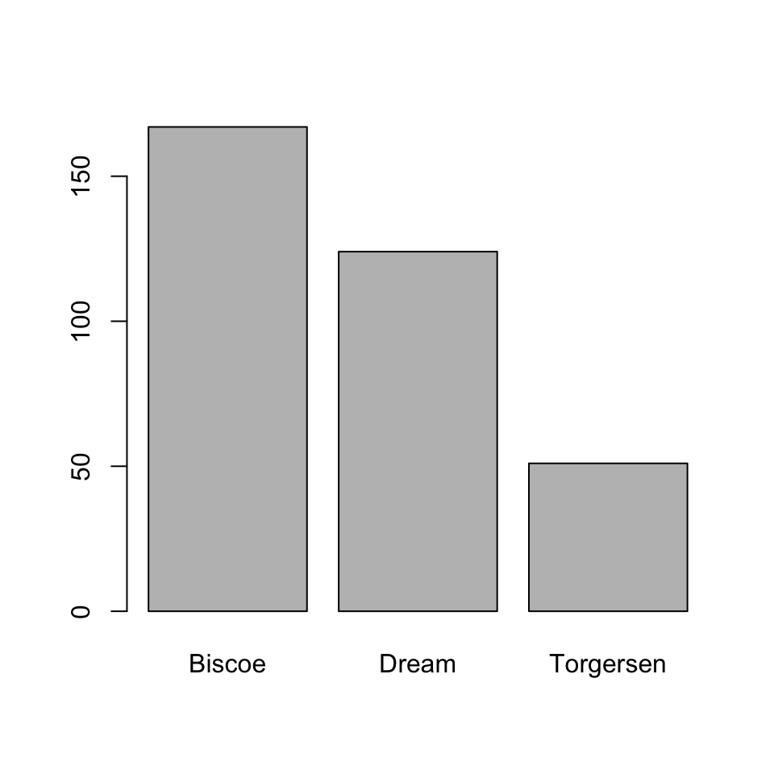
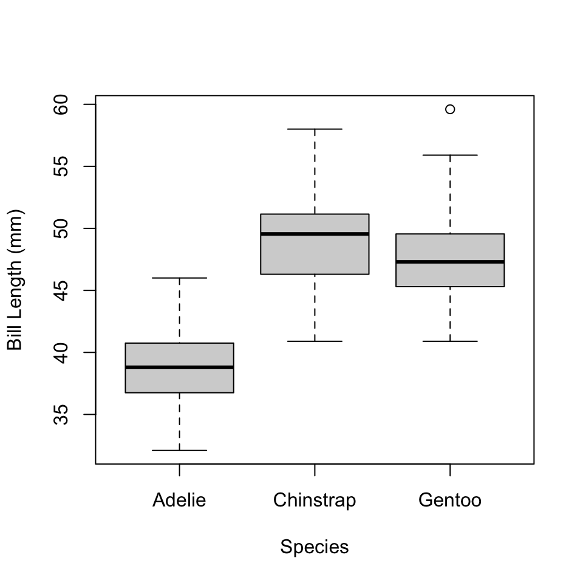

# An Example Workflow {#example-workflow}


<!-- include libraries -->


<!-- kableExtra bootstrap css 
https://haozhu233.github.io/kableExtra/bookdown/use-bootstrap-tables-in-gitbooks-epub.html
-->


<!-- knit_hook: collapse and strip white 
this is a Blake hack -->


<!-- knit_hook: collapse and print error red
super hacky, see here: https://stackoverflow.com/a/54985678/7705429
we'll need to be careful to not string four # together anywhere
--->

<script>
$(document).ready(function() {
  window.setTimeout(function() {
    $(".co:contains('####')").css("color", "red");
    var tmp = $(".co:contains('####')").text();
    $(".co:contains('####')").text(tmp.replace("####", "##"));
  }, 15);
});
</script>


<!-- chunk options -->


<!-- miscellaneous -->


<!-- 
make error messages closer to base R 
https://github.com/hadley/adv-r/blob/master/common.R
looks like it doesn't work because R no longer
let's users override s3 methods, so I changed the s3 to "simpleError"
-->


<div class="figure" style="text-align: center">

<p class="caption">(\#fig:04-workflow)An idealized workflow in R</p>
</div>

## In fits and starts

To give you a feel for what all can be done with R, let's walk through an example workflow, as shown in Fig. \@ref(fig:04-workflow). This typically involves importing data, reshaping and/or subsetting it to get it into a format necessary for analysis, doing some preliminary descriptive statistics to explore general properties of the data, doing some inferential statistics to investigate trends in the data, and summarizing the results of the analysis. At various stages, visualizing the data will be extremely helpful, either to explore the data further or to help communicate the results to others. A lot of the output of this process, we will also want to save for later, perhaps to include in a publication (like a figure or model summary), but maybe also to avoid repetition of difficult and time-consuming tasks.

Now, obviously, the diagram in Figure \@ref(fig:04-workflow) is meant to give you a feel for what a typical workflow _should_ look like, at least ideally. As you can see, it is very austere and organized, almost linear, with cool, pleasant colors. You might even call it inviting. Do not be fooled, however. For what you will actually encounter with your work will often look like this:  

<br>

<div class="figure" style="text-align: center">

<p class="caption">(\#fig:04-rmaze)The often circuitous and sometimes painful maze of statistical analysis in R.</p>
</div>

<br>

The path traversed through the maze in this figure has a disorienting, almost chaotic, feel to it.^[It should, anyway, because it's a random walk.] It suggests - correctly - that statistical programming involves lots and lots of false starts, dead-ends, and backtracking. Frankly, there's no avoiding these frustrations, but that's not because what you're doing is _statistical programming_ per se, but rather just _writing to express ideas_. And, like any writing exercise, you start with a blank page, add content here or there, and then, you know, revise, revise, revise, until you get something sufficiently polished that it conveys its intended meaning well. So, as I walk through this example workflow, maybe think about the idealized diagram more as a representation of your _final_ (or final-ish^[Can we really speak of _final_ drafts in this digital age?]) draft ("script," in code talk), and then the maze is just the frustrating, though ultimately rewarding, write-and-revise path to get there.  

## The whole shebang

### Load data


```r
penguins <- read.csv("penguins.csv")

head(penguins)
##   species    island bill_length_mm flipper_length_mm body_mass_g    sex year
## 1  Adelie Torgersen           39.1               181        3750   male 2007
## 2  Adelie Torgersen           39.5               186        3800 female 2007
## 3  Adelie Torgersen           40.3               195        3250 female 2007
## 4  Adelie Torgersen             NA                NA          NA   <NA> 2007
## 5  Adelie Torgersen           36.7               193        3450 female 2007
## 6  Adelie Torgersen           39.3               190        3650   male 2007
```

### Do grunt work

Are observations of bill length missing for any penguins in this dataset? To answer this question, we can check for NA values. And if we really need that information, we can exclude those penguins from our analysis.


```r
any(is.na(penguins$bill_length_mm))
## [1] TRUE
penguins <- subset(penguins, !is.na(bill_length_mm))
```

The exclamation point `!` (often called "bang") means "not," so you can read that second line as "subset the penguins table and give me the rows that do _not_ have NA values for bill length."  

Now, before moving on to the fun stuff, we might want to ask a few preliminary questions of our data.

_How many penguins are on each island?_


```r
counts <- table(penguins$island)

counts
## 
##    Biscoe     Dream Torgersen 
##       167       124        51
```

_What does this distribution look like?_


```r
barplot(counts)
```



_What is the mean bill length for each species?_


```r
aggregate(bill_length_mm ~ species, 
          FUN = mean,
          data = penguins)
##     species bill_length_mm
## 1    Adelie       38.79139
## 2 Chinstrap       48.83382
## 3    Gentoo       47.50488
```

_And the standard deviation?_


```r
aggregate(bill_length_mm ~ species, 
          FUN = sd,
          data = penguins)
##     species bill_length_mm
## 1    Adelie       2.663405
## 2 Chinstrap       3.339256
## 3    Gentoo       3.081857
```

_How is bill length distributed across species?_


```r
boxplot(bill_length_mm ~ species, 
        data = penguins,
        xlab = "Species",
        ylab = "Bill Length (mm)")
```



### Do fun stuff


```r
penguin_model <- lm(flipper_length_mm ~ bill_length_mm, data = penguins)

summary(penguin_model)
## 
## Call:
## lm(formula = flipper_length_mm ~ bill_length_mm, data = penguins)
## 
## Residuals:
##     Min      1Q  Median      3Q     Max 
## -43.708  -7.896   0.664   8.650  21.179 
## 
## Coefficients:
##                Estimate Std. Error t value Pr(>|t|)    
## (Intercept)    126.6844     4.6651   27.16   <2e-16 ***
## bill_length_mm   1.6901     0.1054   16.03   <2e-16 ***
## ---
## Signif. codes:  0 '***' 0.001 '**' 0.01 '*' 0.05 '.' 0.1 ' ' 1
## 
## Residual standard error: 10.63 on 340 degrees of freedom
## Multiple R-squared:  0.4306,	Adjusted R-squared:  0.4289 
## F-statistic: 257.1 on 1 and 340 DF,  p-value: < 2.2e-16
```

Estimate flipper length using `penguin_model`.


```r
est_flipper_length <- predict(penguin_model)

obs_flipper_length <- penguins$flipper_length_mm

obs_bill_length <- penguins$bill_length_mm
```

Plot the estimated trend against the observed values:


```r
plot(obs_flipper_length ~ obs_bill_length,
     pch = 19,
     cex = 1.3,
     col = adjustcolor("#949494", alpha.f = 0.4),
     xlab = "Bill Length (mm)",
     ylab = "Flipper Length (mm)")

abline(penguin_model, col = "#850000")

mtext(text = "Palmer Penguin Model",
      side = 3, 
      line = 0.3, 
      adj = 0, 
      cex = 1.5)
```


### Export results

Save the cleaned data and the linear model.^[Saving a figure in base R is a bit tricky, so we will leave that lesson for another time.]


```r
write.csv(penguins, "penguins.csv", row.names = FALSE)

save(penguin_model, file = "penguin_model.Rdata")
```

And that's it!

