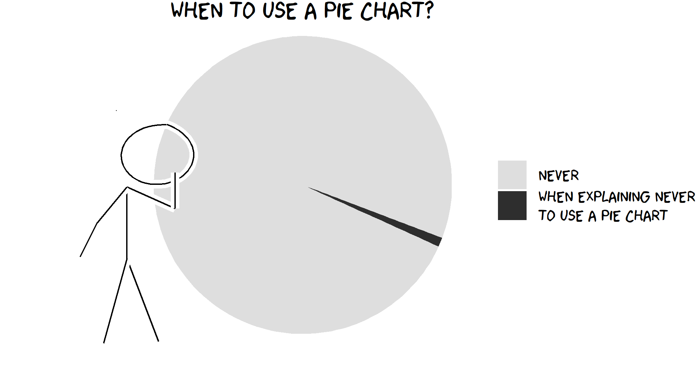

# Data Wrangling {#datawrangling}

```{r, echo = FALSE, out.width = '70%', fig.link = 'https://xkcd.com/'}



```

<br><br><br>

```{r, echo = FALSE}

fn <- here::here("R/insert_intro.R")

source(fn)

```

## Overview

```{r, echo = FALSE, results = 'asis'}

insert_intro(goal = "To introduce students to the fundamentals of data visualization using the base R plotting system.",
             tldr = "Let the data speak. Let the data speak pretty.",
             outcomes = c("plot anatomy", 
                          "plot types,",
                          "plot parameters,",
                          "plot annotation, and",
                          "plot layouts."),
             datasets = list(c(name = "Palmer Penguins", 
                               url = "https://allisonhorst.github.io/palmerpenguins/",
                               ref = "[@horst2020palmer]"),
                             c(name = "General Social Survey", 
                               url = "https://infer.tidymodels.org/reference/gss.html",
                               ref = "[@bray2020infer]")),
             requirements = list(),
             readings = list(c(name = "An Introduction to R",
                               url = "https://cran.r-project.org/doc/manuals/r-release/R-intro.html",
                               ref = "[@rcoreteam2020introduction]"),
                             c(name = "R Graphics (2nd Ed)",
                               url = "https://www.stat.auckland.ac.nz/~paul/RG2e/",
                               ref = "[@murrell2018r]"),
                             c(name = "R Graphics Cookbook (2nd Ed)",
                               url = "https://r-graphics.org",
                               ref = "[@chang2019graphics]"))
             )

```

<br>
