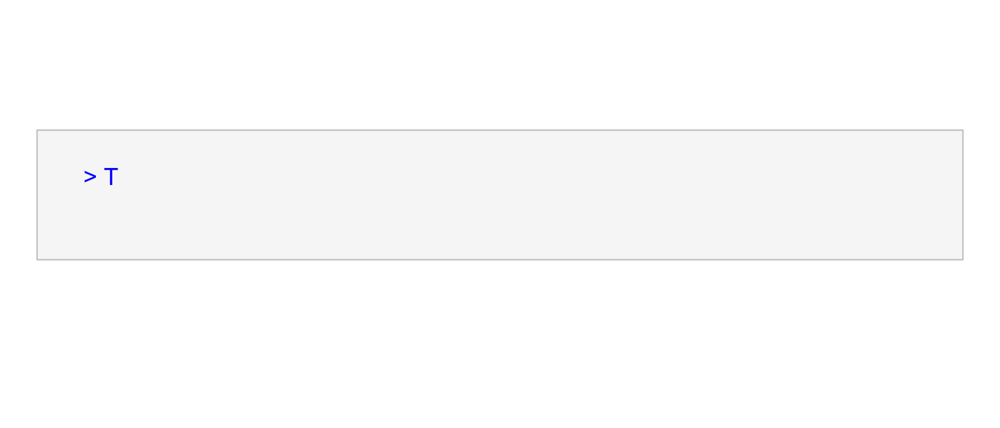

# (PART) Introduction to R {-}

# R Basics {#r-basics}


<!-- include libraries -->


<!-- kableExtra bootstrap css 
https://haozhu233.github.io/kableExtra/bookdown/use-bootstrap-tables-in-gitbooks-epub.html
-->


<!-- knit_hook: collapse and strip white 
this is a Blake hack -->


<!-- knit_hook: collapse and print error red
super hacky, see here: https://stackoverflow.com/a/54985678/7705429
we'll need to be careful to not string four # together anywhere
--->

<script>
$(document).ready(function() {
  window.setTimeout(function() {
    $(".co:contains('####')").css("color", "red");
    var tmp = $(".co:contains('####')").text();
    $(".co:contains('####')").text(tmp.replace("####", "##"));
  }, 15);
});
</script>


<!-- chunk options -->


<!-- miscellaneous -->


<a href="https://en.wikipedia.org/wiki/R" target="_blank"></a>


## Overview

<table class="table-intro table table-hover table-striped" style="margin-left: auto; margin-right: auto;">
<tbody>
  <tr>
   <td style="text-align:left;border: 0 solid transparent; padding-right: 0px; vertical-align: top;"> __Goal__ </td>
   <td style="text-align:left;border: 0 solid transparent; padding-left: 9px; text-align: justify; text-justify: inter-word;"> To provide a brief overview of basic R functionality. </td>
  </tr>
  <tr>
   <td style="text-align:left;border: 0 solid transparent; padding-right: 0px; vertical-align: top;"> __tl;dr__ </td>
   <td style="text-align:left;border: 0 solid transparent; padding-left: 9px; text-align: justify; text-justify: inter-word;"> It's not _just_ a calculator. </td>
  </tr>
  <tr>
   <td style="text-align:left;border: 0 solid transparent; padding-right: 0px; vertical-align: top;"> __Outcomes__ </td>
   <td style="text-align:left;border: 0 solid transparent; padding-left: 9px; text-align: justify; text-justify: inter-word;"> Here, you will learn about<br><ol>
<li>doing arithmetic with R,</li>
<li>creating objects with assignment,</li>
<li>doing things with functions</li>
<li>running code in the console,</li>
<li>writing scripts, and</li>
<li>using R packages.</li>
</ol> </td>
  </tr>
  <tr>
   <td style="text-align:left;border: 0 solid transparent; padding-right: 0px; vertical-align: top;"> __Datasets__ </td>
   <td style="text-align:left;border: 0 solid transparent; padding-left: 9px; text-align: justify; text-justify: inter-word;"> NONE </td>
  </tr>
  <tr>
   <td style="text-align:left;border: 0 solid transparent; padding-right: 0px; vertical-align: top;"> __Requirements__ </td>
   <td style="text-align:left;border: 0 solid transparent; padding-left: 9px; text-align: justify; text-justify: inter-word;"> NONE </td>
  </tr>
  <tr>
   <td style="text-align:left;border: 0 solid transparent; padding-right: 0px; vertical-align: top;"> __Further Reading__ </td>
   <td style="text-align:left;border: 0 solid transparent; padding-left: 9px; text-align: justify; text-justify: inter-word;"> [An Introduction to R](https://cran.r-project.org/doc/manuals/r-release/R-intro.html) [@rcoreteam2020introduction]<br>[R FAQ](https://CRAN.R-project.org/doc/FAQ/R-FAQ.html) [@hornik2020faq] </td>
  </tr>
</tbody>
</table>

## A Glorified Calculator?

R has functionality for basic arithmetic operations, including 

- `+` addition, 
- `-` subtraction, 
- `*` multiplication, 
- `/` division, and 
- `^` exponentiation. 


```r
3+2
## [1] 5
3-2
## [1] 1
3*2
## [1] 6
3/2
## [1] 1.5
3^2
## [1] 9
```

## Objects and Functions

In R, you can _make_ things and you can _do_ things. The things that you make are called _objects_ and the things that you do things with are called _functions_. The most common kind of R object is a `vector`. You can learn more about the different types of vectors in [Chapter 6 The R Menagerie](#the-r-menagerie). Other kinds of objects include `formula`, `raster`, `grob`, `hist`, and `density`. What about functions? These are actually a special class of object that take other objects as input and typically (though not always) return other objects as output.^[A frustrating exception to this is the base R `plot()` function. This function results only in side-effects.] They are thus "functions" in the sense of input-output devices. Any complex statistical operation you want to conduct in R will almost certainly involve the use of one or more functions.  


### Creating objects with assignment

How do you make an object in R? Well, you just... 


```r
bob <- 5.137
```

It's that simple! Or, maybe not. Let's take a moment to unpack this black magic. First, we note that it is made-up of three things:  

(1) a name, in this case, `bob`; 
(2) an arrow, `<-`, the essential ingredient in this incantation; and  
(3) an object, specifically the number `5.137`, which is being created.  

The statement adds an object (`5.137`) to the R environment and then assigns that object to the name `bob`. This is why it is sometimes referred to as an _assignment_ statement [@rcoreteam2020introduction]. It is not just creating an object, but assigning it to a name.

R has a few syntactic requirements for object names. They can only contain letters, numbers, underscores `_`, and periods `.` (or dots). And they cannot start with numbers.  


```r
# Good
winter_solder <- "Buckey"
object4 <- 23.2

# Bad
winter soldier <- "Buckey" # spaces not allowed
4object <- 23.2            # cannot start with a number
```

\BeginKnitrBlock{rmdcaution}<div class="rmdcaution">R is case sensitive! So, R will not treat `My_naME` and `my_name` the same. </div>\EndKnitrBlock{rmdcaution}

But, why assign a name at all? Well, if we just typed


```r
5.137
```

the resulting object would live a fleeting life, shorter than a fruit fly's, being quickly created and just as quickly destroyed. But, when we give an object a _name_, we also give it some permanence, and can literally _call_ it back whenever we like. We just say, "`bob`, come here!" but in the language of R:


```r
print(bob)
## [1] 5.137
```

or even just


```r
bob
## [1] 5.137
```

And then R summons `bob` for us and tells us who `bob` is. `bob` is `5.137`. Obviously!  

Now, you may think, "I could just create `5.137` any time I wanted, let it die, and just create it again. It's not _that_ hard to type five characters, after all." If you want to flirt with anarchy in this way, by all means, but let me offer two good reasons why you shouldn't. First, it is certainly true that one number is not hard to type, but it is rare that you will need just one. Suppose you had an object consisting of ten thousand numbers, would you care to type _that_ each time you needed it? For that matter, it would be nigh impossible to ensure you were typing the _same_ numbers each time. Plus, when you make an object with a name, R has your back. If you type `6.137` instead of `5.137`, for example, R will not protest, but if you type `boo` instead of `bob`, R will say, "nope."


```r
6.137
## [1] 6.137
boo
#### Error in eval(expr, envir, enclos): object 'boo' not found
```

So, giving objects names in R is a good way to avoid errors.


### Doing things with functions

To use a function, we _call_ it just as we would any other object, by typing its name. Unlike simple objects, though, we must also take care to append closed parentheses `()` to the end of the function name. Within those parentheses, we can go on to supply _arguments_ that control how the function behaves. 


```r
function_name(arg1 = value1, arg2 = value2, ...)

# for example
seq(1, 5, length.out = 100)
```

If you cast your mind back to the algebra you learned in high school, this syntax should be familiar to you. Consider this algebraic expression:

$$ f(x) = 2x + 3 $$

The name of this function is $f$. Its arguments include $x$. And the object it returns is the result of multiplying $x$ by 2 and adding 3. So, if you supply this function with the value 4 (as in, $f(x=4)$), it will return 11 as a result. R functions work in precisely the same way. 

Sometimes you just want to see the result of a function call, as it may suggest the next steps in your analysis. Other times, however - for instance, if you believe that you will need the result of your function call to feed as input to some other function, you should probably assign the result to a new name.  


```r
mu <- mean(1:5)

seq(1, mu, length.out = 5)
## [1] 1.0 1.5 2.0 2.5 3.0
```


## Console and Scripts

In this section, we'll go over some basic considerations of where to _write_ your R code and where to _run_ it. 

### R Console

Perhaps this is obvious, but you can write R code basically anywhere - on a napkin at a restaurant, for instance, on your hand in a pinch, or even in a fever dream - but if you want to get your R code to actually _run_, you will have to send it to the R console, so it can be _interpreted_. In this sense, at least, the R console is like R's central nervous system. Signals (your code) get sent to the console to get interpreted and generate some behavioral output (like a plot or a linear model). Here is what typing R code in the actual R console looks like:



Please note that in this book, the greater-than symbol `>` preceding R code is suppressed, and that the result is preceded by `##`.


### R Scripts

One important downside of writing R code directly into the console is that it is more like writing R in a dream than on a restaurant napkin. When you write code into it, you cannot get it back once you "wake up" from your R session.^[This is not strictly true, as R provides _.Rhistory_ files, but you have little control over the formatting of those documents.] This means that working in the console subjects the reproducibility of your analysis to the sometimes (often?) unreliable testimony of your own memory - like trying to remember what happened in your dream. To overcome this limitation of the console, the authors of R have also provided a specially designed text file, called an R "script," that you can write R code into and save to disc. A dead giveaway that you have one on your computer is the _.R_ file extension. 

Note, however, that even with R scripts, you cannot just open one in a text editor and expect the code it contains to run. You would be just as well off wadding up your napkin of code and hurling it defiantly at your monitor. No, to get your code to run, wherever it resides, you must always pass it to the console to get interpreted. There are a number of ways to do this, the most basic being these:

1. Copy and paste the code from your script into the console. This strategy, of course, makes an R script only slightly more advantageous than a napkin...
2. To run a single line of code, place the cursor on that line and hit `CTRL+Enter` on PC or `CMD+Enter` on Mac. 
3. To run multiple lines of code, highlight those lines and hit `CTRL+Enter` (`CMD+Enter`).


## Packages in the R Library

R is a highly _extensible_ programming language. Being extensible is just a fancy way of saying that individuals can write R code (more often than not, this involves writing functions) that others can later incorporate into their own workflow. These functions can be shared as simple scripts, but they can also be bundled into _packages_, which you can think of as being sort of like an R "app." The basic motivation for a package is to save you from having to recreate the wheel every time you open R. That is, it saves you from having to type the same code over and over again. It's also a powerful tool for reproducibility, as it ensures that the _exact same code_ is run each time.  

To install a package, you use the `install.packages()` function.


```r
install.packages("dplyr")
```

This function simply adds the package to your R _library_, which is more or less just a folder on your computer. To actually use the functions provided by an R package, you have to "check out" the package from the library. The way to do this in R is with the `library()` function.


```r
library(dplyr)
```

Once you have done this, the functions provided by the package are now available to use.

Some packages that I use in virtually all of my analyses include the following:

<table class="table table-hover table-striped" style="width: auto !important; margin-left: auto; margin-right: auto;">
<tbody>
  <tr>
   <td style="text-align:left;"> `dplyr` </td>
   <td style="text-align:left;"> A grammar of data manipulation, providing a consistent set of verbs that help you solve the most common data manipulation challenges. </td>
   <td style="text-align:left;"> [LINK](https://dplyr.tidyverse.org/) </td>
  </tr>
  <tr>
   <td style="text-align:left;"> `ggplot2` </td>
   <td style="text-align:left;"> A system for declaratively creating graphics, based on The Grammar of Graphics. </td>
   <td style="text-align:left;"> [LINK](https://ggplot2.tidyverse.org/) </td>
  </tr>
  <tr>
   <td style="text-align:left;"> here </td>
   <td style="text-align:left;"> Enables easy file referencing in project-oriented workflows. </td>
   <td style="text-align:left;"> [LINK](https://here.r-lib.org/) </td>
  </tr>
  <tr>
   <td style="text-align:left;"> sf </td>
   <td style="text-align:left;"> A package that provides simple feature access for R. </td>
   <td style="text-align:left;"> [LINK](https://r-spatial.github.io/sf/) </td>
  </tr>
</tbody>
</table>

