# Statistical Graphics {#statistical-graphics}


<!-- include libraries -->


<!-- kableExtra bootstrap css 
https://haozhu233.github.io/kableExtra/bookdown/use-bootstrap-tables-in-gitbooks-epub.html
-->


<!-- knit_hook: collapse and strip white 
this is a Blake hack -->


<!-- knit_hook: collapse and print error red
super hacky, see here: https://stackoverflow.com/a/54985678/7705429
we'll need to be careful to not string four # together anywhere
--->

<script>
$(document).ready(function() {
  window.setTimeout(function() {
    $(".co:contains('####')").css("color", "red");
    var tmp = $(".co:contains('####')").text();
    $(".co:contains('####')").text(tmp.replace("####", "##"));
  }, 15);
});
</script>


<!-- chunk options -->


<!-- miscellaneous -->


<a href="https://xkcd.com/" target="_blank">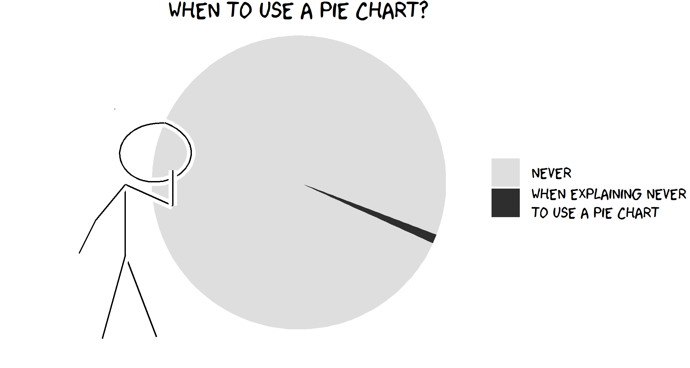</a>

<br>

## Overview

<table class="table-intro table table-hover table-striped" style="margin-left: auto; margin-right: auto;">
<tbody>
  <tr>
   <td style="text-align:left;border: 0 solid transparent; padding-right: 0px; vertical-align: top;"> __Goal__ </td>
   <td style="text-align:left;border: 0 solid transparent; padding-left: 9px; text-align: justify; text-justify: inter-word;"> To introduce students to the fundamentals of data visualization using the base R plotting system. </td>
  </tr>
  <tr>
   <td style="text-align:left;border: 0 solid transparent; padding-right: 0px; vertical-align: top;"> __tl;dr__ </td>
   <td style="text-align:left;border: 0 solid transparent; padding-left: 9px; text-align: justify; text-justify: inter-word;"> Let the data speak. Let the data speak pretty. </td>
  </tr>
  <tr>
   <td style="text-align:left;border: 0 solid transparent; padding-right: 0px; vertical-align: top;"> __Outcomes__ </td>
   <td style="text-align:left;border: 0 solid transparent; padding-left: 9px; text-align: justify; text-justify: inter-word;"> Here, you will learn about<br><ol>
<li>the anatomy of a base R plot</li>
<li>the `plot()` function,</li>
<li>layering,</li>
<li>annotation,</li>
<li>graphical parameters, and</li>
<li>multi-plot layouts.</li>
</ol> </td>
  </tr>
  <tr>
   <td style="text-align:left;border: 0 solid transparent; padding-right: 0px; vertical-align: top;"> __Datasets__ </td>
   <td style="text-align:left;border: 0 solid transparent; padding-left: 9px; text-align: justify; text-justify: inter-word;"> [Palmer Penguins](https://allisonhorst.github.io/palmerpenguins/) [@horst2020palmer]<br>[General Social Survey](https://infer.tidymodels.org/reference/gss.html) [@bray2020infer] </td>
  </tr>
  <tr>
   <td style="text-align:left;border: 0 solid transparent; padding-right: 0px; vertical-align: top;"> __Requirements__ </td>
   <td style="text-align:left;border: 0 solid transparent; padding-left: 9px; text-align: justify; text-justify: inter-word;"> NONE </td>
  </tr>
  <tr>
   <td style="text-align:left;border: 0 solid transparent; padding-right: 0px; vertical-align: top;"> __Further Reading__ </td>
   <td style="text-align:left;border: 0 solid transparent; padding-left: 9px; text-align: justify; text-justify: inter-word;"> [An Introduction to R](https://cran.r-project.org/doc/manuals/r-release/R-intro.html) [@rcoreteam2020introduction]<br>[R Graphics (2nd Ed)](https://www.stat.auckland.ac.nz/~paul/RG2e/) [@murrell2018r]<br>[R Graphics Cookbook (2nd Ed)](https://r-graphics.org) [@chang2019graphics] </td>
  </tr>
</tbody>
</table>

<br>

In statistics, graphics provide visual representations of data, but why might we want to visualize data? To answer this question, we might consider a common distinction between three modes of data visualization: _exploration_, _analysis_, and _presentation_.

* __Visual exploration__ is part and parcel of what John @tukey1977exploratory referred to as "exploratory data analysis" [cf @peng2016exploratory; @tufte2006beautiful]. With it, we can (i) investigate the distribution of observations around some measure of central tendency (like the mean or median) or evaluate relationships between variables; (ii) detect problems with our data, like outliers, missing values, or other anomalies; and (iii) generate questions we may not have considered otherwise.
* __Visual analysis__, as its name suggests, is largely concerned with the statistical analyses we are conducting to answer our primary research questions. It involves such things as direct hypothesis testing, as well as evaluation of the results of statistical analyses, usually to see if the results are actually meaningful, even sometimes finding patterns that may have been missed or over-interpreted.   
* __Visual presentation__ is largely aimed at reporting findings to others, whether about the data itself or the results of analyses conducted with the data. Of course, the intended audience is often other scientists and researchers, but it does not have to be. Informing the public about your research is also important, and having nice graphics is a really good way of doing that.

Here we are focusing on the basics of visual exploration using R's native `graphics` tools, though much of what you learn here will apply more generally to visual presentation too.  


## Plot Anatomy

Producing statistical graphics in R is a lot like adding layers to a canvas. To setup a canvas and to add some default layering, we use the `plot()` function. This is a programming workhorse in R, used routinely and repeatedly during R sessions. Before diving into its use, though, let's first step back to, as it were, dissect a base R plot, getting a feel for its general structure or anatomy (Fig. \@ref(fig:r-anatomy)). In effect, this means getting a feel for the hidden layout of a plot canvas. Hopefully, this will provide you a better sense of what you are doing when, for example, you feed your plot this parameter `xlim = c(0, 1)`. 

<div class="figure" style="text-align: center">
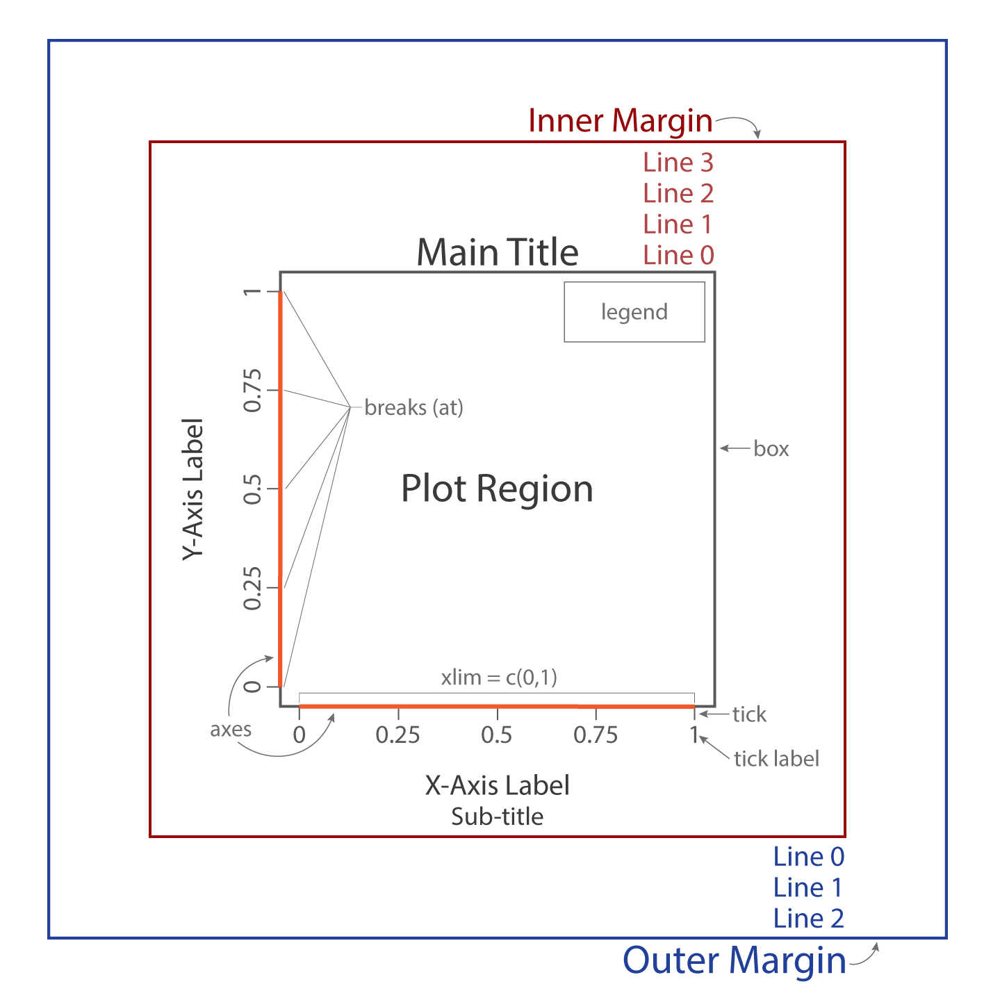
<p class="caption">(\#fig:r-anatomy)Base R plot anatomy</p>
</div>

<br>

### Region

The plot _region_ is the area in which _geometries_ (like points, lines, and polygons) provide visual representations of data. Particular locations within the plot region are specified using a two-dimensional coordinate grid, the coordinates being denoted by convention as 'x' and 'y'. Around the plot region, R defaults to including a plot box (represented by the light gray square in Fig. \@ref(fig:r-anatomy)). 

### Sides

The plot region is rectangular, so, naturally, it has four sides. R uses a number to refer to each side.

- `1` = bottom
- `2` = left
- `3` = top
- `4` = right

Knowing how to refer to sides will allow you to control the position of other plot elements, like axes, for example.  

### Axes

The scope of the plot region is defined by the x and y axes (represented by the thick orange lines), which specify the upper and lower limits of the observations to include in the plot. In Fig. \@ref(fig:r-anatomy), the limits are (0, 1) for both x and y. You may notice that the axes do not meet at the origin (0, 0). This is because R by default includes some padding above and below the specified limits. The most important elements of plot axes are breaks, tick marks, and tick labels. Tick marks provide a visual reference for how observations are arrayed within the plot region and are represented by short dashes emanating from each axis line. Breaks are specific values within the limits of an axis at which tick marks are displayed. By default, the breaks include the limits themselves. Ideally, break values are used as tick labels, though if you really wanted to confuse someone, including yourself, you can give them other labels as well.

### Titles

Every R plot includes four titles, the main title, the subtitle, and a title for each axis. One somewhat strange design choice on the part of the R Core Team was to place the subtitle below the x-axis title. It appears they meant the 'sub' in 'subtitle' quite literally... 

### Margins

One of the more complicated features of the base R anatomy is margins. For every plot, there are two sets of these: the inner (or figure) margins and the outer margins. The inner margin (represented by the dark red box) is the area immediately surrounding the plot region, which typically involves plot titles and axis labels. The outer margin (represented by the dark blue box) is an area of additional space around the inner margin. Fiddling with the outer margin is not particularly useful in most contexts, unless you want to have multiple plot regions in one figure (discussed below in the [Plot Layout](#layout) section). The area of the margins is defined by "Lines," named starting with 0. By default, the inner margin is four lines in width (Line 0 to Line 3) and the outer margin is three lines in width. These lines may be used to position other plot elements, including, more often than not, plot titles. Note that R does not include the outer margin by default. It must be added explicitly using [Graphical Parameters](#graphical-parameters) (see below). 

### Legend

A legend or key provides a list of additional variables represented by symbols or colors in the plot region, along with the symbols or colors used. By default, R includes the legend within the plot region, but it is possible to move it to the inner or outer margin.

## The `plot()` Function {#plot-function}

The base `plot()` function is a _generic_ function, meaning it will produce different results depending on what kind of R object you are asking it to draw. At its core, though, the `plot()` function is simply a tool for mapping data onto a grid (the plot _region_ in Fig. \@ref(fig:r-anatomy)). Consider, for example, these values of x and y. 


```r
x <- c(0.0, 0.2, 0.3, 0.5, 0.6, 0.8)
y <- c(0.9, 0.8, 0.6, 0.5, 0.3, 0.1)
```

When you supply `plot()` with these values, it maps them to a grid like so.

<div class="figure" style="text-align: center">
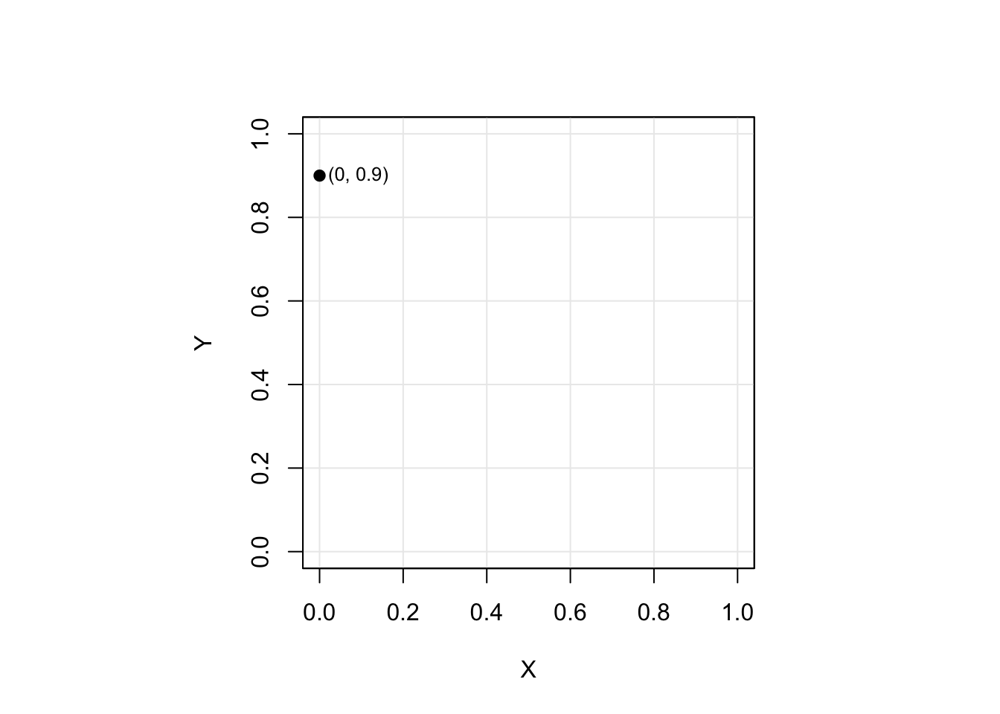
<p class="caption">(\#fig:05-data-mapping)Mapping data onto a grid.</p>
</div>

There are two ways to supply the `plot()` function with these x and y values: (i) as separate vectors or (ii) as a combined formula. 

__As separate vectors__


```r
plot(x, y)
```

__As a combined formula__


```r
plot(y ~ x)
```

Notice the tilde, `~`. This may be read as "... is a function of ...", in this case "y is a function of x."

\BeginKnitrBlock{rmdnote}<div class="rmdnote">You should use the formula notation whenever plotting a _relationship_ between two variables, as it makes it explicit in your code that you are plotting that relationship.  </div>\EndKnitrBlock{rmdnote}

By default, `plot()` provides for nine different types of plot. These are specified using the argument `type`. Options include all of the following: `"p"` (points), `"l"` (lines), `"b"` (both points and lines), `"c"` (lines with missing points), `"o"` (points plotted over lines), `"s"` (stair steps), `"S"` (stair steps inverted), `"h"` (histogram-like vertical lines), `"n"` (nothing). So, if you want to plot points, for instance, you would type


```r
plot(y ~ x, type = "p")
```

And just so you can see the result, here are examples of each:

<div class="figure" style="text-align: center">
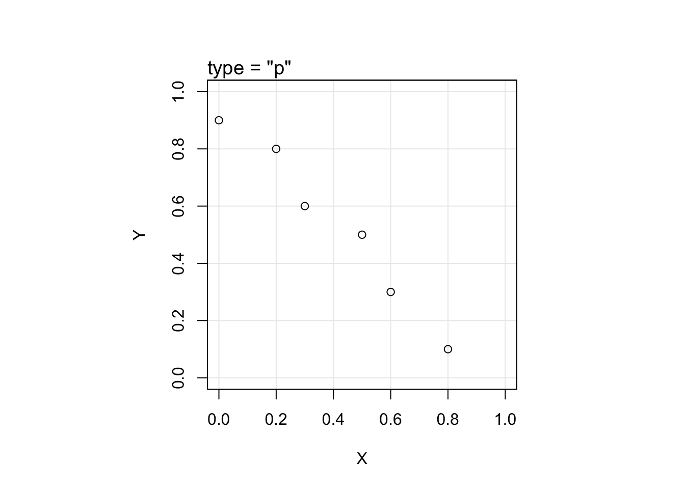
<p class="caption">(\#fig:05-plot-types)Default plot types.</p>
</div>

One of the most important features of a plot is its limits. By default, `plot()` uses the range of the x and y vectors. In this case, the range of x is [0, 0.8] and the range of y is [0.1, 0.9]. You will perhaps have noticed, however, that the limits in Figures \@ref(fig:05-data-mapping) and \@ref(fig:05-plot-types) are [0, 1]. That is because we supplied `plot()` with these values using the arguments `xlim` and `ylim`.


```r
plot(y ~ x, 
     xlim = c(0, 1),
     ylim = c(0, 1),
     xlab = "X",
     ylab = "Y")
```

\BeginKnitrBlock{rmdcaution}<div class="rmdcaution">Individuals (especially those with a chaotic-evil alignment) may abuse plot limits to obscure or exaggerate features of their data. You see, for example, in our toy data that the points have a certain _trend_ starting in the upper left corner of the plot and falling to the lower right corner. What do you think would happen to the look of that trend, though, if we were to specify new limits for y, say [0, 100]?</div>\EndKnitrBlock{rmdcaution}

 
## Layering

Whenever you use `plot()`, it establishes a new "canvas" and provides some default plot elements (specifically x and y axis titles, a box around the plot region, and tick marks and labels). These can all be "turned off," so that `plot()` simply establishes an empty canvas.  


```r
plot(y ~ x,
     type = "n",
     xaxt = "n", # remove the x-axis
     yaxt = "n", # remove the y-axis
     xlab = "",  # remove x-axis title
     ylab = "",  # remove y-axis title
     frame.plot = FALSE) # remove the box around the plot region
```

<div class="figure" style="text-align: center">

<p class="caption">(\#fig:unnamed-chunk-8)'A blizzard' by M. Duchamp</p>
</div>

Now, let's add the defaults back incrementally. 

<div class="figure" style="text-align: center">

<p class="caption">(\#fig:05-layering-plot)Layering. The plot title explains what function is being used to add each layer.</p>
</div>

This is what we mean by "layering." As you can see, `plot()` not only establishes an empty canvas, but adds some default layers. And to those defaults, we can add _even_ more! In fact, here is a list of really, really useful layering functions.

<table class="table" style="margin-left: auto; margin-right: auto;">
 <thead>
  <tr>
   <th style="text-align:left;"> Function </th>
   <th style="text-align:left;"> Description </th>
  </tr>
 </thead>
<tbody>
  <tr>
   <td style="text-align:left;"> `abline()` </td>
   <td style="text-align:left;"> Adds one or more straight lines through the current plot. </td>
  </tr>
  <tr>
   <td style="text-align:left;"> `axis()` </td>
   <td style="text-align:left;"> Adds an axis to the current plot, allowing the specification of the side, position, labels, and other options. </td>
  </tr>
  <tr>
   <td style="text-align:left;"> `box()` </td>
   <td style="text-align:left;"> Draws a box around the current plot in the given color and linetype. </td>
  </tr>
  <tr>
   <td style="text-align:left;"> `curve()` </td>
   <td style="text-align:left;"> Draws a curve corresponding to a function over the interval [from, to]. </td>
  </tr>
  <tr>
   <td style="text-align:left;"> `grid()` </td>
   <td style="text-align:left;"> Adds rectangular grid to an existing plot. </td>
  </tr>
  <tr>
   <td style="text-align:left;"> `lines()` </td>
   <td style="text-align:left;"> A generic function taking coordinates given in various ways and joining the corresponding points with line segments. </td>
  </tr>
  <tr>
   <td style="text-align:left;"> `mtext()` </td>
   <td style="text-align:left;"> Writes text in one of the four margins of the current figure region or one of the outer margins of the device region. </td>
  </tr>
  <tr>
   <td style="text-align:left;"> `points()` </td>
   <td style="text-align:left;"> A generic function to draw a sequence of points at the specified coordinates. </td>
  </tr>
  <tr>
   <td style="text-align:left;"> `rect()` </td>
   <td style="text-align:left;"> Draws a rectangle (or sequence of rectangles) with the given coordinates, fill and border colors. </td>
  </tr>
  <tr>
   <td style="text-align:left;"> `segments()` </td>
   <td style="text-align:left;"> Draw line segments between pairs of points. </td>
  </tr>
  <tr>
   <td style="text-align:left;"> `text()` </td>
   <td style="text-align:left;"> Draws the strings given in the vector `labels` at the coordinates given by `x` and `y`. </td>
  </tr>
  <tr>
   <td style="text-align:left;"> `title()` </td>
   <td style="text-align:left;"> Add labels to a plot. </td>
  </tr>
</tbody>
</table>

Figure \@ref(fig:05-layering-plot) shows how some of these functions work. Here is the code used to generate that plot.


```r
plot(y ~ x,
     type = "n",
     xaxt = "n", 
     yaxt = "n",
     xlab = i,
     ylab = "",
     col.lab = "white",
     frame.plot = FALSE,
     xlim = c(0, 1),
     ylim = c(0, 1))

# add box around plot region
box()

# add axes
axis(side = 1) # x-axis to bottom
axis(side = 2) # y-axis to left

# add axis lables
title(xlab = "X", ylab = "Y")

# add points
points(y ~ x)
```


## Annotation

Annotation refers to the addition of natural language elements (i.e., characters, words, and numerals) to a plot. These include plot titles (the main title, the subtitle, and the axis titles), as well as the legend title, axes labels (i.e., the tick labels, usually numerals), and any other text comments, either within the plot region or in the margins. Much of this may be specified within the `plot()` function itself. 


```r
plot(y ~ x,
     xlab = "X-axis Label",
     ylab = "Y-axis Label",
     main = "Main Plot Title",
     sub  = "Literally, below the plot title")
```

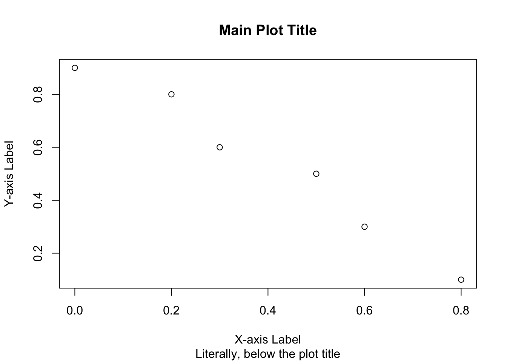

Specifying these title annotations within `plot()` should be sufficient for simple plots, but for more fine grained control, you will want to use the `title()` function. 


```r
plot(y ~ x,
     xlab = "X-axis Label",
     ylab = "Y-axis Label")

title(main = "Main Plot Title", 
      col.main = "red3", # color of main title
      line = 0.3,        # inner margin line location
      adj = 0)           # text alignment left

title(sub = "Literally, below the plot title",
      col.sub = "orange3")
```

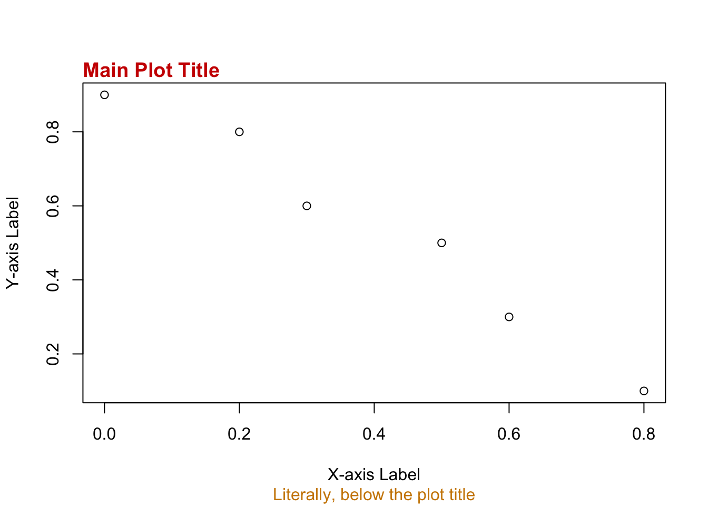

Sometimes it is useful to label points or other geometries in the plot region. For this, R provides the `text()` function. As with the geometries themselves, the key here is to provide coordinates for where to locate the text. In this case, we use the point coordinates, since we are labeling them.


```r
plot(y ~ x,
     xlab = "X",
     ylab = "Y",
     xlim = c(0, 1),
     ylim = c(0, 1))

# create point labels having the form "(x, y)"
point_labels <- paste0("(", x, ", ", y, ")")

text(y ~ x,
     pos = 4,      # place text on the right side of the coordinate location
     offset = 0.3, # add this much space between coordinate and text
     labels = point_labels,
     cex = 0.8)
```


You can also add text to the inner or outer margins with `mtext()` (though, bear in mind that you will have to add outer margins before you can add text to them). Since you are plotting outside the plot region, you specify the location of text in the margin using the side, line, and adjustment (or alignment), rather than coordinates.  


```r
plot(y ~ x,
     xlab = "X",
     ylab = "Y",
     xlim = c(0, 1),
     ylim = c(0, 1))

mtext(text  = "(side = 3, line = 1, adj = 1)",
      side  = 3,
      line  = 1,
      col   = "red3",
      adj   = 1)

mtext(text  = "(side = 1, line = 4, adj = 0)",
      side  = 1,
      line  = 4,
      col   = "darkblue",
      adj   = 0)
```

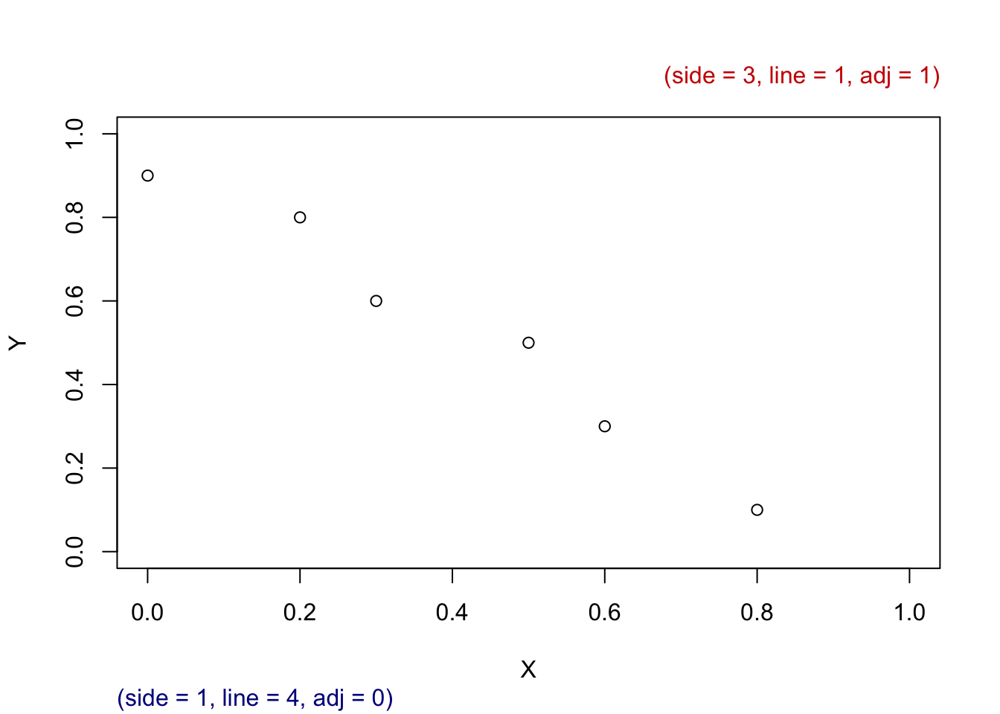


## Graphical Parameters {#graphical-parameters}

Graphical parameters control aesthetic aspects of a plot, for example, color and size. R provides two ways to set these parameters. If you want to make changes to a single plot, you can supply graphical parameters to the `plot()` call directly. For instance,


```r
plot(y ~ x, pch = 19)
```

supplies the `plot()` function with the graphical parameter `pch = 19`, which specifies the type of point symbol to use (in this case a filled circle). The layering functions mentioned above will also take graphical parameters in this way.   

You can also define graphical parameters globally, which means they will affect all plots the same way (well, more or less the same way). You do this by calling the `par()` function and supplying graphical parameters to it. For example,


```r
par(pch = 19)
```

sets the point symbol to the filled circle for all plots.  

Sometimes you will want to set graphical parameters for several plots then revert to the original parameters for subsequent plotting. To do this, you simply assign the parameters to an object, like so:


```r
original_parameters <- par()

# new parameter specifications
par(pch = 19)

### <do some plotting here>

# revert to original parameters
par(original_parameters)
```

Now, let's go over just a few of the many, many graphical parameters and how they affect your plot aesthetics.  

\BeginKnitrBlock{rmdnote}<div class="rmdnote">For an exhaustive list of graphical parameters and examples of their effect, see Porra (2017) ["Graphical parameters of R {graphics} package"](http://rstudio-pubs-static.s3.amazonaws.com/315576_85cccd774c29428ba46969316cbc76c0.html) at RStudio Pubs.</div>\EndKnitrBlock{rmdnote}


### Geometry Type

R allows you to specify graphical parameters for points and lines (and by extension, polygons), for example, the type of symbol used to display the geometry. For points, this is controlled by `pch`. For lines, by `lty`. `pch` can take any value from 0 to 25, `lty` any value from 0 to 6. `lty` can also be specified with the words `"blank"`, `"solid"`, `"dashed"`, `"dotted"`, `"dotdash"`, `"longdash"`, and `"twodash"`. Here is what these look like.

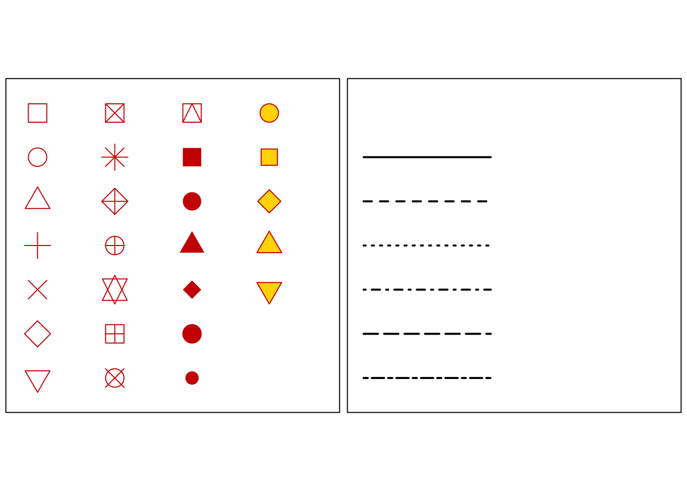

Notice that point symbols 0-14 are unfilled, 15-20 are filled and a single color, and 21-25 are filled and different colors, one for the line and one for the fill. Here is an example of changing the point symbol using our x and y vectors from above:


```r
plot(y ~ x,
     type = "p", # 'p' for "point"
     pch  = 17, # set point type here
     xlab = "X",
     ylab = "Y",
     main = "Strange Points")
```

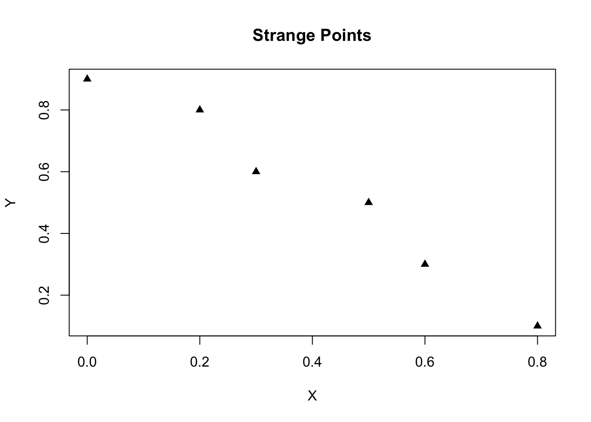

And here is an example of changing the line type: 


```r
plot(y ~ x,
     type = "l", # 'l' for "line"
     lty  = 4, # set line type here
     xlab = "X",
     ylab = "Y",
     main = "Strange Line")
```

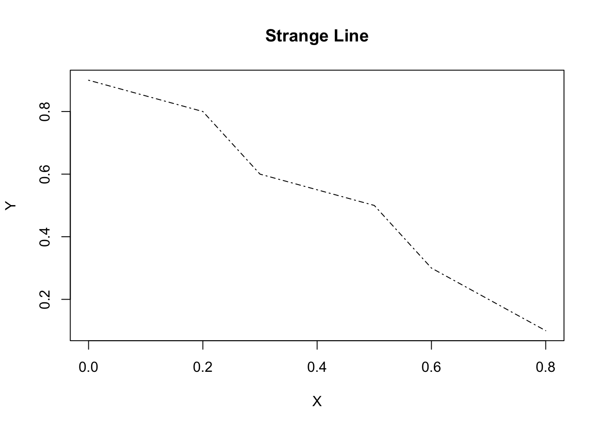

### Text

There are several ways to modify text output in a plot. Here we will focus on font type (meaning, normal, __bold__, or _italic_) and justification (or alignment, for example, centered text). These are controlled by `font` and `adj`, respectively. `font` can take any value from 1 to 4, `adj` any continuous value from 0 for left aligned to 1 for right aligned, with 0.5 being the value for centered text. 

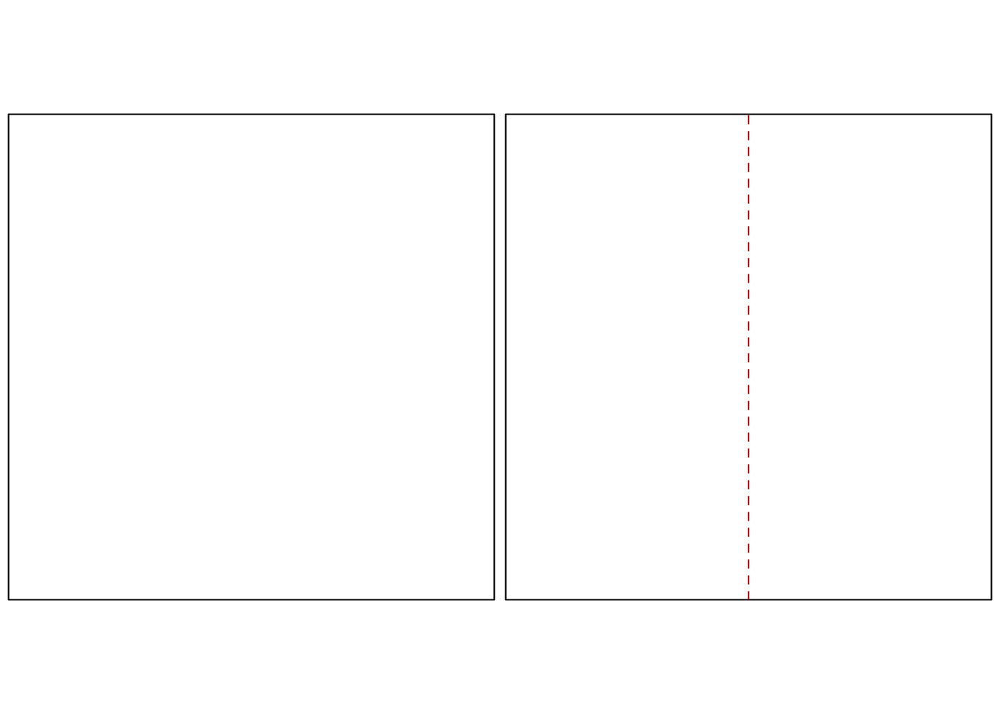

### Color

Color is an enormous topic in its own right and rightly so. For it's one of the most important aspects of a good plot. Here, however, we can only touch on some of the issues. To begin with, R provides five graphical parameters to control the color of different plot elements. Those are the following: 

<table class="table" style="width: auto !important; margin-left: auto; margin-right: auto;">
 <thead>
  <tr>
   <th style="text-align:left;"> Parameter </th>
   <th style="text-align:left;"> Description </th>
  </tr>
 </thead>
<tbody>
  <tr>
   <td style="text-align:left;"> `col` </td>
   <td style="text-align:left;"> Color of geometries in the plot region. </td>
  </tr>
  <tr>
   <td style="text-align:left;"> `col.axis` </td>
   <td style="text-align:left;"> Color of axis tick labels. </td>
  </tr>
  <tr>
   <td style="text-align:left;"> `col.lab` </td>
   <td style="text-align:left;"> Color of axis labels. </td>
  </tr>
  <tr>
   <td style="text-align:left;"> `col.main` </td>
   <td style="text-align:left;"> Color of main title. </td>
  </tr>
  <tr>
   <td style="text-align:left;"> `col.sub` </td>
   <td style="text-align:left;"> Color of subtitle. </td>
  </tr>
</tbody>
</table>

Now, we just need a way of providing the color we want to those parameters. For this, R offers a number of tools. The two most intuitive ones are perhaps the name of the color and its R number identifier. For a complete list of R color names, you can use the `colors()` function.  


```r
all_R_colors <- colors()

all_R_colors[1:3]
## [1] "white"        "aliceblue"    "antiquewhite"
```

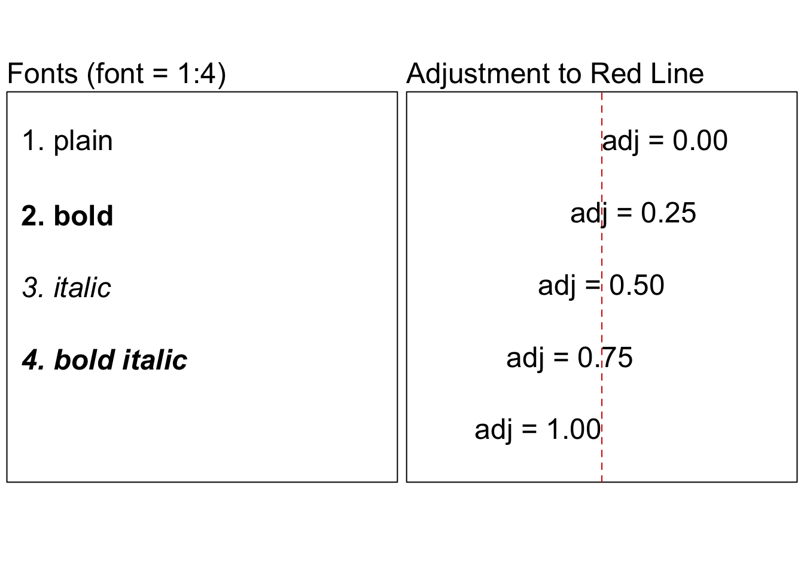

Now we can combine these color specifications with the graphical parameters and do this:


```r
plot(y ~ x,
     type = "n",
     xaxt = "n",
     yaxt = "n",
     xlab = "", 
     ylab = "",
     xlim = c(0, 1),
     ylim = c(0, 1))

axis(side = 1, col.axis = "blue4") # who comes up with these names?
axis(side = 2, col.axis = "blue4")

points(y ~ x, 
       pch = 19, 
       col = "darkgoldenrod")

title(main = "Weird Colors",
      line = 0.3,
      adj = 0,
      col.main = "aquamarine4")

title(xlab = "X",
      ylab = "Y",
      col.lab = "darkorchid")

title(sub = "Can't unsee this plot.",
      col.sub = "deeppink4")
```

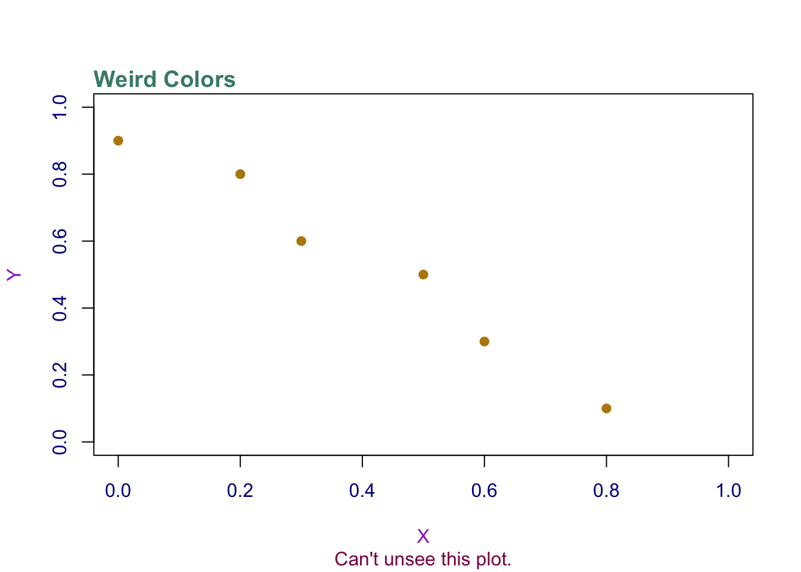


### Size

### Axes

### Margins

### Miscellaneous


## Multi-plot Layouts


