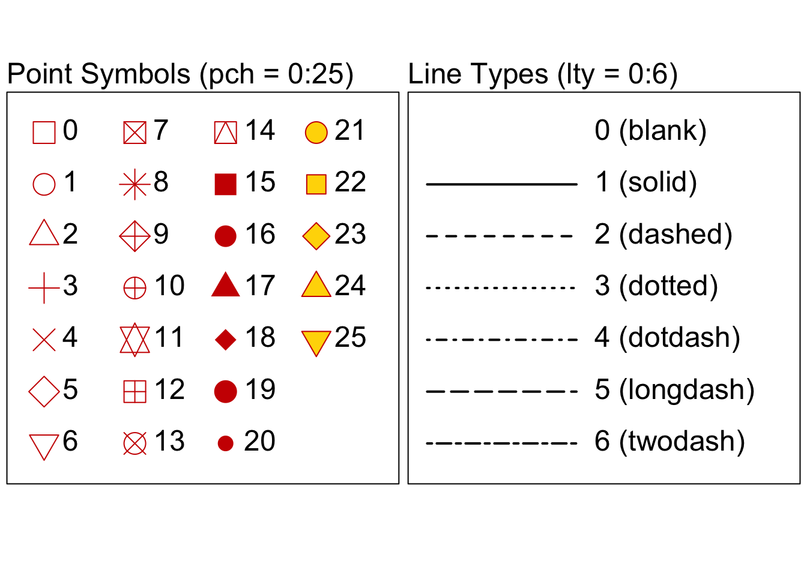

# Statistical Graphics {#statistical-graphics}


<!-- include libraries -->


<!-- kableExtra bootstrap css 
https://haozhu233.github.io/kableExtra/bookdown/use-bootstrap-tables-in-gitbooks-epub.html
-->


<!-- knit_hook: collapse and strip white 
this is a Blake hack -->


<!-- knit_hook: collapse and print error red
super hacky, see here: https://stackoverflow.com/a/54985678/7705429
we'll need to be careful to not string four # together anywhere
--->

<script>
$(document).ready(function() {
  window.setTimeout(function() {
    $(".co:contains('####')").css("color", "red");
    var tmp = $(".co:contains('####')").text();
    $(".co:contains('####')").text(tmp.replace("####", "##"));
  }, 15);
});
</script>


<!-- chunk options -->


<!-- miscellaneous -->


<!-- 
make error messages closer to base R 
https://github.com/hadley/adv-r/blob/master/common.R
looks like it doesn't work because R no longer
let's users override s3 methods, so I changed the s3 to "simpleError"
-->


<a href="https://xkcd.com/" target="_blank"></a>

<br>

## Overview

<table class="table-intro table table-hover table-striped" style="margin-left: auto; margin-right: auto;">
<tbody>
  <tr>
   <td style="text-align:left;border: 0 solid transparent; padding-right: 0px; vertical-align: top;"> __Goal__ </td>
   <td style="text-align:left;border: 0 solid transparent; padding-left: 9px; text-align: justify; text-justify: inter-word;"> To introduce students to the programming fundamentals of data visualization using the base R plotting system. </td>
  </tr>
  <tr>
   <td style="text-align:left;border: 0 solid transparent; padding-right: 0px; vertical-align: top;"> __tl;dr__ </td>
   <td style="text-align:left;border: 0 solid transparent; padding-left: 9px; text-align: justify; text-justify: inter-word;"> It's got layers to it, like tiramisu. </td>
  </tr>
  <tr>
   <td style="text-align:left;border: 0 solid transparent; padding-right: 0px; vertical-align: top;"> __Outcomes__ </td>
   <td style="text-align:left;border: 0 solid transparent; padding-left: 9px; text-align: justify; text-justify: inter-word;"> Here, you will learn about<br><ol>
<li>the anatomy of a base R plot</li>
<li>the `plot()` function,</li>
<li>layering,</li>
<li>annotation,</li>
<li>graphical parameters (including font, color, and size),</li>
<li>multi-plot layouts, and</li>
<li>saving figures (with graphical devices).</li>
</ol> </td>
  </tr>
  <tr>
   <td style="text-align:left;border: 0 solid transparent; padding-right: 0px; vertical-align: top;"> __Datasets__ </td>
   <td style="text-align:left;border: 0 solid transparent; padding-left: 9px; text-align: justify; text-justify: inter-word;"> NONE </td>
  </tr>
  <tr>
   <td style="text-align:left;border: 0 solid transparent; padding-right: 0px; vertical-align: top;"> __Requirements__ </td>
   <td style="text-align:left;border: 0 solid transparent; padding-left: 9px; text-align: justify; text-justify: inter-word;"> [Chapter 6: R Basics](#r-basics) </td>
  </tr>
  <tr>
   <td style="text-align:left;border: 0 solid transparent; padding-right: 0px; vertical-align: top;"> __Further Reading__ </td>
   <td style="text-align:left;border: 0 solid transparent; padding-left: 9px; text-align: justify; text-justify: inter-word;"> [An Introduction to R](https://cran.r-project.org/doc/manuals/r-release/R-intro.html) [@rcoreteam2020introduction]<br>[R Graphics (2nd Ed)](https://www.stat.auckland.ac.nz/~paul/RG2e/) [@murrell2018r]<br>[R Graphics Cookbook (2nd Ed)](https://r-graphics.org) [@chang2019graphics] </td>
  </tr>
</tbody>
</table>

<br>

In statistics, graphics provide visual representations of data, but why might we want to visualize data? To answer this question, we might consider a common distinction between three modes of data visualization: _exploration_, _analysis_, and _presentation_.

* __Visual exploration__ is part and parcel of what John @tukey1977exploratory referred to as "exploratory data analysis" [cf @peng2016exploratory; @tufte2006beautiful]. With it, we can (i) investigate the distribution of observations around some measure of central tendency (like the mean or median) or evaluate relationships between variables; (ii) detect problems with our data, like outliers, missing values, or other anomalies; and (iii) generate questions we may not have considered otherwise.
* __Visual analysis__, as its name suggests, is largely concerned with the statistical analyses we are conducting to answer our primary research questions. It involves such things as direct hypothesis testing, as well as evaluation of the results of statistical analyses, usually to see if the results are actually meaningful, even sometimes finding patterns that may have been missed or over-interpreted.   
* __Visual presentation__ is largely aimed at reporting findings to others, whether about the data itself or the results of analyses conducted with the data. Of course, the intended audience is often other scientists and researchers, but it does not have to be. Informing the public about your research is also important, and having nice graphics is a really good way of doing that.

Here we are focusing on the basics of visual exploration using R's native `graphics` tools, though much of what you learn here will apply more generally to visual presentation too.  

\BeginKnitrBlock{rmdnote}<div class="rmdnote">Highly recommend that you have a look at the [R Graph Gallery](https://www.r-graph-gallery.com/), which provides code and examples for lots of different plot types, along with helpful explanations of those plot types, specifically what they are and when to use them.  </div>\EndKnitrBlock{rmdnote}


## Plot anatomy

Producing statistical graphics in R is a lot like adding layers to a canvas. To setup a canvas and to add some default layering, we use the `plot()` function. This is a programming workhorse in R, used routinely and repeatedly during R sessions. Before diving into its use, though, let's first step back to, as it were, dissect a base R plot, getting a feel for its general structure or anatomy (Fig. \@ref(fig:r-anatomy)). In effect, this means getting a feel for the hidden layout of a plot canvas. Hopefully, this will provide you a better sense of what you are doing when, for example, you feed your plot this parameter `xlim = c(0, 1)`. 

<div class="figure" style="text-align: center">

<p class="caption">(\#fig:r-anatomy)Base R plot anatomy</p>
</div>

<br>

### Region

The plot _region_ is the area in which _geometries_ (like points, lines, and polygons) provide visual representations of data. Particular locations within the plot region are specified using a two-dimensional coordinate grid, the coordinates being denoted by convention as 'x' and 'y'. Around the plot region, R defaults to including a plot box (represented by the light gray square in Fig. \@ref(fig:r-anatomy)). 

### Sides

The plot region is rectangular, so, naturally, it has four sides. R uses a number to refer to each side.

- `1` = bottom
- `2` = left
- `3` = top
- `4` = right

Knowing how to refer to sides will allow you to control the position of other plot elements, like axes, for example.  

### Axes

The scope of the plot region is defined by the x and y axes (represented by the thick orange lines), which specify the upper and lower limits of the observations to include in the plot. In Fig. \@ref(fig:r-anatomy), the limits are (0, 1) for both x and y. You may notice that the axes do not meet at the origin (0, 0). This is because R by default includes some padding above and below the specified limits. The most important elements of plot axes are breaks, tick marks, and tick labels. Tick marks provide a visual reference for how observations are arrayed within the plot region and are represented by short dashes emanating from each axis line. Breaks are specific values within the limits of an axis at which tick marks are displayed. By default, the breaks include the limits themselves. Ideally, break values are used as tick labels, though if you really wanted to confuse someone, including yourself, you can give them other labels as well.

### Titles

Every R plot includes four titles, the main title, the subtitle, and a title for each axis. One somewhat strange design choice on the part of the R Core Team was to place the subtitle below the x-axis title. It appears they meant the 'sub' in 'subtitle' quite literally... 

### Margins

One of the more complicated features of the base R anatomy is margins. For every plot, there are two sets of these: the inner (or figure) margins and the outer margins. The inner margin (represented by the dark red box) is the area immediately surrounding the plot region, which typically involves plot titles and axis labels. The outer margin (represented by the dark blue box) is an area of additional space around the inner margin. Fiddling with the outer margin is not particularly useful in most contexts, unless you want to have multiple plot regions in one figure (discussed below in the [Plot Layout](#layout) section). The area of the margins is defined by "Lines," named starting with 0. By default, the inner margin is four lines in width (Line 0 to Line 3) and the outer margin is three lines in width. These lines may be used to position other plot elements, including, more often than not, plot titles. Note that R does not include the outer margin by default. It must be added explicitly using [Graphical Parameters](#graphical-parameters) (see below). 

### Legend

A legend or key provides a list of additional variables represented by symbols or colors in the plot region, along with the symbols or colors used. By default, R includes the legend within the plot region, but it is possible to move it to the inner or outer margin.

## The `plot()` Function {#plot-function}

At its core, the `plot()` function is simply a tool for mapping data onto a grid (the plot _region_ in Fig. \@ref(fig:r-anatomy)). Consider, for example, these values of x and y. 


```r
x <- c(0.0, 0.2, 0.3, 0.5, 0.6, 0.8)
y <- c(0.9, 0.8, 0.6, 0.5, 0.3, 0.1)
```

When you supply `plot()` with these values, it maps them to a grid like so.

<div class="figure" style="text-align: center">

<p class="caption">(\#fig:05-data-mapping)Mapping data onto a grid.</p>
</div>

There are two ways to supply the `plot()` function with these x and y values: (i) as separate vectors or (ii) as a combined formula. 

__As separate vectors__


```r
plot(x, y)
```

__As a combined formula__


```r
plot(y ~ x)
```

Notice the tilde, `~`. This may be read as "... is a function of ...", in this case "y is a function of x."

I go back and forth about which style is more preferable, or I should say, more _reproducible_. The formula notation is better for conveying that you are plotting a _relationship_. However, providing the x and y vectors separately to `plot()` is more suggestive of what the function is actually doing, which is to map coordinates onto a grid. So, for now, I think I would recommend that you simply choose the style that feels more comfortable to you.  

\BeginKnitrBlock{rmdnote}<div class="rmdnote">RStudio displays the result of calling `plot()` in the [Viewer pane](#pane-layout), by default the bottom right window pane. </div>\EndKnitrBlock{rmdnote}

\BeginKnitrBlock{rmdwarning}<div class="rmdwarning">The `plot()` function is a tad more complicated than this simple introduction would suggest, for it will produce different types of plot depending on what kind of object x is. In the technical idiom of R, this makes `plot()` a _generic_ function.  </div>\EndKnitrBlock{rmdwarning}

### Plot type

By default, `plot()` provides for nine different types of plot. These are specified using the argument `type`. Options include all of the following: `"p"` (points), `"l"` (lines), `"b"` (both points and lines), `"c"` (lines with missing points), `"o"` (points plotted over lines), `"s"` (stair steps), `"S"` (stair steps inverted), `"h"` (histogram-like vertical lines), `"n"` (nothing). So, if you want to plot points, for instance, you would type


```r
plot(y ~ x, type = "p")
```

And just so you can see the result, here are examples of each:

<div class="figure" style="text-align: center">

<p class="caption">(\#fig:05-plot-types)Default plot types.</p>
</div>

### Plot limits

One of the most important features of a plot is its limits. By default, `plot()` uses the range of the x and y vectors. In this case, the range of x is [0, 0.8] and the range of y is [0.1, 0.9]. You will perhaps have noticed, however, that the limits in Figures \@ref(fig:05-data-mapping) and \@ref(fig:05-plot-types) are [0, 1]. That is because we supplied `plot()` with these values using the arguments `xlim` and `ylim`.


```r
plot(y ~ x, 
     xlim = c(0, 1),
     ylim = c(0, 1),
     xlab = "X",
     ylab = "Y")
```

\BeginKnitrBlock{rmdcaution}<div class="rmdcaution">Individuals with a chaotic-evil alignment will feel tempted to abuse plot limits to obscure or exaggerate features of their data. You see, for example, in our toy data that the points have a certain _trend_ starting in the upper left corner of the plot and falling to the lower right. What do you think would happen to the look of that trend, though, if we were to specify new limits for y, say [0, 100]?</div>\EndKnitrBlock{rmdcaution}

 
## Layering

Whenever you use `plot()`, it establishes a new "canvas" and provides some default plot elements (specifically x and y axis titles, a box around the plot region, and tick marks and labels). These can all be "turned off," so that `plot()` simply establishes an empty canvas.  


```r
plot(y ~ x,
     type = "n",
     xaxt = "n", # remove the x-axis
     yaxt = "n", # remove the y-axis
     xlab = "",  # remove x-axis title
     ylab = "",  # remove y-axis title
     frame.plot = FALSE) # remove the box around the plot region
```

<div class="figure" style="text-align: center">

<p class="caption">(\#fig:unnamed-chunk-10)'A blizzard' by M. Duchamp</p>
</div>

Now, let's add the defaults back incrementally. 

<div class="figure" style="text-align: center">

<p class="caption">(\#fig:05-layering-plot)Layering. The plot title explains what function is being used to add each layer.</p>
</div>

This is what we mean by "layering." As you can see, `plot()` not only establishes an empty canvas, but adds some default layers. And to those defaults, we can add _even_ more! In fact, here is a list of really, really useful layering functions.

<table class="table" style="margin-left: auto; margin-right: auto;">
 <thead>
  <tr>
   <th style="text-align:left;"> Function </th>
   <th style="text-align:left;"> Description </th>
  </tr>
 </thead>
<tbody>
  <tr>
   <td style="text-align:left;"> `abline()` </td>
   <td style="text-align:left;"> Adds one or more straight lines through the current plot. </td>
  </tr>
  <tr>
   <td style="text-align:left;"> `axis()` </td>
   <td style="text-align:left;"> Adds an axis to the current plot, allowing the specification of the side, position, labels, and other options. </td>
  </tr>
  <tr>
   <td style="text-align:left;"> `box()` </td>
   <td style="text-align:left;"> Draws a box around the current plot in the given color and linetype. </td>
  </tr>
  <tr>
   <td style="text-align:left;"> `curve()` </td>
   <td style="text-align:left;"> Draws a curve corresponding to a function over the interval [from, to]. </td>
  </tr>
  <tr>
   <td style="text-align:left;"> `grid()` </td>
   <td style="text-align:left;"> Adds rectangular grid to an existing plot. </td>
  </tr>
  <tr>
   <td style="text-align:left;"> `lines()` </td>
   <td style="text-align:left;"> A generic function taking coordinates given in various ways and joining the corresponding points with line segments. </td>
  </tr>
  <tr>
   <td style="text-align:left;"> `mtext()` </td>
   <td style="text-align:left;"> Writes text in one of the four margins of the current figure region or one of the outer margins of the device region. </td>
  </tr>
  <tr>
   <td style="text-align:left;"> `points()` </td>
   <td style="text-align:left;"> A generic function to draw a sequence of points at the specified coordinates. </td>
  </tr>
  <tr>
   <td style="text-align:left;"> `polygon()` </td>
   <td style="text-align:left;"> Draws a polygon whose vertices are given by `x` and `y`. </td>
  </tr>
  <tr>
   <td style="text-align:left;"> `rect()` </td>
   <td style="text-align:left;"> Draws a rectangle (or sequence of rectangles) with the given coordinates, fill and border colors. </td>
  </tr>
  <tr>
   <td style="text-align:left;"> `segments()` </td>
   <td style="text-align:left;"> Draw line segments between pairs of points. </td>
  </tr>
  <tr>
   <td style="text-align:left;"> `text()` </td>
   <td style="text-align:left;"> Draws the strings given in the vector `labels` at the coordinates given by `x` and `y`. </td>
  </tr>
  <tr>
   <td style="text-align:left;"> `title()` </td>
   <td style="text-align:left;"> Add labels to a plot. </td>
  </tr>
</tbody>
</table>

Figure \@ref(fig:05-layering-plot) shows how some of these functions work. Here is the code used to generate that plot.


```r
plot(y ~ x,
     type = "n",
     xaxt = "n", 
     yaxt = "n",
     xlab = i,
     ylab = "",
     col.lab = "white",
     frame.plot = FALSE,
     xlim = c(0, 1),
     ylim = c(0, 1))

# add axes
axis(side = 1) # x-axis to bottom
axis(side = 2) # y-axis to left

# add box around plot region
box()

# add axis labels
title(xlab = "X", ylab = "Y")

# add points
points(y ~ x)
```


## Annotation

Generally speaking, annotation refers to the addition of natural language elements (i.e., characters, words, and numerals) to a plot. These include plot titles (the main title, the subtitle, and the axis titles), as well as the legend title, axes labels (i.e., the tick labels, usually numerals), and any other text comments, either within the plot region or in the margins. Much of this may be specified within the `plot()` function itself. 


```r
plot(y ~ x,
     xlab = "X-axis Label",
     ylab = "Y-axis Label",
     main = "Main Plot Title",
     sub  = "Literally, below the plot title")
```


Specifying these title annotations within `plot()` should be sufficient for simple plots, but for more fine grained control, you will want to use the `title()` function. 


```r
plot(y ~ x,
     xlab = "X-axis Label",
     ylab = "Y-axis Label")

title(main = "Main Plot Title", 
      col.main = "red3", # color of main title
      line = 0.3,        # inner margin line location
      adj = 0)           # text alignment left

title(sub = "Literally, below the plot title",
      col.sub = "orange3")
```


Sometimes it is useful to label points or other geometries in the plot region. For this, R provides the `text()` function. As with the geometries themselves, the key here is to provide coordinates for where to locate the text. In this case, we use the point coordinates, since we are labeling them.


```r
plot(y ~ x,
     xlab = "X",
     ylab = "Y",
     xlim = c(0, 1),
     ylim = c(0, 1))

# create point labels having the form "(x, y)"
point_labels <- paste0("(", x, ", ", y, ")")

text(y ~ x,
     pos = 4,      # place text on the right side of the coordinate location
     offset = 0.4, # add this much space between coordinate and text
     labels = point_labels,
     cex = 0.8)
```


You can also add text to the inner or outer margins with `mtext()`. Since you are plotting outside the plot region, you specify the location of text in the margin using the side, line, and adjustment (or alignment), rather than coordinates.  


```r
plot(y ~ x,
     xlab = "X",
     ylab = "Y",
     xlim = c(0, 1),
     ylim = c(0, 1))

mtext(text  = "(side = 3, line = 1, adj = 1)",
      side  = 3,
      line  = 1,
      col   = "red3",
      adj   = 1)

mtext(text  = "(side = 1, line = 4, adj = 0)",
      side  = 1,
      line  = 4,
      col   = "darkblue",
      adj   = 0)
```


## Graphical parameters {#graphical-parameters}

Graphical parameters control aesthetic aspects of a plot, for example, color and size. R provides two ways to set these parameters. If you want to make changes to a single plot, you can supply graphical parameters to the `plot()` call directly. For instance,


```r
plot(y ~ x, pch = 19)
```

supplies the `plot()` function with the graphical parameter `pch = 19`, which specifies the type of point symbol to use (in this case a filled circle). Note that the layering functions mentioned above will also take graphical parameters in this way.   

You can also define graphical parameters globally, which means they will affect all plots the same way (well, more or less the same way). You do this by calling the `par()` function and supplying graphical parameters to it. For example,


```r
par(pch = 19)
```

sets the point symbol to the filled circle _for all plots_. Note, however, that `par()` does not actually plot anything itself. It merely changes the properties of the plots that come after, which you will see only when you explicitly call the `plot()` function (or one of its ilk).

Sometimes you will want to set graphical parameters for several plots then revert to the original parameters for subsequent plotting. To do this, you simply assign the parameters to an object, like so:


```r
original_parameters <- par()

# new parameter specifications
par(pch = 19)

### <do some plotting here>

# revert to original parameters
par(original_parameters)
```

Now, let's go over just a few of the many, many graphical parameters and how they affect your plot aesthetics.  

\BeginKnitrBlock{rmdnote}<div class="rmdnote">For an exhaustive list of graphical parameters and examples of their effect, see Porra (2017) ["Graphical parameters of R {graphics} package"](http://rstudio-pubs-static.s3.amazonaws.com/315576_85cccd774c29428ba46969316cbc76c0.html) at RStudio Pubs.</div>\EndKnitrBlock{rmdnote}

### Region

Whenever working with base R graphics, one graphical parameter I turn to compulsively is `pty`. This controls the type of plot region, of which there are two, a _square_ plot region (with value `s`) and a _maximal_ plot region (with value `m`, this is the default). In almost all cases, I find the square plot region to be, well, more _aesthetically_ preferable. Does it have any relevance at all to reproducible code? Doubtful, but come on, nobody's perfect! Plus, now I can make the remaining plots in this chapter perfectly square, as I wanted to do all along!

An example:


```r
par(pty = "s")

plot(y ~ x,
     type = "p",
     xlab = "X",
     ylab = "Y",
     xlim = c(0, 1),
     ylim = c(0, 1))
```


\BeginKnitrBlock{rmdnote}<div class="rmdnote">`pty` is actually one of those graphical parameters that can be set _only_ with `par()`.</div>\EndKnitrBlock{rmdnote}


### Geometry

R allows you to specify graphical parameters for points and lines (and by extension, polygons), for example, the type of symbol used to display the geometry. For points, this is controlled by `pch`. For lines, by `lty`. `pch` can take any value from 0 to 25, `lty` any value from 0 to 6. `lty` can also be specified with the words `"blank"`, `"solid"`, `"dashed"`, `"dotted"`, `"dotdash"`, `"longdash"`, and `"twodash"`. Here is what these look like.



Notice that point symbols 0-14 are unfilled, 15-20 are filled and a single color, and 21-25 are filled and different colors, one for the line and one for the fill. Here is an example of changing the point symbol using our x and y vectors from above:


```r
par(pty = "s")

plot(y ~ x,
     type = "p", # 'p' for "point"
     pch  = 17, # set point type here
     xlab = "X",
     ylab = "Y",
     main = "Strange Points")
```


And here is an example of changing the line type: 


```r
par(pty = "s")

plot(y ~ x,
     type = "l", # 'l' for "line"
     lty  = 4, # set line type here
     xlab = "X",
     ylab = "Y",
     main = "Strange Line")
```


### Text

There are several ways to modify text output in a plot. Here we will focus on font type (meaning, normal, __bold__, or _italic_) and justification (or alignment, for example, centered text). These are controlled by `font` and `adj`, respectively. `font` can take any value from 1 to 4, `adj` any continuous value from 0 for left aligned to 1 for right aligned, with 0.5 being the value for centered text. 


Note that R provides multiple `font` parameters that allow you to control the font of specific plot elements. Those include: 

<table class="table" style="width: auto !important; margin-left: auto; margin-right: auto;">
 <thead>
  <tr>
   <th style="text-align:left;"> Parameter </th>
   <th style="text-align:left;"> Description </th>
  </tr>
 </thead>
<tbody>
  <tr>
   <td style="text-align:left;"> `font` </td>
   <td style="text-align:left;"> Font of text and symbols in the plot region. </td>
  </tr>
  <tr>
   <td style="text-align:left;"> `font.axis` </td>
   <td style="text-align:left;"> Font of axis tick labels. </td>
  </tr>
  <tr>
   <td style="text-align:left;"> `font.lab` </td>
   <td style="text-align:left;"> Font of axis labels. </td>
  </tr>
  <tr>
   <td style="text-align:left;"> `font.main` </td>
   <td style="text-align:left;"> Font of main title. </td>
  </tr>
  <tr>
   <td style="text-align:left;"> `font.sub` </td>
   <td style="text-align:left;"> Font of subtitle. </td>
  </tr>
</tbody>
</table>

Here is an example:


```r
par(pty = "s")

plot(y ~ x,
     type = "n",
     xaxt = "n",
     yaxt = "n",
     xlab = "", 
     ylab = "",
     xlim = c(0, 1),
     ylim = c(0, 1))

axis(side = 1, font.axis = 3) # who comes up with these names?
axis(side = 2, font.axis = 2)

points(y ~ x, pch = 19)

title(main = "Strange Fonts",
      line = 0.3,
      adj = 0,
      font.main = 4)

title(xlab = "X",
      ylab = "Y",
      font.lab = 2)

title(sub = "Italics are for emphasis.",
      font.sub = 3)
```


### Color

The graphical parameters controlling color all begin - somewhat intuitively - with `col`. Each allows you to modify the color of a specific plot element. They include: 

<table class="table" style="width: auto !important; margin-left: auto; margin-right: auto;">
 <thead>
  <tr>
   <th style="text-align:left;"> Parameter </th>
   <th style="text-align:left;"> Description </th>
  </tr>
 </thead>
<tbody>
  <tr>
   <td style="text-align:left;"> `col` </td>
   <td style="text-align:left;"> Color of text and symbols in the plot region. </td>
  </tr>
  <tr>
   <td style="text-align:left;"> `col.axis` </td>
   <td style="text-align:left;"> Color of axis tick labels. </td>
  </tr>
  <tr>
   <td style="text-align:left;"> `col.lab` </td>
   <td style="text-align:left;"> Color of axis labels. </td>
  </tr>
  <tr>
   <td style="text-align:left;"> `col.main` </td>
   <td style="text-align:left;"> Color of main title. </td>
  </tr>
  <tr>
   <td style="text-align:left;"> `col.sub` </td>
   <td style="text-align:left;"> Color of subtitle. </td>
  </tr>
</tbody>
</table>

Now, we just need a way of telling those parameters what colors we want to use. For this, R offers a number of tools, the two most commonly used being the name of the color and the number R has assigned to it. For a complete list of R color names, you can use the `colors()` function.  


```r
all_R_colors <- colors()

all_R_colors[1:3]
## [1] "white"        "aliceblue"    "antiquewhite"
```


Combining these color specifications with the listed graphical parameters allows us to create this monstrosity:


```r
par(pty = "s")

plot(y ~ x,
     type = "n",
     xaxt = "n",
     yaxt = "n",
     xlab = "", 
     ylab = "",
     xlim = c(0, 1),
     ylim = c(0, 1))

axis(side = 1, col.axis = "blue4") # who comes up with these names?
axis(side = 2, col.axis = "blue4")

points(y ~ x, 
       pch = 19, 
       col = "darkgoldenrod")

title(main = "Strange Colors",
      line = 0.3,
      adj = 0,
      col.main = "aquamarine4")

title(xlab = "X",
      ylab = "Y",
      col.lab = "darkorchid")

title(sub = "Can't unsee this plot.",
      col.sub = "deeppink4")
```


### Size

The graphical parameters controlling size all begin - somewhat confusingly - with `cex`. Each allows you to modify the size of a specific plot element. They include: 

<table class="table" style="width: auto !important; margin-left: auto; margin-right: auto;">
 <thead>
  <tr>
   <th style="text-align:left;"> Parameter </th>
   <th style="text-align:left;"> Description </th>
  </tr>
 </thead>
<tbody>
  <tr>
   <td style="text-align:left;"> `cex` </td>
   <td style="text-align:left;"> Size of text and symbols in the plot region. </td>
  </tr>
  <tr>
   <td style="text-align:left;"> `cex.axis` </td>
   <td style="text-align:left;"> Size of axis tick labels. </td>
  </tr>
  <tr>
   <td style="text-align:left;"> `cex.lab` </td>
   <td style="text-align:left;"> Size of axis labels. </td>
  </tr>
  <tr>
   <td style="text-align:left;"> `cex.main` </td>
   <td style="text-align:left;"> Size of main title. </td>
  </tr>
  <tr>
   <td style="text-align:left;"> `cex.sub` </td>
   <td style="text-align:left;"> Size of subtitle. </td>
  </tr>
</tbody>
</table>

Here is an example:


```r
par(pty = "s")

plot(y ~ x,
     type = "n",
     xaxt = "n",
     yaxt = "n",
     xlab = "", 
     ylab = "",
     xlim = c(0, 1),
     ylim = c(0, 1))

axis(side = 1, cex.axis = 1.3)
axis(side = 2, cex.axis = 1.3)

points(y ~ x, 
       pch = 19, 
       cex = 3)

title(main = "Strange Sizes",
      line = 0.3,
      adj = 0,
      cex.main = 3.5)

title(xlab = "X",
      ylab = "Y",
      cex.lab = 2)

title(sub = "This is the literal sub-title. Also, the fine print.",
      cex.sub = 0.5)
```


Note that the graphical parameter `lwd` works for lines and segments the same as `cex` does for all the rest.


```r
par(pty = "s")

plot(y ~ x,
     type = "l",
     lwd  = 5,
     xlab = "X", 
     ylab = "Y",
     xlim = c(0, 1),
     ylim = c(0, 1))
```


That all seems easy enough. But, what exactly do the numbers mean? This is not obvious, for they are not tied to a specific unit of measure (like centimeters or inches). What are they tied to? Well, a graphical device! We'll go over what that means exactly in a minute, but for now just keep in mind that the same number can look different depending on which device you use.  

### Margin

The thing to keep in mind about plot margins is that you should mess with them in maybe one circumstance and otherwise just leave them alone. What is that circumstance? Multi-plot layouts! But, that's for the next section. Let's just get a feel for how to manipulate the margins. Recall that there are actually _two_ sets of margins, the inner and outer margins (Fig. \@ref(fig:r-anatomy)). The graphical parameters that control these are `mar` for the inner margins and `oma` for the outer margins. To specify these, you need to pass each a vector having precisely four numerical values. Don't worry, you'll learn what a vector is in the next chapter. The important thing for now is that the order of the values matters. Why? Well, because the first value you pass specifies the width of the bottom margin (that's side 1 if you recall). The second value specifies the width of the left margin, the third the width of the top margin, and the fourth the width of the right margin. So, your vector of margin widths should look like this:

```r
par(mar = c(bottom, left, top, right))
```

Note: this is not proper R syntax as `bottom`, `left`, `top`, and `right` are undefined. It is merely meant to illustrate the idea. A real example would look like this:

```r
par(mar = c(5, 4, 4, 2))
```

In fact, these are the default settings (well, more or less). Now, here's what changing the margins looks like:

<div class="figure" style="text-align: center">

<p class="caption">(\#fig:unnamed-chunk-33)Changing inner margin.</p>
</div>


### Layout

On occasion, you will want to include multiple plots side-by-side or above-and-below each other. The graphical parameters `mfrow` and `mfcol` provide the simplest way to do this. Each of these requires a vector of two values, the number of rows and the number of columns. So, your vector of rows and columns should look like this: 

```r
par(mfrow = c(number of rows, number of columns))
```

Again, this is not proper R syntax. It's just illustrative of the idea. A real example would look like this:

```r
par(mfrow = c(3, 3))
```

As mentioned above, this does _not_ plot anything. It simply tells R to do two things: first, prepare a plot layout having three rows and three columns, and second, to add plots to that layout _by row_. In the case of a 3x3 plot layout, that means the first plot you add will appear in the top left, the second in the top middle, the third in the top right, and so on. It will look something like this:  

<div class="figure" style="text-align: center">

<p class="caption">(\#fig:unnamed-chunk-34)`par(mfrow = c(3, 3))`</p>
</div>

If we had used `mfcol` instead, plots would have been added _by column_, meaning the first plot would be top left, the second middle left, the third bottom left, and so on. Here is an actual example:


```r
par(pty = "s",
    mar = rep(2, 4),
    mfrow = c(2, 2))

# add first plot -- top left
plot(y ~ x, 
     type = "p",
     xlim = c(0, 1),
     ylim = c(0, 1))

title(main = "Add first plot", 
      adj = 0, 
      line = 0.3, 
      cex = 0.75)

# add second plot -- top right
plot(y ~ x,
     type = "l", 
     xlim = c(0, 1),
     ylim = c(0, 1))

title(main = "Add second plot", 
      adj = 0, 
      line = 0.3, 
      cex = 0.75)

# add third plot -- bottom left
plot(y ~ x,
     type = "s",
     xlim = c(0, 1),
     ylim = c(0, 1))

title(main = "Add third plot", 
      adj = 0, 
      line = 0.3, 
      cex = 0.75)

# add fourth plot -- bottom right
plot(y ~ x,
     type = "S",
     xlim = c(0, 1),
     ylim = c(0, 1))

title(main = "Add fourth plot", 
      adj = 0, 
      line = 0.3, 
      cex = 0.75)
```


## Saving figures

Alright, let's talk about how to save figures. There are two ways to do this, one simple (this is the point-and-click approach with RStudio), the other, let's say, less intuitive (this is the explicit code approach with R). 

I'm only going to outline the easy way very, very briefly because saving figures this way is inherently unreproducible, which is fine in some cases, but not when you are generating figures for scientific publications. The basic idea should be familiar enough. It's just point-and-click. If you have a look in RStudio's Viewer pane - this is the pane where plots are displayed by default, you'll see a drop down menu labeled "Export." When you click that, you'll have the option to _Save as Image..._ or _Save as PDF..._. From there, you can select the width and height of the figure, the directory to save in, the filename, and, in the case of image files, the file type (e.g., PNG, JPEG, or SVG). Click save, and you're done!      

OK, so that wasn't too bad, but now let's talk about the reproducible way of doing the same thing, which is to declare with R code each step explicitly. First, however, we need to introduce the concept of a _graphical device_. In R, the phrase 'graphical device' refers somewhat confusingly to three different things: 

* the __software__ an operating system uses to display graphics on a screen or monitor, 
* the __file types__ used to store graphical information, and 
* the __R functions__ used to translate R code into the language of either the graphical software or the graphical file types.  

To help differentiate these, let's refer to the latter as "graphical device _functions_."  

There are two basic types of graphical device functions: _screen_ and _file_. The first you might also call a _direct_ device function, as it translates right away into the language your operating system uses to display graphics, for example `windows()` (for the Windows OS) and `quartz()` (for the MacOS). As suggested above, RStudio captures the results of these functions and displays them in the Viewer pane. This is helpful for getting a sense of what your figure looks like before saving to file. Importantly, you don't have to call these functions explicitly when plotting in R. Why? Because when you first open an R session, R talks to your computer and figures out what OS you are using, so it knows implicitly what screen device function to use. 

The other graphical device function you might call an _indirect_ device function, as it translate R code into an image file that you can then go on to open with whatever graphical software you have on your computer. R provides a number of file device functions, the ones you are more likely to use being `pdf()`, `png()`, `jpeg()` and perhaps `tiff()`. The procedure for using these is not obvious, but you can boil it down to these three steps:

1. Open the graphical device.  
2. Run all your plotting code.  
3. Close the graphical device.  

This is more or less what the RStudio point-and-click approach is doing, though again, not in a reproducible  manner. Here is how it actually looks as R code:


```r
# 1) open the graphical device
png()

# 2) run all your plotting code
plot(y ~ x, 
     xlim = c(0, 1),
     ylim = c(0, 1),
     xlab = "X",
     ylab = "Y")

title(main = "Saving a plot is weird.")

# 3) close the graphical device
dev.off()
```

With the function `dev.off()`, 'dev.off' is short for "turn device off."

These graphical device functions (both screen and file) come with specific parameters you will find helpful, including all of the following:

<table class="table" style="width: auto !important; margin-left: auto; margin-right: auto;">
 <thead>
  <tr>
   <th style="text-align:left;"> Parameter </th>
   <th style="text-align:left;"> Description </th>
  </tr>
 </thead>
<tbody>
  <tr>
   <td style="text-align:left;"> `filename` </td>
   <td style="text-align:left;"> the output file path </td>
  </tr>
  <tr>
   <td style="text-align:left;"> `width` </td>
   <td style="text-align:left;"> the width of the image </td>
  </tr>
  <tr>
   <td style="text-align:left;"> `height` </td>
   <td style="text-align:left;"> the height of the image </td>
  </tr>
  <tr>
   <td style="text-align:left;"> `units` </td>
   <td style="text-align:left;"> the units in which `height` and `width` are given </td>
  </tr>
</tbody>
</table>

Applying these to our example above:


```r
# 1) open the graphical device
png(filename = "some_folder/my_r_plot.png", # the ".png" is not strictly necessary
    width = 5,
    height = 5,
    units = "in") # in = inches

# 2) run all your plotting code
plot(y ~ x, 
     xlim = c(0, 1),
     ylim = c(0, 1),
     xlab = "X",
     ylab = "Y")

title(main = "Saving a plot is weird.")

# 3) close the graphical device
dev.off()
```

Shew! That was a lot! How about we call it a day?  

