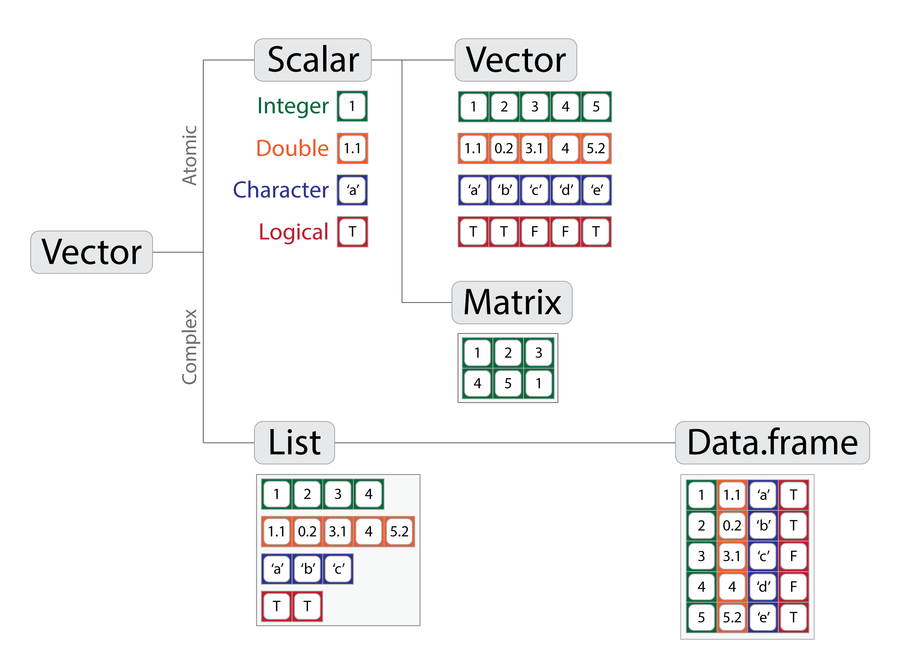
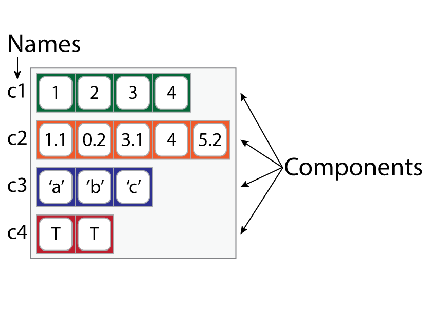

# Vector Types {#vector-types}


<!-- include libraries -->


<!-- kableExtra bootstrap css 
https://haozhu233.github.io/kableExtra/bookdown/use-bootstrap-tables-in-gitbooks-epub.html
-->


<!-- knit_hook: collapse and strip white 
this is a Blake hack -->


<!-- knit_hook: collapse and print error red
super hacky, see here: https://stackoverflow.com/a/54985678/7705429
we'll need to be careful to not string four # together anywhere
--->

<script>
$(document).ready(function() {
  window.setTimeout(function() {
    $(".co:contains('####')").css("color", "red");
    var tmp = $(".co:contains('####')").text();
    $(".co:contains('####')").text(tmp.replace("####", "##"));
  }, 15);
});
</script>


<!-- chunk options -->


<!-- miscellaneous -->


<!-- 
make error messages closer to base R 
https://github.com/hadley/adv-r/blob/master/common.R
looks like it doesn't work because R no longer
let's users override s3 methods, so I changed the s3 to "simpleError"
-->


## Overview

<table class="table-intro table table-hover table-striped" style="margin-left: auto; margin-right: auto;">
<tbody>
  <tr>
   <td style="text-align:left;border: 0 solid transparent; padding-right: 0px; vertical-align: top;"> __Goal__ </td>
   <td style="text-align:left;border: 0 solid transparent; padding-left: 9px; text-align: justify; text-justify: inter-word;"> To familiarize students with primary data and vector types in R. </td>
  </tr>
  <tr>
   <td style="text-align:left;border: 0 solid transparent; padding-right: 0px; vertical-align: top;"> __tl;dr__ </td>
   <td style="text-align:left;border: 0 solid transparent; padding-left: 9px; text-align: justify; text-justify: inter-word;"> The beings of R are objects. </td>
  </tr>
  <tr>
   <td style="text-align:left;border: 0 solid transparent; padding-right: 0px; vertical-align: top;"> __Outcomes__ </td>
   <td style="text-align:left;border: 0 solid transparent; padding-left: 9px; text-align: justify; text-justify: inter-word;"> Here, you will learn about<br><ol>
<li>data types and how to create them,</li>
<li>vector types and how to create them, and</li>
<li>how to coerce objects of one vector or data type to another,</li>
</ol> </td>
  </tr>
  <tr>
   <td style="text-align:left;border: 0 solid transparent; padding-right: 0px; vertical-align: top;"> __Datasets__ </td>
   <td style="text-align:left;border: 0 solid transparent; padding-left: 9px; text-align: justify; text-justify: inter-word;"> NONE </td>
  </tr>
  <tr>
   <td style="text-align:left;border: 0 solid transparent; padding-right: 0px; vertical-align: top;"> __Requirements__ </td>
   <td style="text-align:left;border: 0 solid transparent; padding-left: 9px; text-align: justify; text-justify: inter-word;"> NONE </td>
  </tr>
  <tr>
   <td style="text-align:left;border: 0 solid transparent; padding-right: 0px; vertical-align: top;"> __Further Reading__ </td>
   <td style="text-align:left;border: 0 solid transparent; padding-left: 9px; text-align: justify; text-justify: inter-word;"> [An Introduction to R](https://cran.r-project.org/doc/manuals/r-release/R-intro.html) [@rcoreteam2020introduction]<br>[Advanced R](https://adv-r.hadley.nz/) [@Wickham2015advanced] </td>
  </tr>
</tbody>
</table>

The word 'vector' is just fancy R-speak for an R object with a specific form or _structure_ that contains one or more _data types_. The forms vectors can take include, among others, scalars and lists (see Fig. \@ref(fig:r-objects)), and the data types they can hold include integer, double (i.e., fractions), logical, character, and factor (though this last one only as an honorable mention). Putting effort into understanding these vector forms and data types might at first blush feel like a foolhardy pursuit of the inconsequential and esoteric, a task best relegated to crusty philosophers. But that is a mistake, for the different statistical questions you might want to ask will require data in one or the other form and type to answer. Understanding these forms and types will also help you manage your data better, thus making your statistical workflow more efficient and reproducible.  


## Data types

As mentioned already,  there are four primary data types in R: integer, double, logical, and character, with integer and double also collectively referred to as numeric. We will not discuss any of these in great detail here, pausing only to mention very briefly what each is, how to make them, how to catch one in the wild, and what they are for. As an honorable mention, we will also include _factors_. These are not strictly their own data type (R actually encodes them as integers), but they are ubiquitous and utilized quite often in statistical analyses. So, we'll treat them as a data type in their own right, on a level with the others; even if they aren't, strictly speaking.


### Integer

<table class="table table-hover" style="">
<tbody>
  <tr>
   <td style="text-align:left;width: 7em; border: 0px"> Meaning </td>
   <td style="text-align:left;border: 0px"> A whole number or a number without a fractional component (like 1 as opposed to 1.3). </td>
  </tr>
  <tr>
   <td style="text-align:left;width: 7em; border: 0px"> Use </td>
   <td style="text-align:left;border: 0px"> Counting things! It answers the question _How many?_ </td>
  </tr>
  <tr>
   <td style="text-align:left;width: 7em; border: 0px"> Example </td>
   <td style="text-align:left;border: 0px"> How many students are in this class? (Hopefully, an integer.) <br> How many Avengers are there now? </td>
  </tr>
  <tr>
   <td style="text-align:left;width: 7em; border: 0px"> Create </td>
   <td style="text-align:left;border: 0px"> By appending an `L` to a number. </td>
  </tr>
  <tr>
   <td style="text-align:left;width: 7em; border: 0px"> Identify </td>
   <td style="text-align:left;border: 0px"> With `is.integer()`. </td>
  </tr>
</tbody>
</table>


```r
my_integer <- 3L

my_integer
## [1] 3
is.integer(4.2)
## [1] FALSE
is.integer(my_integer)
## [1] TRUE
```

### Double

<table class="table table-hover" style="">
<tbody>
  <tr>
   <td style="text-align:left;width: 7em; border: 0px"> Meaning </td>
   <td style="text-align:left;border: 0px"> A number with a fractional component (like 1.3 as opposed to 1). </td>
  </tr>
  <tr>
   <td style="text-align:left;width: 7em; border: 0px"> Use </td>
   <td style="text-align:left;border: 0px"> Measuring things! It answers the question _How much?_ </td>
  </tr>
  <tr>
   <td style="text-align:left;width: 7em; border: 0px"> Example </td>
   <td style="text-align:left;border: 0px"> How much coffee did I have this morning? <br> How much did it rain last year in Pasquotank County, North Carolina? </td>
  </tr>
  <tr>
   <td style="text-align:left;width: 7em; border: 0px"> Create </td>
   <td style="text-align:left;border: 0px"> By typing a number (with or without a decimal, but no `L`) </td>
  </tr>
  <tr>
   <td style="text-align:left;width: 7em; border: 0px"> Identify </td>
   <td style="text-align:left;border: 0px"> With `is.double()`. </td>
  </tr>
</tbody>
</table>


```r
my_double <- 3.2

my_double
## [1] 3.2
is.double(3L)
## [1] FALSE
is.double(my_double)
## [1] TRUE
```

### Character

<table class="table table-hover" style="">
<tbody>
  <tr>
   <td style="text-align:left;width: 7em; border: 0px"> Meaning </td>
   <td style="text-align:left;border: 0px"> A string of symbols used to construct words in a natural language (by default, English letters). </td>
  </tr>
  <tr>
   <td style="text-align:left;width: 7em; border: 0px"> Use </td>
   <td style="text-align:left;border: 0px"> Saying things! It can answer a bunch of questions. </td>
  </tr>
  <tr>
   <td style="text-align:left;width: 7em; border: 0px"> Example </td>
   <td style="text-align:left;border: 0px"> How much coffee did I have this morning? <br> How much did it rain last year in Pasquotank County, North Carolina? </td>
  </tr>
  <tr>
   <td style="text-align:left;width: 7em; border: 0px"> Create </td>
   <td style="text-align:left;border: 0px"> By quoting it, i.e., surrounding a string with double `"` or single `'` apostrophes. </td>
  </tr>
  <tr>
   <td style="text-align:left;width: 7em; border: 0px"> Identify </td>
   <td style="text-align:left;border: 0px"> With `is.character()`. </td>
  </tr>
</tbody>
</table>


```r
my_character <- 'quotidian'

my_character
## [1] "quotidian"
is.character(4.2)
## [1] FALSE
is.character(my_character)
## [1] TRUE
```

A quick warning: if you do not surround the character with apostrophes, R will think you are trying to call an object with that name. If that object does not exist, R will protest. 


```r
quotidian
#### Error: object 'quotidian' not found
```

Similarly, if you use quote marks around a named object, R treats it as a character string, rather than a call to the object.


```r
"my_integer"
## [1] "my_integer"
my_integer
## [1] 3
```

### Logical

<table class="table table-hover" style="">
<tbody>
  <tr>
   <td style="text-align:left;width: 7em; border: 0px"> Meaning </td>
   <td style="text-align:left;border: 0px"> A truth condition, i.e., TRUE or FALSE. Also known as a _boolean_. </td>
  </tr>
  <tr>
   <td style="text-align:left;width: 7em; border: 0px"> Use </td>
   <td style="text-align:left;border: 0px"> Implying things! Specifically, making conditional or hypothetical claims. </td>
  </tr>
  <tr>
   <td style="text-align:left;width: 7em; border: 0px"> Example </td>
   <td style="text-align:left;border: 0px"> If it rains today, I will take my umbrella. <br> If x is an integer, please add one to it. </td>
  </tr>
  <tr>
   <td style="text-align:left;width: 7em; border: 0px"> Create </td>
   <td style="text-align:left;border: 0px"> By typing `TRUE`, `FALSE`, `T`, or `F`. </td>
  </tr>
  <tr>
   <td style="text-align:left;width: 7em; border: 0px"> Identify </td>
   <td style="text-align:left;border: 0px"> With `is.logical()`. </td>
  </tr>
</tbody>
</table>


```r
my_logical <- TRUE

my_logical 
## [1] TRUE
is.logical(my_double) 
## [1] FALSE
is.logical(my_logical)
## [1] TRUE
```

You can also create logicals in R using statements that R can evaluate for their truth or falsity. For example,


```r
# is 2 greater than 5?
2 > 5
## [1] FALSE
# is 7 greater than or equal to itself?
7 >= 7
## [1] TRUE
# is 'cat' the same string as 'hat'
'cat' == 'hat'
## [1] FALSE
```

The symbols `>`, `>=`, and `==` are called _logical operators_. We'll talk more about them in the chapter on indexing vectors. For now, simply note that the truth conditions of statements formed with these operators can be assigned to names, as with any object in R.


```r
jim_bob <- 'cat' == 'hat'
```

Did you notice that our `is.*` functions all return a `logical`?

### Factors

<table class="table table-hover" style="">
<tbody>
  <tr>
   <td style="text-align:left;width: 7em; border: 0px"> Meaning </td>
   <td style="text-align:left;border: 0px"> Categories, typically represented in R as character strings with _levels_. </td>
  </tr>
  <tr>
   <td style="text-align:left;width: 7em; border: 0px"> Use </td>
   <td style="text-align:left;border: 0px"> Categorizing things! </td>
  </tr>
  <tr>
   <td style="text-align:left;width: 7em; border: 0px"> Example </td>
   <td style="text-align:left;border: 0px"> Tom is a _feline_. <br> Jerry is a _mouse_. </td>
  </tr>
  <tr>
   <td style="text-align:left;width: 7em; border: 0px"> Create </td>
   <td style="text-align:left;border: 0px"> Using the function `factor()` </td>
  </tr>
  <tr>
   <td style="text-align:left;width: 7em; border: 0px"> Identify </td>
   <td style="text-align:left;border: 0px"> With `is.factor()`. </td>
  </tr>
</tbody>
</table>


```r
my_factor <- factor("Australian")

my_factor
## [1] Australian
## Levels: Australian
is.factor("quotidian")
## [1] FALSE
is.factor(my_factor)
## [1] TRUE
```

Notice that unlike a simple character, a factor has "levels." These levels are the categories of the factor variable. A good example is nationality. Nationality is a factor, with the specific levels or categories of that factor including, for instance, _American_, _Australian_, _Chinese_, and _French_.  


```r
factor(c("American", "Australian", "Chinese", "French"))
## [1] American   Australian Chinese    French    
## Levels: American Australian Chinese French
```


## Vector types

Vectors come in two general flavors: atomic and complex. These differ in one crucial respect. While atomic vectors are limited to one data type, complex vectors can contain many data types. As shown in Fig. \@ref(fig:r-objects), atomic vectors include scalars, vectors, and matrices. Complex vectors include lists and data.frames. 

<div class="figure" style="text-align: center">

<p class="caption">(\#fig:r-objects)Vector Types.</p>
</div>

### Scalar

A scalar-vector is an atomic vector that contains only one element. Hence, by definition, it can include only one data type. Here, we represent this with a square, which includes a value and is color-coded by its data type.


Note that all the examples we have used so far have been scalar vectors. You can check this using the `length()` function.


```r
length(my_integer)
## [1] 1
```

### Vector

A vector-vector is an atomic vector that contains multiple elements. These multi-scalar atomic vectors do not really have a name like "list" or "scalar," but in common R parlance the word 'vector' is often used as a synonym, which is a tad confusing, like "Are you going to New York (the state) or New York (the city)?" In what follows, we'll just cross our fingers and hope the context is sufficient to tell the difference.


The standard way to create one of these is to use the concatenate function on scalars `c()`.


```r
my_vector <- c(1, 2, 3, 4, 5)

my_vector
## [1] 1 2 3 4 5
length(my_vector)
## [1] 5
```

Of course, you can have a vector of any data type, it just cannot be the case that any vector contains multiple data types. 


```r
integer_vector <- c(1L, 2L, 3L, 4L, 5L)

double_vector <- c(1.1, 0.2, 3.1, 4, 5.2)

character_vector <- c('a', 'b', 'c', 'd', 'e')

logical_vector <- c(TRUE, TRUE, FALSE, FALSE, TRUE)
```

What happens if you try to create a vector with different data types?


```r
c(1, 'a', TRUE)
## [1] "1"    "a"    "TRUE"
```

It converted them all to character strings! This is known as _implicit coercion_. It is a way of ensuring that all vector-vectors are atomic.

### Matrix

A matrix-vector is an atomic vector with _dimensions_, meaning the vector is "folded," so to speak, into rows and columns. As you can see, a matrix has the shape of a data table, like what you would find in an Excel spreadsheet.


To create a matrix, you use the `matrix()` function by providing it with a vector and then specifying the number of rows and columns it should have.


```r
my_matrix <- matrix(my_vector, 
                    nrow = 2,  # number of rows
                    ncol = 3)  # number of columns

my_matrix
##      [,1] [,2] [,3]
## [1,]    1    3    5
## [2,]    2    4    1
```

The odd, bracketed numbers printed above and to the left of the matrix are known as _subscripts_. They are like numeric names for columns and rows that can be used to reference specific locations in the matrix. For example, row one is `[1,]`, and column two is `[,2]`. So, if I want to refer to the cell containing the value `3`, use `[1,2]`. And, if you want to know how many rows and columns a matrix has, you can use `nrow()` and `ncol()`, or the function `dim()`, which returns both counts.


```r
nrow(my_matrix)
## [1] 2
ncol(my_matrix)
## [1] 3
dim(my_matrix)
## [1] 2 3
```

### List

A list-vector is a complex vector that may include other vectors of any data type and length. The gray box around each vector in the figure below is meant to suggest that the list is a single complex vector made up of other vectors, and the space between each vector is meant to show that they are still separate components of the list, unconstrained by the other components. So, yeah, a list...



To create a list, use the `list()` function and supply it with vectors. Be sure to assign list-names using the `name = vector` syntax.


```r
my_list <- list('c1' = c(1L, 2L, 3L, 4L),
                'c2' = double_vector,
                'c3' = c('a', 'b', 'c'),
                'c4' = c(TRUE, TRUE))

my_list
## $c1
## [1] 1 2 3 4
## 
## $c2
## [1] 1.1 0.2 3.1 4.0 5.2
## 
## $c3
## [1] "a" "b" "c"
## 
## $c4
## [1] TRUE TRUE
```

Each vector in the list is called a component. You can find the names of these components using the `names()` function, which returns a character vector.


```r
names(my_list)
## [1] "c1" "c2" "c3" "c4"
```

You can also assign new names to a list with `names()` and the assignment arrow `<-`. 


```r
names(my_list) <- c("A", "B", "C", "D")

names(my_list)
## [1] "A" "B" "C" "D"
```

Now, we said above that lists can contain any vector type, and this is true. Lists can even contain other lists!


```r
my_super_list <- list('e' = my_list,
                      'f' = my_logical)
```

In this sense, you will sometimes hear people refer to lists as _recursive_ vectors [@rcoreteam2020introduction].  

### Data.frame

A data.frame-vector is a special sort of list with a super-restriction on it: all the vectors it includes must be of the same length. It is also not recursive.


To create a data.frame, use the `data.frame()` function, supplying it with `name = vector` arguments as you would with `list()`.


```r
my_dataframe <- data.frame('c1' = integer_vector,
                           'c2' = double_vector,
                           'c3' = character_vector,
                           'c4' = logical_vector)

my_dataframe
##   c1  c2 c3    c4
## 1  1 1.1  a  TRUE
## 2  2 0.2  b  TRUE
## 3  3 3.1  c FALSE
## 4  4 4.0  d FALSE
## 5  5 5.2  e  TRUE
```

Notice that when you create the data.frame, the vectors become named columns. To extract those column names, we can again use the `names()` function.


```r
names(my_dataframe)
## [1] "c1" "c2" "c3" "c4"
```

As with a matrix, you can also get the number of columns and rows with `nrow` and `ncol`.


```r
nrow(my_dataframe)
## [1] 5
ncol(my_dataframe)
## [1] 4
```

## Coercion

R provides tools for transforming objects of one data or vector type into objects of another data or vector type. This is known as _coercion_, which you were introduced to above in the form of _implicit_ coercion. As a reminder, that's what happens when you try to combine different data types in an atomic vector like so:


```r
c(1, 'a', TRUE)
## [1] "1"    "a"    "TRUE"
```

But, what about _explicit_ coercion, meaning coercion you declare explicitly with R code? Well, R provides several functions for this, all having the form `as.*()` where the `*` is replaced with the name of the type that you wish to coerce your object to. 

Why care about coercion? Here are two reasons. First, you should probably care about coercion for the simple reason that you do not want to mistakenly compare apples and oranges when conducting an analysis, so you should always make sure to check the data type using the `is.*()` functions described above. And, if you don't get the answer you want from those functions, use the coercion rules we are about to discuss. Second, reproducibility! An essential ingredient of reproducible code is explicit commands. As we noted above, however, R will sometimes invoke implicit coercion, with the consequence that someone who later came along to reproduce your code might for whatever reason fail to apply the coercion and, thus, fail to reproduce your results. Bad, bad, bad all around! So, bottom line, coercion matters!  

### Data type coercion

Here is an example of data type coercion from integer to character.


```r
a_new_character <- as.character(integer_vector)

a_new_character
## [1] "1" "2" "3" "4" "5"
is.integer(a_new_character)
## [1] FALSE
is.character(a_new_character)
## [1] TRUE
```

As you see, it surrounds the numerals with quotation marks, indicating these are now character strings. Other data type coercion functions include `as.double()`, `as.integer()`, `as.numeric()` (for either double or integer), `as.logical()`, and `as.factor()`. But, notice that R can be somewhat finicky about how these behave. I mean, converting from logical, numeric, or integer to character is obvious. Just wrap the elements in quotes. But, what should R do when you ask it to convert, say, double to integer? 


```r
double_vector
## [1] 1.1 0.2 3.1 4.0 5.2
as.integer(double_vector)
## [1] 1 0 3 4 5
```

In this case, it rounds the decimals to whole numbers, which seems intuitive enough. But, if you wanted, for example, to coerce a letter like 'e' into a logical value, which would it be? True or false? Obviously, this is not a meaningful question, and R agrees. Same goes for coercing character strings to numeric values. I mean, is the letter 'b' more like 1.2 or 57, or maybe even -33.3?


```r
as.logical('e')
## [1] NA
as.integer('b')
## [1] NA
```

As you see, R chooses not to return a value, providing `NA` instead. 

\BeginKnitrBlock{rmdnote}<div class="rmdnote">One somewhat bizarre coercion rules involves the translation of numbers into logicals, but the nature of that rule and the explanation for it are deeply esoteric topics involving R's original design. So, rather than delving into that particular idiosyncrasy, I would just encourage you to try out `as.logical()` on a number (double or integer) and see what happens. Hint: try it on zero, too.  </div>\EndKnitrBlock{rmdnote}


### Vector type coercion

For our purposes, the primary functions for vector type coercion are these: `as.matrix()`, `as.list()`, and `as.data.frame()`. Here is an example of vector type coercion from data.frame to list.


```r
a_new_list <- as.list(my_dataframe)

a_new_list
## $c1
## [1] 1 2 3 4 5
## 
## $c2
## [1] 1.1 0.2 3.1 4.0 5.2
## 
## $c3
## [1] "a" "b" "c" "d" "e"
## 
## $c4
## [1]  TRUE  TRUE FALSE FALSE  TRUE
is.data.frame(a_new_list)
## [1] FALSE
is.list(a_new_list)
## [1] TRUE
```

To round off this discussion, let me leave you with this question: how should a data.frame be coerced to a matrix? Here is an example.


```r
a_new_matrix <- as.matrix(my_dataframe)

a_new_matrix
##      c1  c2    c3  c4     
## [1,] "1" "1.1" "a" "TRUE" 
## [2,] "2" "0.2" "b" "TRUE" 
## [3,] "3" "3.1" "c" "FALSE"
## [4,] "4" "4.0" "d" "FALSE"
## [5,] "5" "5.2" "e" "TRUE"
is.data.frame(a_new_matrix)
## [1] FALSE
is.matrix(a_new_matrix)
## [1] TRUE
```

Remember that the cardinal rule for atomic vectors is that they consist of a single data type!


