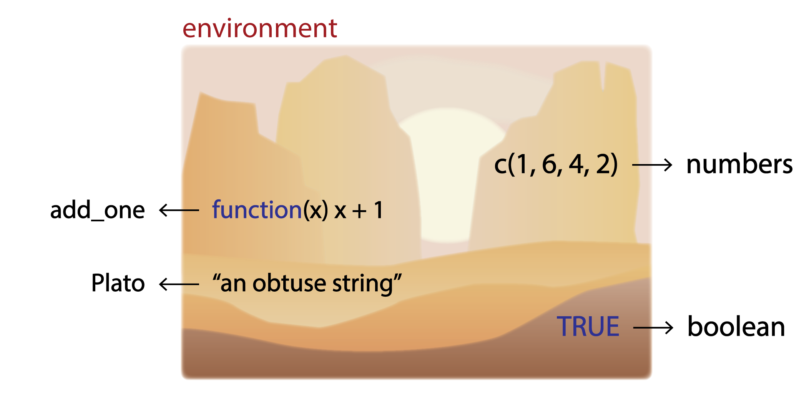

# Workspace Management {#workspace-management}

```{r, include = FALSE, echo = FALSE, child = "R/before_chunk.Rmd"}
```

```{r r-menagerie, echo = FALSE, out.width = '100%', fig.cap = "The R Environment"}



```

## Overview

```{r, echo = FALSE, results = 'asis'}

insert_intro(goal = "To familiarize students with the idea of a computing workspace.",
             tldr = "It's just like your kitchen! Keeping it clean won't necessarily make you a great cook, but it will make you a _better_ one.",
             outcomes = c("the working directory,",
                          "absolute and relative file paths,",
                          "directory management,",
                          "importing and exporting data,",
                          "environments, specifically the workspace, and",
                          "workspace management."),
             datasets = list(),
             requirements = list(c(name = "Chapter 6: R Basics",
                                   url = "#r-basics"),
                                 c(name = "Chapter 8: Vector Types",
                                   url = "#vector-types")),
             readings = list(c(name = "An Introduction to R",
                               url = "https://cran.r-project.org/doc/manuals/r-release/R-intro.html",
                               ref = "[@rcoreteam2020introduction]"),
                             c(name = "Advanced R",
                               url = "https://adv-r.hadley.nz/",
                               ref = "[@Wickham2015advanced]")))

```

Think of the workspace as your kitchen. 

## Working directory

Describe the difference between a project directory and a working directory.

Explain how to identify the current working directory with `getwd()` and then to make the project directory the working directory with `setwd()`.

A question about reproducible code. To be reproducible, shouldn't it be true that you don't have to change _anything_ in an R script? But what about `setwd()`?

### File paths

Relative vs absolute file paths.


### Directory management

directory structure

file names


## Data Import and Export

Import and assign! In [R Basics](#r-basics) we learned how to create objects with some staying-power using assignment. Well, when we import data, we typically want it to have some staying power too, so we need to assign it to a name right away.  

## Environments

When we create an object in R, _where does it go_?!!! This is a question that a lot of smart people find themselves asking when first learning about R. While the answer is a tad on the esoteric side, it is perhaps useful to peel back the curtain ever so slightly, so you can see what is happening when you create an object in R (including functions!). To do that, we need to talk about environments, in particular, the "global" environment, which is your default "workspace." You can think of an environment like the workspace as a special sort of named list. 

```{r}

bob <- list(a = 1:5,
            b = LETTERS[1:10],
            c = "quotidian",
            d = TRUE,
            add_one = function(x) x + 1)

# coerce list to environment object
digital_zoo <- as.environment(bob)

```

When you create an object, you do not have to go through these steps explicitly for R adds objects assigned to names to your global environment by default. The key here is just to recognize that when you use `<-`, you are in effect adding an element to a list, the environment list. 

If you want to know what all lives in your R environment, you can try `ls()`, which works like `names()` does for lists, printing the names of its denizens.

```{r}

ls(digital_zoo)

```

As a general rule, you should keep your environments clean and orderly. This will help prevent you from making careless mistakes (like running operations on the wrong objects) and also make it easier to manage your workflow. One way to do this is to let go of objects that you will not re-use - meaning, you should banish them from your environment. This is achieved with the `rm()` function.

```{r}

rm(a, envir = digital_zoo) # read this as: remove object a from the digital zoo environment

```

When you're removing objects from your global environment or workspace (and not the toy environment that I just created as an example), it is sufficient simply to type `rm(<object>)` without specifying the environment, since it defaults to the global environment anyway.  


### Save source!

