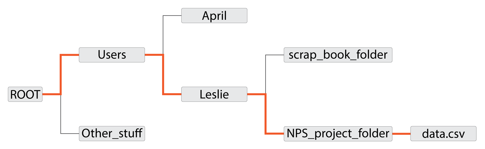
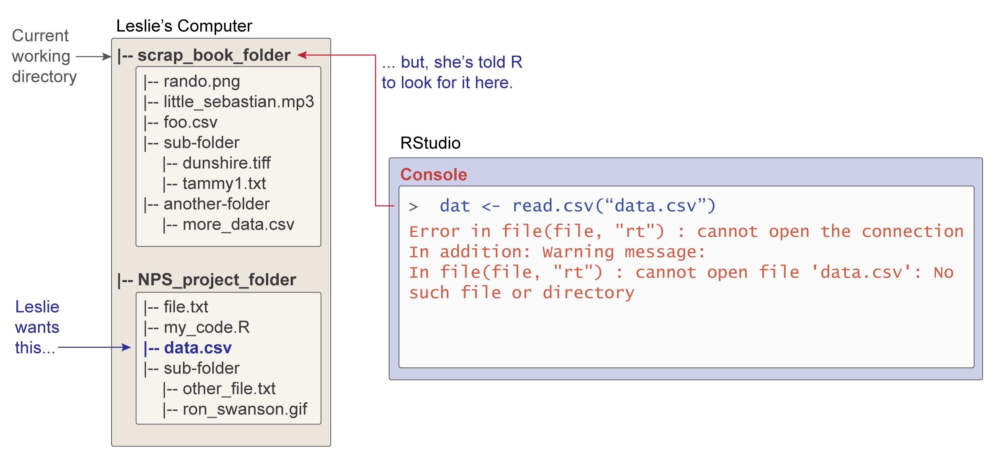
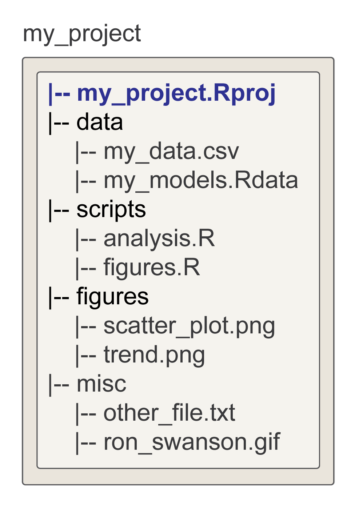

# Workspace Management {#workspace-management}


<!-- include libraries -->


<!-- kableExtra bootstrap css 
https://haozhu233.github.io/kableExtra/bookdown/use-bootstrap-tables-in-gitbooks-epub.html
-->


<!-- knit_hook: collapse and strip white 
this is a Blake hack -->


<!-- knit_hook: collapse and print error red
super hacky, see here: https://stackoverflow.com/a/54985678/7705429
we'll need to be careful to not string four # together anywhere
--->

<script>
$(document).ready(function() {
  window.setTimeout(function() {
    $(".co:contains('####')").css("color", "red");
    var tmp = $(".co:contains('####')").text();
    $(".co:contains('####')").text(tmp.replace("####", "##"));
  }, 15);
});
</script>


<!-- chunk options -->


<!-- miscellaneous -->


<!-- 
make error messages closer to base R 
https://github.com/hadley/adv-r/blob/master/common.R
looks like it doesn't work because R no longer
let's users override s3 methods, so I changed the s3 to "simpleError"
-->


<div class="figure" style="text-align: center">

<p class="caption">(\#fig:r-menagerie)The R Environment</p>
</div>

## Overview

<table class="table-intro table table-hover table-striped" style="margin-left: auto; margin-right: auto;">
<tbody>
  <tr>
   <td style="text-align:left;border: 0 solid transparent; padding-right: 0px; vertical-align: top;"> __Goal__ </td>
   <td style="text-align:left;border: 0 solid transparent; padding-left: 9px; text-align: justify; text-justify: inter-word;"> To introduce students to the idea of a computing workspace. </td>
  </tr>
  <tr>
   <td style="text-align:left;border: 0 solid transparent; padding-right: 0px; vertical-align: top;"> __tl;dr__ </td>
   <td style="text-align:left;border: 0 solid transparent; padding-left: 9px; text-align: justify; text-justify: inter-word;"> It's just like your kitchen! Keeping it clean won't necessarily make you a _great_ cook, but it will make you a _better_ one. </td>
  </tr>
  <tr>
   <td style="text-align:left;border: 0 solid transparent; padding-right: 0px; vertical-align: top;"> __Outcomes__ </td>
   <td style="text-align:left;border: 0 solid transparent; padding-left: 9px; text-align: justify; text-justify: inter-word;"> Here, you will learn about<br><ol>
<li>the workspace (as an environment),</li>
<li>workspace management,</li>
<li>absolute and relative file paths,</li>
<li>the working directory,</li>
<li>directory management, and</li>
<li>importing and exporting data.</li>
</ol> </td>
  </tr>
  <tr>
   <td style="text-align:left;border: 0 solid transparent; padding-right: 0px; vertical-align: top;"> __Datasets__ </td>
   <td style="text-align:left;border: 0 solid transparent; padding-left: 9px; text-align: justify; text-justify: inter-word;"> NONE </td>
  </tr>
  <tr>
   <td style="text-align:left;border: 0 solid transparent; padding-right: 0px; vertical-align: top;"> __Requirements__ </td>
   <td style="text-align:left;border: 0 solid transparent; padding-left: 9px; text-align: justify; text-justify: inter-word;"> [Chapter 6: R Basics](#r-basics)<br>[Chapter 8: Vector Types](#vector-types) </td>
  </tr>
  <tr>
   <td style="text-align:left;border: 0 solid transparent; padding-right: 0px; vertical-align: top;"> __Further Reading__ </td>
   <td style="text-align:left;border: 0 solid transparent; padding-left: 9px; text-align: justify; text-justify: inter-word;"> NONE </td>
  </tr>
</tbody>
</table>


## The Workspace

When you first start working with R, you might find yourself on occasion asking a rather innocuous question: _Where do the objects we create actually go_? The technical and very far afield answer is your computer's memory, with an anchor (related to the object's name) that allows you to retrieve them. The simpler and way more intuitive answer is that they end up in one of your R environments, in particular, your _workspace_. You can think of an environment like the workspace as a special sort of named list. 


```r
bob <- list(a = 1:5,
            add_one = function(x){ x + 1 },
            b = LETTERS[1:10],
            c = "quotidian",
            d = TRUE)

# coerce list to environment object
workspace <- as.environment(bob)
```

When you create an object, you do not have to explicitly add it to an environment, for R adds your defined objects to your workspace by default. The key here is just to recognize that when you use `<-`, you are really just adding an element to a list, the environment list.  

If you want to know what objects currently reside in your workspace, you can use `ls()`, which works like `names()` does for lists, printing the names of its denizens.


```r
names(bob)
## [1] "a"       "add_one" "b"       "c"       "d"
ls(workspace)
## [1] "a"       "add_one" "b"       "c"       "d"
```

Note that because `ls()` assumes you are interested in the workspace, you do not have to specify the environment explicitly. In the example above, we did so just to emphasize the list-analogy. That is, wen you call `ls()`, you are doing something very similar to checking the names of a list.  

One other function you might find useful is `ls.str()`. This is a combination of `ls()` and `str()`, which you were introduced to in the previous chapter. This function lists all the elements in the workspace and provides information about their structure.


```r
ls.str(workspace)
## a :  int [1:5] 1 2 3 4 5
## add_one : function (x)  
## b :  chr [1:10] "A" "B" "C" "D" "E" "F" "G" "H" "I" "J"
## c :  chr "quotidian"
## d :  logi TRUE
```

\BeginKnitrBlock{rmdnote}<div class="rmdnote">The information provided by `ls()` and `ls.str()` is more or less what you will find in RStudio's Environment pane, by default the pane in the upper right corner of the RStudio window. That means you do not normally need to use either function. RStudio does it for you. </div>\EndKnitrBlock{rmdnote}


### Workspace Management

As a general rule, you should keep your workspace clean and orderly when conducting any analysis, just as you should keep your kitchen clean and orderly when cooking. There are two big reasons for this. First, it will help prevent careless mistakes (like running operations on the wrong objects or adding a cup of salt when the recipe calls for sugar). Second, it will make it easier to manage your workflow, to make it more efficient and intelligible. Right now, I have this horrifying image of that college roommate, you know, the one that never does the dishes, leaves food stains on the counter, lets food rot in the fridge, and for some reason you can't quite fathom, spends several weeks conducting an experiment involving molds growing beneath the sink. And now that person is somehow, by some miracle, in charge of - I don't know - Katz's Deli in New York! One shudders at the thought! I mean, talk about a kitchen nightmare. By all that is good, you ought to avoid this. You want to avoid workspace nightmares. 

One way to do that is to regularly remove objects that you will not re-use - meaning, you should banish them from your workspace. This is achieved with the `rm()` or _remove_ function.


```r
rm(a, envir = workspace) # read this as: remove object a from the workspace

ls(workspace)
## [1] "add_one" "b"       "c"       "d"
```

Just as we noted with `ls()`, when you're removing objects from your workspace (and not the toy environment that I just created as an example), it is sufficient to type `rm(<object>)` without specifying the environment, since it defaults to the workspace anyway.  


## The working directory

Now that we have some sense of the workspace in R, we need some way to associate it with a particular location on your computer. Why? For the familiar reasons: (i) to make your workflow more efficient (mostly by saving you from the tedium of excessive typing!) and (ii) to make your workflow more reproducible! And, actually, we can add one other very big one with very immediate, practical consequences, namely, (iii) to make collaboration easier! To make these big claims more digestible, let's talk about file paths, and in particular the distinction between relative and absolute file paths.

### File paths

A file path, maybe you know, is just a way of specifying the location of a file in a hierarchical directory. If you think of that hierarchical directory as having a tree-like structure, you can represent it as we do in Fig. \@ref(fig:14-file-paths).  

<div class="figure" style="text-align: center">

<p class="caption">(\#fig:14-file-paths)Tree-like structure of a hierarchical computer directory. The orange line represents the absolute file path to data.csv.</p>
</div>

A complete file path for `data.csv` here might look like this:

    ROOT/Users/Leslie/NPS_project_folder/data.csv

with the backslash `/` providing a folder or directory _separator_, signifying that the bit on the right-hand side is contained within the bit on the left-hand side (sometimes called the "parent" directory).  Assuming that `ROOT` is the first or top-most directory in this system (meaning it's not a sub-folder of some other folder or directory), that file path is also _absolute_. No matter where you are on your computer, using that file path will also pick out that specific `data.csv` file. 

A _relative_ file path, on the other hand, is one that depends on your current location on your computer. It is _relative_ to that location. For instance, the relative file path

    NPS_project_folder/data.csv

will find `data.csv` _only if_ your current location on your computer is 

    ROOT/Users/Leslie

As you can see, if we take care to make our location known, relative file paths can save us a lot of typing. They also contribute to reproducibility, but let's build up to that idea.


### Setting the working directory

First, let's consider what happens if you try to use relative file paths in R without specifying what directory you are currently working in. So, let's look more carefully at the folders in Leslie's user directory.

<div class="figure" style="text-align: center">

<p class="caption">(\#fig:unnamed-chunk-8)Leslie has two folders in her directory on the computer: (i) scrap_book_folder and (ii) NPS_project_folder. She wants to read the file _data.csv_ into R, but something has gone wrong...</p>
</div>

From the diagram, you can see that her `scrap_book_folder` contains, among other things, some image and audio files. Similarly, `NPS_project_folder` includes some text and data files, as well as an R script! Now, suppose Leslie wants to open the file `NPS_project_folder/data.csv` in R and assign it to a name using this line of code:

```r
dat <- read.csv("data.csv")
```

What happens? It throws an error! R says it cannot open a connection because the file or directory does not exist. Why is this? The simple answer is that `data.csv` is a relative path, but R is currently pointing to the `scrap_book_folder`, so it's looking in there for that file. Assuming we want to avoid absolute file paths - hint: we do! - we need some way to point R to `NPS_project_folder`, so we can use the relative path `data.csv`.

To help with this, base R provides two functions: `getwd()` and `setwd()`. As you might have guessed, the first identifies or _gets_ the current working directory, the second changes or _sets_ it. If Leslie were to use these commands while working with R on her own computer, she could type this:

```r
getwd()
## [1] "ROOT/Users/Leslie/scrap_book_folder"

setwd("ROOT/Users/Leslie/NPS_project_folder")

getwd()
## [1] "ROOT/Users/Leslie/NPS_project_folder"
```

Having set the working directory to `NPS_project_folder`, she could now go on to using the relative path `data.csv` to import that data into R.   

### Reproducible projects

What makes code reproducible? While we can't give a complete answer to that now, we can offer at least one _necessary condition_:

> R code is reproducible _only if_ it is self-contained.

What does it mean for R code to be self-contained? Putting it simply, you should be able to save your R script (or the folder containing it, along with any data it requires) onto an external thumb drive, load it onto another computer (even one with a different operating system), run all the code, and get the exact (or very nearly the same) results _WITHOUT CHANGING ANYTHING_ in the script. 

This definition of containment should give you some sense of the problem `setwd()` poses. While it does allow you to use relative file paths in whatever comes after it, it itself requires an absolute file path! Meaning, each time you load the script onto a different computer, to run the code, you have to update `setwd()` with a new absolute path to the working directory. Thus, it bakes in an inherently unreproducible element of code.  

What is the solution to this? In a word, Projects, specifically RStudio projects. 

\BeginKnitrBlock{rmdnote}<div class="rmdnote">For a passionate and sometimes humorous defense of RStudio Projects as an alternative to `setwd()`, see Jenny Bryan's somewhat infamous blog post, [Project-oriented workflow](https://www.tidyverse.org/blog/2017/12/workflow-vs-script/). </div>\EndKnitrBlock{rmdnote}

What is a project? It's two things, really, a folder and a file. When you create a project in RStudio, you first give it a name. This name is then assigned to the project folder and file, with the latter also having a _.Rproj_ extension. The project folder contains the project file and gets set as the working directory by default. Basically, what happens is that whenever you open the project in RStudio, RStudio finds the absolute file path to the folder containing the _.Rproj_ file and sets it as the working directory.  

I won't go into detail about how to make one. The basic steps are to open RStudio, then go to `File > New Project` and make suitable choices based on the prompts.


### Directory management

directory structure




Some rules for how to name files and folders:


## Data Import and Export

Import and assign! In [R Basics](#r-basics) we learned how to create objects with some staying-power using assignment. Well, when we import data, we typically want it to have some staying power too, so we need to assign it to a name right away.  

