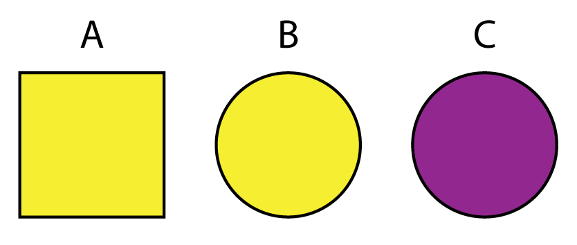

# Subsetting Data {#subsetting-data}


<!-- include libraries -->


<!-- kableExtra bootstrap css 
https://haozhu233.github.io/kableExtra/bookdown/use-bootstrap-tables-in-gitbooks-epub.html
-->


<!-- knit_hook: collapse and strip white 
this is a Blake hack -->


<!-- knit_hook: collapse and print error red
super hacky, see here: https://stackoverflow.com/a/54985678/7705429
we'll need to be careful to not string four # together anywhere
--->

<script>
$(document).ready(function() {
  window.setTimeout(function() {
    $(".co:contains('####')").css("color", "red");
    var tmp = $(".co:contains('####')").text();
    $(".co:contains('####')").text(tmp.replace("####", "##"));
  }, 15);
});
</script>


<!-- chunk options -->


<!-- miscellaneous -->


<!-- 
make error messages closer to base R 
https://github.com/hadley/adv-r/blob/master/common.R
looks like it doesn't work because R no longer
let's users override s3 methods, so I changed the s3 to "simpleError"
-->


## Overview

<table class="table-intro table table-hover table-striped" style="margin-left: auto; margin-right: auto;">
<tbody>
  <tr>
   <td style="text-align:left;border: 0 solid transparent; padding-right: 0px; vertical-align: top;"> __Goal__ </td>
   <td style="text-align:left;border: 0 solid transparent; padding-left: 9px; text-align: justify; text-justify: inter-word;"> To understand how to subset data in R. </td>
  </tr>
  <tr>
   <td style="text-align:left;border: 0 solid transparent; padding-right: 0px; vertical-align: top;"> __tl;dr__ </td>
   <td style="text-align:left;border: 0 solid transparent; padding-left: 9px; text-align: justify; text-justify: inter-word;"> Like when you use your index finger to _point_ at something. </td>
  </tr>
  <tr>
   <td style="text-align:left;border: 0 solid transparent; padding-right: 0px; vertical-align: top;"> __Outcomes__ </td>
   <td style="text-align:left;border: 0 solid transparent; padding-left: 9px; text-align: justify; text-justify: inter-word;"> Here, you will learn about<br><ol>
<li>the friendly `subset()` function and</li>
<li>the foreboding subset operators `[` and `$`.</li>
</ol> </td>
  </tr>
  <tr>
   <td style="text-align:left;border: 0 solid transparent; padding-right: 0px; vertical-align: top;"> __Datasets__ </td>
   <td style="text-align:left;border: 0 solid transparent; padding-left: 9px; text-align: justify; text-justify: inter-word;"> [Palmer Penguins](https://allisonhorst.github.io/palmerpenguins/) [@horst2020palmer] </td>
  </tr>
  <tr>
   <td style="text-align:left;border: 0 solid transparent; padding-right: 0px; vertical-align: top;"> __Requirements__ </td>
   <td style="text-align:left;border: 0 solid transparent; padding-left: 9px; text-align: justify; text-justify: inter-word;"> [Chapter 6: R Basics](#r-basics) </td>
  </tr>
  <tr>
   <td style="text-align:left;border: 0 solid transparent; padding-right: 0px; vertical-align: top;"> __Further Reading__ </td>
   <td style="text-align:left;border: 0 solid transparent; padding-left: 9px; text-align: justify; text-justify: inter-word;"> NONE </td>
  </tr>
</tbody>
</table>

Consider these three scenarios: 

* You have a global dataset detailing movie theater attendance rates, along with movie genre and director, for the last decade, but you only want to compare general attendance trends in Brazil to those in, say, France.  
* You have an enormous pollen record for Western North America going back some 15,000 years, but you're only interested in the terminal Pleistocene (approximately 11,000 to 10,000 years ago).  
* You have measurements of multiple penguin traits across several species, but you only want to model the relationship of bill length to body mass for Adelie penguins living on Torgersen Island.

In all of these scenarios, you are required to extract from the total data just the portion relevant to your specific research question. This is known as _subsetting_. It comes in two primary flavors: (i) _selecting variables_ or columns by their name or numeric position and (ii) _filtering observations_ or rows according to the values of one or more variables. While R provides many tools and methods for subsetting data in these ways, we will focus on the `subset()` function, which provides a friendly interface to handling tabular data or data.frames. We will also cover the sparser bracket `[` and dollar `$` operators, which provide greater flexibility, albeit with a much more formidable syntax.

We'll be working again with our familiar penguins data.


```r
penguins <- read.csv("penguins.csv")

str(penguins)
## 'data.frame':	344 obs. of  7 variables:
##  $ species          : chr  "Adelie" "Adelie" "Adelie" "Adelie" ...
##  $ island           : chr  "Torgersen" "Torgersen" "Torgersen" "Torgersen" ...
##  $ bill_length_mm   : num  39.1 39.5 40.3 NA 36.7 39.3 38.9 39.2 34.1 42 ...
##  $ flipper_length_mm: int  181 186 195 NA 193 190 181 195 193 190 ...
##  $ body_mass_g      : int  3750 3800 3250 NA 3450 3650 3625 4675 3475 4250 ...
##  $ sex              : chr  "male" "female" "female" NA ...
##  $ year             : int  2007 2007 2007 2007 2007 2007 2007 2007 2007 2007 ...
```


## Selecting variables

Subsetting data by selecting variables is fairly straightforward with `subset()`. You simply pass the name of each column you want to the function's `select` parameter. Here are some examples.  

_Select one variable_  


```r
penguins_subset <- subset(penguins, select = island)

head(penguins_subset)
##      island
## 1 Torgersen
## 2 Torgersen
## 3 Torgersen
## 4 Torgersen
## 5 Torgersen
## 6 Torgersen
```

_Select multiple variables_  


```r
penguins_subset <- subset(penguins, select = c(species, island, body_mass_g))

head(penguins_subset)
##   species    island body_mass_g
## 1  Adelie Torgersen        3750
## 2  Adelie Torgersen        3800
## 3  Adelie Torgersen        3250
## 4  Adelie Torgersen          NA
## 5  Adelie Torgersen        3450
## 6  Adelie Torgersen        3650
```


## Filtering observations

Subsetting data by filtering observations is a little bit more involved, but intuitively, you are simply asking for those observations that satisfy a certain condition. Getting `subset()` to return those observations requires that you pass an expression containing a comparison operator to the function's eponymous `subset` parameter. The expression is then evaluated by R for its truth or falsity, with observations that evaluate to `TRUE` being returned, observations that evaluate to `FALSE` being ignored. Let's walk through an example, then try to break down what is happening in a little more detail. Suppose we want only those observations of penguins residing on Biscoe Island. Here is how we would go about collecting those observations from our penguins data.frame.


```r
biscoe_penguins <- subset(penguins, subset = (island == "Biscoe"))

head(biscoe_penguins)
##    species island bill_length_mm flipper_length_mm body_mass_g    sex year
## 21  Adelie Biscoe           37.8               174        3400 female 2007
## 22  Adelie Biscoe           37.7               180        3600   male 2007
## 23  Adelie Biscoe           35.9               189        3800 female 2007
## 24  Adelie Biscoe           38.2               185        3950   male 2007
## 25  Adelie Biscoe           38.8               180        3800   male 2007
## 26  Adelie Biscoe           35.3               187        3800 female 2007
```

Here we supplied this key information to the `subset()` function: 

```r
subset = (island == "Biscoe")
``` 

with the additional parentheses provided only for readability, not because they are required. What does this expression mean exactly? In effect, it is directing `subset()` to scan through our data, specifically the `island` column, and select only those rows where the value is _Biscoe_. That's `island == "Biscoe"`. The so-called _comparison operator_ here is the double equal sign, `==`. This is importantly different than the single equal sign, `=`, which is used inside a function as part of a `key=value` or `argument=value` pair. R provides several helpful comparison operators:  

* `==` for _equals_ in the sense of a perfect match,  
* `!=` for _not equals_,  
* `>` for _greater than_,  
* `>=` for _greater than or equal to_,  
* `<` for _less than_, and  
* `<=` for _less than or equal to_.  

You can use the first two, `==` and `!=`, for comparisons with either character or numeric variables (integer or double), but the rest apply only to the latter. Let's run through a few more examples:  

_Filter penguins with body mass greater than 3500 grams_.  


```r
larger_penguins <- subset(penguins, subset = (body_mass_g > 3500))

head(larger_penguins)
##    species    island bill_length_mm flipper_length_mm body_mass_g    sex year
## 1   Adelie Torgersen           39.1               181        3750   male 2007
## 2   Adelie Torgersen           39.5               186        3800 female 2007
## 6   Adelie Torgersen           39.3               190        3650   male 2007
## 7   Adelie Torgersen           38.9               181        3625 female 2007
## 8   Adelie Torgersen           39.2               195        4675   male 2007
## 10  Adelie Torgersen           42.0               190        4250   <NA> 2007
```

_Filter penguins with beaks longer than 39 millimeters_.


```r
long_beaks <- subset(penguins, subset = (bill_length_mm > 39))

head(long_beaks)
##    species    island bill_length_mm flipper_length_mm body_mass_g    sex year
## 1   Adelie Torgersen           39.1               181        3750   male 2007
## 2   Adelie Torgersen           39.5               186        3800 female 2007
## 3   Adelie Torgersen           40.3               195        3250 female 2007
## 6   Adelie Torgersen           39.3               190        3650   male 2007
## 8   Adelie Torgersen           39.2               195        4675   male 2007
## 10  Adelie Torgersen           42.0               190        4250   <NA> 2007
```

### Multiple conditions

Often enough, we will want to combine a number of these simple conditions into one complex expression. In R, this is done with Boolean operators:  

* `&` for _and_,  
*  `|` for _or_, and  
* `!` for _not_.  

To demonstrate the underlying logic of these Boolean operators, consider these shapes and colors. You can think of each of A, B, and C as its own observation or row in a data.frame that includes two variables `color` and `shape`.  



<table class="table" style="width: auto !important; margin-left: auto; margin-right: auto;">
 <thead>
  <tr>
   <th style="text-align:left;"> Boolean </th>
   <th style="text-align:left;"> Subset </th>
   <th style="text-align:left;"> Result </th>
  </tr>
 </thead>
<tbody>
  <tr>
   <td style="text-align:left;"> x </td>
   <td style="text-align:left;"> `color == "yellow"` </td>
   <td style="text-align:left;"> A, B </td>
  </tr>
  <tr>
   <td style="text-align:left;"> y </td>
   <td style="text-align:left;"> `shape == "circle"` </td>
   <td style="text-align:left;"> B, C </td>
  </tr>
  <tr>
   <td style="text-align:left;"> x & y </td>
   <td style="text-align:left;"> `color == "yellow" & shape == "circle"` </td>
   <td style="text-align:left;"> B </td>
  </tr>
  <tr>
   <td style="text-align:left;"> x | y </td>
   <td style="text-align:left;"> `color == "yellow" | shape == "circle"` </td>
   <td style="text-align:left;"> A, B, C </td>
  </tr>
  <tr>
   <td style="text-align:left;"> x & !y </td>
   <td style="text-align:left;"> `color == "yellow" & shape != "circle"` </td>
   <td style="text-align:left;"> A </td>
  </tr>
  <tr>
   <td style="text-align:left;"> !x & y </td>
   <td style="text-align:left;"> `color != "yellow" & shape == "circle"` </td>
   <td style="text-align:left;"> C </td>
  </tr>
  <tr>
   <td style="text-align:left;"> !(x & y) </td>
   <td style="text-align:left;"> `!(color == "yellow" & shape == "circle")` </td>
   <td style="text-align:left;"> A, C </td>
  </tr>
  <tr>
   <td style="text-align:left;"> !(x | y) </td>
   <td style="text-align:left;"> `!(color == "yellow" | shape == "circle")` </td>
   <td style="text-align:left;"> NULL </td>
  </tr>
</tbody>
</table>

<br>

And here is an example with our penguins data.frame, where we ask R to return those observations in which (a) penguins reside on Biscoe Island and (b) their bills are longer than 39 millimeters.  


```r
biscoe_long_beaks <- subset(penguins, 
                            subset = (island == "Biscoe" & bill_length_mm > 39))

head(biscoe_long_beaks)
##    species island bill_length_mm flipper_length_mm body_mass_g    sex year
## 27  Adelie Biscoe           40.6               183        3550   male 2007
## 28  Adelie Biscoe           40.5               187        3200 female 2007
## 30  Adelie Biscoe           40.5               180        3950   male 2007
## 51  Adelie Biscoe           39.6               186        3500 female 2008
## 52  Adelie Biscoe           40.1               188        4300   male 2008
## 54  Adelie Biscoe           42.0               200        4050   male 2008
```


## Filtering and selecting

`subset()` also allows you to filter observations and select rows at the same time.


```r
biscoe_long_beaks <- subset(penguins, 
                            subset = (island == "Biscoe" & bill_length_mm > 39),
                            select = c(species, island, bill_length_mm))

head(biscoe_long_beaks)
##    species island bill_length_mm
## 27  Adelie Biscoe           40.6
## 28  Adelie Biscoe           40.5
## 30  Adelie Biscoe           40.5
## 51  Adelie Biscoe           39.6
## 52  Adelie Biscoe           40.1
## 54  Adelie Biscoe           42.0
```

In this example, we filter observations to include only penguins that (a) reside on Biscoe Island and (b) have a bill length longer than 39 millimeters. We also select only the `species`, `island`, and `bill_length_mm` variables.  


## Formiddable subsetting

Selecting variables and filtering rows can also be done with the bracket `[` operator. This is a less friendly tool in many ways, but it is more flexible, meaning you can subset a data.frame in more ways than you can with the `subset()` function. What is more, understanding it, and especially the concept of an index vector, should help us better understand the use of `subset()` too. So, let's first walk through an example of how to subset a data.frame. Then we'll break down what we're doing in more detail.  

The basic syntax is this:  

```r
dataframe[row, column]
```

where `dataframe` is the name of your dataframe, `row` is an index vector of the filtered observations, and `column` is an index vector of the selected variables. As you see, the closed `[` operator flanks the row and column indexes, which are separated by a comma.  

Here is an actual example with penguins:


```r
# i for index
row_i <- 1:5
col_i <- 1:3

penguins[row_i, col_i]
##   species    island bill_length_mm
## 1  Adelie Torgersen           39.1
## 2  Adelie Torgersen           39.5
## 3  Adelie Torgersen           40.3
## 4  Adelie Torgersen             NA
## 5  Adelie Torgersen           36.7
```

This code filters the first five observations in the penguins data and selects the first three variables. The key to understanding this is to understand the concept of an index vector.


## Index vectors

You should already be familiar with index vectors. That is actually what we were constructing when, for example, we supplied `subset = (bill_length_mm > 39)` to `subset()`. These are known specifically as _logical_ index vectors, for they include `TRUE` and `FALSE` values. The greater _flexibility_ of `[` comes from the fact that you can supply it an index vector defined by any data type, not just logical vectors as `subset()` requires. That said, the three that are most useful (and the three that you will use most often) are:  

- __Integer__, which indexes by _position_,      
- __Character__, which indexes by _name_, and  
- __Logical__, which indexes by _condition_, as you learned above.

Let's walk through some examples of each.


### Integer index

With integer indexing, you select variables and filter rows by their literal numeric position. This is actually what we used in our example just above. The basic idea is to supply the `[` operator with a vector of integers for rows or observations and a vector of integers for columns or variables.  


```r
row_i <- c(2, 4, 6, 8, 10)
col_i <- c(1, 3, 5)

penguins[row_i, col_i]
##    species bill_length_mm body_mass_g
## 2   Adelie           39.5        3800
## 4   Adelie             NA          NA
## 6   Adelie           39.3        3650
## 8   Adelie           39.2        4675
## 10  Adelie           42.0        4250
```

For brevity, we can supply the indexing vectors directly.


```r
penguins[c(2, 4, 6, 8, 10), c(1, 3, 5)]
##    species bill_length_mm body_mass_g
## 2   Adelie           39.5        3800
## 4   Adelie             NA          NA
## 6   Adelie           39.3        3650
## 8   Adelie           39.2        4675
## 10  Adelie           42.0        4250
```

And, this is usually fine if the subsetting you are doing is quite simple. For more complex cases, you should stick to creating the indexing vectors first.  

Because these are numbers, R allows us to perform arithmetic operations on them (like addition and subtraction) to produce new vectors. (Note that the parentheses are not necessary and are only added to increase readability.)


```r
(row_i <- (row_i - 1))
## [1] 1 3 5 7 9
(col_i <- (col_i + 1))
## [1] 2 4 6
penguins[row_i, col_i]
##      island flipper_length_mm    sex
## 1 Torgersen               181   male
## 3 Torgersen               195 female
## 5 Torgersen               193 female
## 7 Torgersen               181 female
## 9 Torgersen               193   <NA>
```

Finally, if we want _everything but_ some value or values, we simply negate the vectors with the dash, `-`.


```r
# remove these specific columns
penguins[row_i, -col_i]
##   species bill_length_mm body_mass_g year
## 1  Adelie           39.1        3750 2007
## 3  Adelie           40.3        3250 2007
## 5  Adelie           36.7        3450 2007
## 7  Adelie           38.9        3625 2007
## 9  Adelie           34.1        3475 2007
```


### Character index

With character indexing, you reference objects by their given name. With data.frames, this is most useful for selecting variables. 


```r
row_i <- 1:5
col_i <- c("species", "island", "body_mass_g")

penguins[row_i, col_i]
##   species    island body_mass_g
## 1  Adelie Torgersen        3750
## 2  Adelie Torgersen        3800
## 3  Adelie Torgersen        3250
## 4  Adelie Torgersen          NA
## 5  Adelie Torgersen        3450
```

If we want to extract a single variable as a vector from a data.frame, we can also use the `$` operator, which does not require you to quote the variable name. Because the `$` operator returns a single vector, we can also do simple indexing on it too.


```r
body_mass_g <- penguins$body_mass_g

body_mass_g[1:5]
## [1] 3750 3800 3250   NA 3450
```


### Logical index

To illustrate what our logical index vectors are doing in `subset()` and `[`, let's look at the first five values of `body_mass_g` from the penguins data and suppose, perhaps, that we want to return only those penguins having a body mass greater than 3500 grams.  


```r
body_mass_g <- c(3750, 3800, 3250, NA, 3450, 3650)

body_mass_g > 3500
## [1]  TRUE  TRUE FALSE    NA FALSE  TRUE
```

As you see, R compares every value in `body_mass_g` to 3500. If the value is greater than 3500, it returns `TRUE`. If it is less than 3500, it returns `FALSE`. And `NA` returns `NA`. In `subset()`, these logical values are then used to decide which observations to filter. As mentioned above, observations or rows in which the comparison evaluates to `TRUE` are returned, those that evaluate to `FALSE` or `NA` are ignored.  

Combining this idea with the use of the `$` operator, we can subset using `[` in this way:


```r
# extract body mass variable as vector
body_mass_g <- penguins$body_mass_g

# construct logical index vector with it
row_i <- (body_mass_g > 3500)

# select variables
col_i <- c("species", "island", "body_mass_g")

# subset penguins
penguins_subset <- penguins[row_i, col_i]

head(penguins_subset)
##    species    island body_mass_g
## 1   Adelie Torgersen        3750
## 2   Adelie Torgersen        3800
## NA    <NA>      <NA>          NA
## 6   Adelie Torgersen        3650
## 7   Adelie Torgersen        3625
## 8   Adelie Torgersen        4675
```

Here, we subset the penguins data by penguins having a body mass greater than 3500 grams and select the variables `species`, `island`, and `body_mass_g`. 

You can also use these in `subset()`. This is especially useful when your filter expression includes a very complex comparison.


```r
# multiple conditions
ind_1 <- (penguins$body_mass_g > 3500)
ind_2 <- (penguins$island == "Biscoe")
ind_3 <- (penguins$bill_length_mm > 50)

# combined with Booleans into one row index
row_i <- (ind_1 & ind_2) | ind_3

# select variables
col_i <- c("species", "island", "body_mass_g")

penguins_subset <- subset(penguins,
                          subset = row_i,
                          filter = col_i)

head(penguins_subset)
##    species island bill_length_mm flipper_length_mm body_mass_g    sex year
## 22  Adelie Biscoe           37.7               180        3600   male 2007
## 23  Adelie Biscoe           35.9               189        3800 female 2007
## 24  Adelie Biscoe           38.2               185        3950   male 2007
## 25  Adelie Biscoe           38.8               180        3800   male 2007
## 26  Adelie Biscoe           35.3               187        3800 female 2007
## 27  Adelie Biscoe           40.6               183        3550   male 2007
```


### Empty index

For completeness, we should also mention that an empty vector will simply return unchanged whatever you are subsetting with it. This is not particularly useful when applied to simple atomic vectors, but it does save some typing when applied to data.frames and other vector types with dimensions. It saves typing by allowing you to leave unspecified the row index to return all rows and column index to return all columns.


```r
col_i <- c("species", "island", "body_mass_g")

# empty space or empty vector for rows
penguins_subset <- penguins[ , col_i]

# does it return all rows?
nrow(penguins_subset) == nrow(penguins)
## [1] TRUE
```


```r
row_i <- 1:10

# empty space or empty vector for columns
penguins_subset <- penguins[row_i, ]

# does it return all columns?
ncol(penguins_subset) == ncol(penguins)
## [1] TRUE
```


## Subset output

While `subset()` always returns a data.frame, filtering rows and subsetting variables with `[` will return a different vector type depending on whether you are subsetting it with one or more columns. We can represent these outcomes as a 2x2 contingency matrix, with the value in each cell indicating the resulting vector If you select one variable, `[` will return a vector, and if you select multiple variables, it will return a data.frame.

If you recall that an atomic vector can have only one value, these rules should make sense to you. A column just is a vector with a single set of values, so indexing a single column should return a vector. However, a row cuts across vectors, potentially including multiple data types, so R has a choice to either coerce them all to the same data type and return a vector or keep the data types different and return a smaller data.frame. The latter is the safer alternative, so it makes sense.   

_Single column &#8594; vector_  


```r
row_i <- 1:5
col_i <- 3

penguins[row_i, col_i]
## [1] 39.1 39.5 40.3   NA 36.7
```

_Multiple columns &#8594; data.frame_  


```r
row_i <- 1:5
col_i <- 3:5

penguins[row_i, col_i]
##   bill_length_mm flipper_length_mm body_mass_g
## 1           39.1               181        3750
## 2           39.5               186        3800
## 3           40.3               195        3250
## 4             NA                NA          NA
## 5           36.7               193        3450
```


