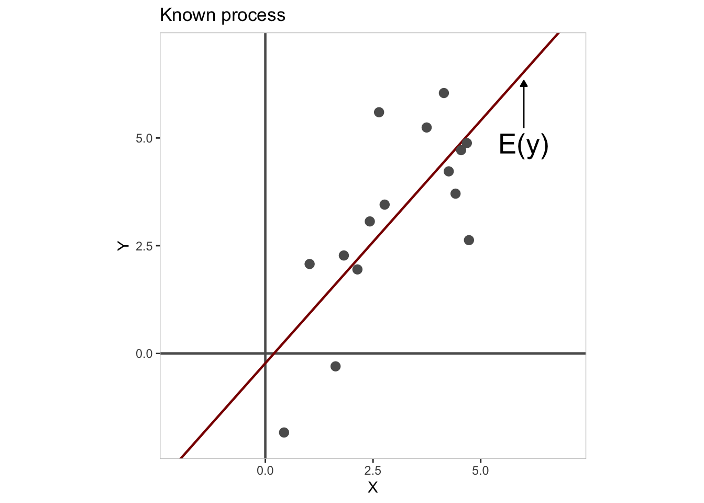

# (PART) Introduction to Statistics {-}

# Empirical Modeling {#empirical-modeling}

<!-- include libraries -->

<!-- kableExtra bootstrap css 
https://haozhu233.github.io/kableExtra/bookdown/use-bootstrap-tables-in-gitbooks-epub.html
-->

<!-- knit_hook: collapse and strip white 
this is a Blake hack -->

<!-- knit_hook: collapse and print error red
super hacky, see here: https://stackoverflow.com/a/54985678/7705429
we'll need to be careful to not string four # together anywhere
--->

<!-- chunk options -->

<!-- miscellaneous -->

<!-- 
make error messages closer to base R 
https://github.com/hadley/adv-r/blob/master/common.R
looks like it doesn't work because R no longer
let's users override s3 methods, so I changed the s3 to "simpleError"
-->

## Overview

<table class="table-intro table table-hover table-striped" style="margin-left: auto; margin-right: auto;">
<tbody>
  <tr>
   <td style="text-align:left;border: 0 solid transparent; padding-right: 0px; vertical-align: top;"> __Goal__ </td>
   <td style="text-align:left;border: 0 solid transparent; padding-left: 9px; text-align: justify; text-justify: inter-word;"> To understand the process of empirical modeling. </td>
  </tr>
  <tr>
   <td style="text-align:left;border: 0 solid transparent; padding-right: 0px; vertical-align: top;"> __tl;dr__ </td>
   <td style="text-align:left;border: 0 solid transparent; padding-left: 9px; text-align: justify; text-justify: inter-word;">  </td>
  </tr>
  <tr>
   <td style="text-align:left;border: 0 solid transparent; padding-right: 0px; vertical-align: top;"> __Outcomes__ </td>
   <td style="text-align:left;border: 0 solid transparent; padding-left: 9px; text-align: justify; text-justify: inter-word;"> Here, you will learn about <ol>
<li>modeling an outcome,</li>
<li>sampling from a population,</li>
<li>describing a sample, and</li>
<li>inferring properties of a population.</li>
</ol> </td>
  </tr>
  <tr>
   <td style="text-align:left;border: 0 solid transparent; padding-right: 0px; vertical-align: top;"> __Datasets__ </td>
   <td style="text-align:left;border: 0 solid transparent; padding-left: 9px; text-align: justify; text-justify: inter-word;"> NONE </td>
  </tr>
  <tr>
   <td style="text-align:left;border: 0 solid transparent; padding-right: 0px; vertical-align: top;"> __Requirements__ </td>
   <td style="text-align:left;border: 0 solid transparent; padding-left: 9px; text-align: justify; text-justify: inter-word;"> NONE </td>
  </tr>
  <tr>
   <td style="text-align:left;border: 0 solid transparent; padding-right: 0px; vertical-align: top;"> __Further Reading__ </td>
   <td style="text-align:left;border: 0 solid transparent; padding-left: 9px; text-align: justify; text-justify: inter-word;"> NONE </td>
  </tr>
</tbody>
</table>

Empirical modeling is for scientists what inquiry is for the philosopher Charles Sanders Peirce, a process by which one moves from a state of doubt or uncertainty about some topic to one of belief, understanding, or certainty. For Peirce, this process is almost mechanical, like a reflex response to the irritation of a nerve. You find yourself stirred by the "irritation of doubt" to find a belief that puts your questioning mind to rest. For models, the process is strikingly similar. Uncertainty tugs on a model like a stretched spring, compelling it to settle on a state of energetic equilibrium.^[Joshua Loftus' blog post on [Least squares as springs](https://joshualoftus.com/posts/2020-11-23-least-squares-as-springs/) actually gave me the idea for this analogy.] The objective, in either case, is to _minimize uncertainty_ about some topic, as far as that is possible. In what follows, we'll unpack this idea in more detail, starting first with the very idea of an empirical model.   

## Model components

Consider this innocuous scenario: _a jar contains some number of marbles, which you are asked to estimate_. Rather than thinking about how you might actually go about estimating the number of marbles here, let's look at general features of the scenario itself, especially the two critical pieces of information it provides. First, the scenario indicates that the jar contains an actual - albeit unknown - number of marbles. This we will refer to as the __outcome__ and denote $y$. Second, we have your estimate of $y$, or what we will call your __expectation__ of $y$'s value and denote $E[y]$. From these two variables, we can actually calculate a third, namely, the __error__ in your estimate, which we denote by convention with the Greek letter $\epsilon$ (epsilon). The error measures the difference between the actual or observed value of $y$ and your expectation $E[y]$.  

Together, these three ingredients give us all the raw materials we need to define an empirical model. It boils down to this simple formula:

$$ y = E[y] + \epsilon $$

where, again, 

* $y$ is the outcome, 
* $E[y]$ is the expectation of $y$, and 
* $\epsilon$ is the error.

In a manner of speaking, this formula _decomposes_ your outcome variable - your data - into a more certain component (the expectation) and a less certain component (the error).  

### Outcome

The outcome, $y$, is a __random variable__ consisting of the value of each _possible_ outcome or combination of outcomes in a __sample space__. Importantly, each numeric value has a probability of occurrence such that we can define the distribution of probabilities over all outcomes. This distribution is known as the __probability distribution__ of the random variable.  

For example, the sample space for a fair, six-sided dice would be the set {1, 2, 3, 4, 5, 6} and its probability distribution would be {1/6, 1/6, 1/6, 1/6, 1/6, 1/6}.

<!-- consists of the observed values of a variable we want to explain. The variable itself is simply a property, either of events or of things. Some examples, pulled haphazardly from my own mind, include:

* The _magnitude_ of an earthquake,
* The _height_ of a person,
* The _grade_ of a student,
* The _bitterness_ of a beer,
* The _color_ of a marble,
* The _run time_ of a race.

Each of these properties will have a certain value that can be observed and/or measured. Run times in a marathon, for example, will have a unique value for each runner, which is measured in continuous durations of time, like 2 hours, 34 minutes, and 32 seconds (or 2:34:32). So, we have the variable for our outcome, which is a common property of some type of thing, and we have its observed or measured values for individual instances of that type.  

Typically, the outcome is the result of some underlying empirical process. In the case of the jar of marbles, the underlying process would just be that someone filled it up, though other attributes might be more or less relevant, for instance, the jar's volume. For run times in a race, the underlying process might be the number of hours of practice in the previous year.

-->

### Expectation

, which we derive from our prior knowledge or understanding of the underlying process. 

If we have no information about the underlying process, our 

### Error

, which we can characterize as the mismatch between our expectation and what we actually observe.

$$ \epsilon = y - E[y] $$
<!--
This implies that the closer our expectation, $E(y)$, gets to the observed value of the outcome, $y$, the smaller our uncertainty, $\epsilon$, becomes. So, we can think of the process of model building as getting our expectations into agreement with what we observe. And, because we derive our expectations from our prior knowledge or understanding, any change to our expectations owing to a mismatch with observation ought to lead us to revise our beliefs.

I have this very simple theory that _rain makes things wet_. From this theory, I derive the following hypothesis:  

$H_{1}$ If it rains, then the sidewalk will become wet.  

Now suppose that on some occasion I observe that it is raining. Combining that observation with my hypothesis $H_{1}$, I predict that the sidewalk is wet. Having made this prediction, I can now go out and check.  

$$ \epsilon \sim N(0, \sigma) $$
-->

## Model process

1. Gather data (sample from outcome).  
2. Build model (describe property of sample).  
2. Compare model to alternatives (infer property of population).  

### Sampling

### Describing

or, model building

### Inferring

$$
\begin{aligned}
  y &= E(y) + \epsilon \\
  E(y) &= mu \\
  \epsilon &\sim N(0, sigma) \\
\end{aligned}
$$

