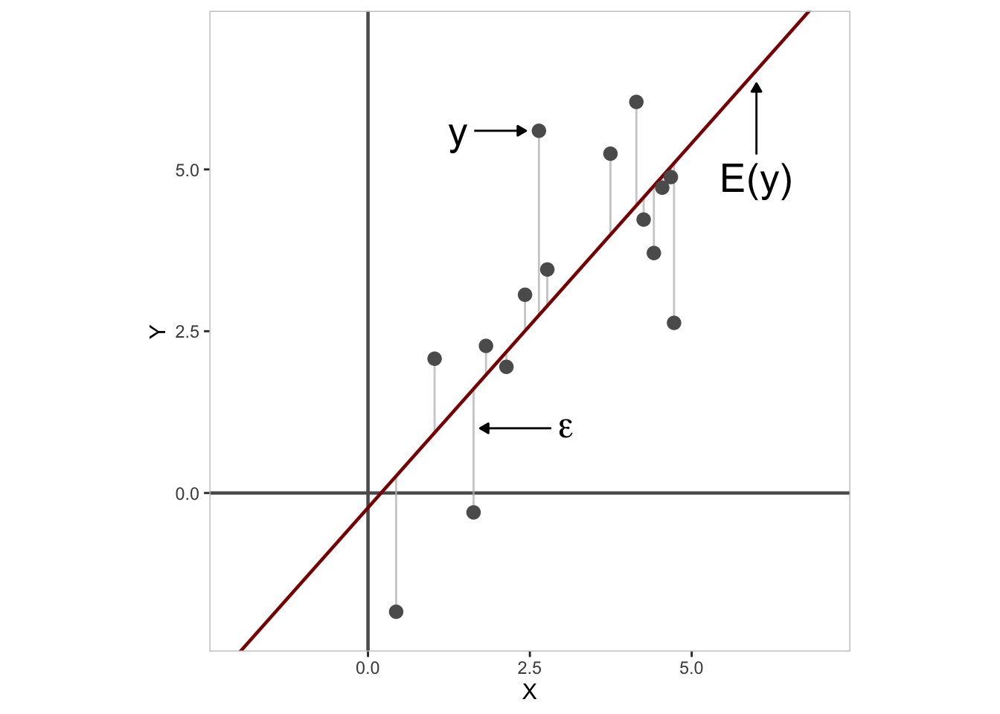

# (PART) Introduction to Statistics {-}

# What is Statistics? {#whatisstats}

<!-- include libraries -->

<!-- kableExtra bootstrap css 
https://haozhu233.github.io/kableExtra/bookdown/use-bootstrap-tables-in-gitbooks-epub.html
-->

<!-- knit_hook: collapse and strip white 
this is a Blake hack -->

<!-- knit_hook: collapse and print error red
super hacky, see here: https://stackoverflow.com/a/54985678/7705429
we'll need to be careful to not string four # together anywhere
--->

<!-- chunk options -->

<!-- miscellaneous -->

<!-- 
make error messages closer to base R 
https://github.com/hadley/adv-r/blob/master/common.R
looks like it doesn't work because R no longer
let's users override s3 methods, so I changed the s3 to "simpleError"
-->

$$
\begin{aligned}
  y &= E(y) + \epsilon \\
  E(y) &= mu \\
  \epsilon &\sim N(0, sigma) \\
\end{aligned}
$$

I like this because it is modular. You can use this to explain: 
-	what does E(y) mean? It’s the expected value or what you would guess as the value for any new observation of y. Why is it constant? Well, we don’t have any other information to control how it varies. 
o	Now it’s a short step to add in X. And the nice thing is that you only now have to change the E(y) definition to E(y) = beta X.
-	What does sigma mean? It’s a measure of how much observed y varies around mu. We don’t know exactly what this variation might be, but we can try to quantify the range of errors. 
o	Better yet, we don’t just say that the variation is between +/- sigma, but that there is probability of errors, which is higher closer to mu, and then drops off away from it. 
o	It’s easy then to change the description of the errors. We’ve used a normal distribution, but if your data don’t match this, you can change N(0, sigma) to Pois(lambda), or Binom(pi) giving you a GLM. (You need a link function as well, but that’s pretty straightforward) 
o	You can use this to explain iid – why is the 0 important in the errors? It’s so that the errors are unbiased (which they should be), and that these are symmetric with a normal distribution
-	Other things:
o	You can explain heteroscedascity by changing sigma to sigma_i
o	Mixed models change sigma to sigma_j (where j is the group membership)
o	Temporal or spatial models just alter sigma to two components, u and v, and then you can start to explain how you model u (the spatial error).
