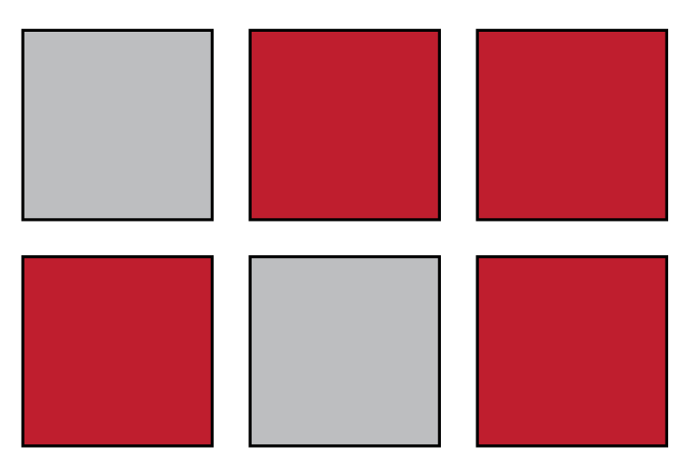

# Univariate Description {#univariate-description}

```{r, include = FALSE, echo = FALSE, child = "R/before_chunk.Rmd"}
```

## Overview

```{r, echo = FALSE, results = 'asis'}

insert_intro(
  goal = "To learn how to model an outcome using properties of the outcome itself.",
  tldr = "For a single variable model, Expectation = central tendency, Error = variability.",
  outcomes = c("measures of central tendency, and", 
               "measures of variability."),
  datasets = list(),
  requirements = list(),
  readings = list()
)

```

As a way of priming you for the topics we'll cover here, consider this toy scenario. You have six squares, as shown in Fig. \@ref(fig:outcome-squares), with four of them being red, two gray. 

```{r outcome-squares, echo = FALSE, out.width = "40%", fig.cap = "Outcome of an unknown process."}



```

You can think of these squares as being the result of an experiment, with the outcome of interest being the observed color. Let's stipulate, as well, that you have no information about _why_ they are these colors. You don't know, for example, that the author has a preference for dark reds and grays. Now, suppose we shuffle these squares, then have you select one at random, without looking. What color do you expect to draw? The answer, I hope, is red. Why? Because there are more of them! In which case, you are more _likely_ to draw red just by chance.   

And, just like that, lacking any information about how this particular outcome came to be, you still managed to form a pretty reasonable expectation about it solely on the basis of the value it _tends_ toward or is _more likely to take_. The technical term for this value of the outcome is its __central tendency__, though you will sometimes hear it referred to as the _location_ of your data. As the name suggests, this is the value around which observations of your outcome tend to cluster.  

Fortunately, that is not the _only_ information we can extract from this scenario, for suppose now that we had you repeat this exercise, say, a hundred times. How often do you think, having guessed red, that gray would actually be the color to come up? Roughly a third of the time, right? And, why is that? Because the _proportion_ of squares that are gray is one-third! That is to say, in spite of your expectation, and just by chance, you should draw a gray square one-third of the time. 

Thus, you have won this additional bit of new knowledge, a precise, quantitative expectation about your own error, the technical for which is __variability__, also sometimes referred to as _uncertainty_.^[I know, I know. The actual variance according to the binomial distribution is $np(1-p)$, in this case $(100*0.66)(1-0.66)$, which is around 22.2. I'm working up to that in the most natural and intuitive way I can, even if it involves some falsehoods along the way. Something, something, Kahlil Gibran.] This is a measure not just of the actual but of the _expected_ disagreement between your expectation and the outcome.  

You now have the makings of an empirical model. On the one hand, you have your expectation about the outcome, which you have identified with its central tendency. And, on the other hand, you have your expectation of the error or variability. Because this involves a single random variable, you have just engaged in what we will refer to it as __univariate description__, understood here as the act of building a model of an outcome in terms of its central tendency and variability. Framed in terms of our fundamental formula

$$ y = E[y] + \epsilon $$
you have just specified that   

* $E[y] =$ central tendency and  
* $\epsilon \sim$ variability.

Obviously, this is going to take some unpacking, which we'll turn to now. Along the way, we'll talk about how to calculate these values and how to visualize them in R.   

```{block2, type = "rmdwarning"}
Instead of using $y$ as our variable, we are going to switch to using $x$, as it is common when covering these topics to use that notation. However, nothing hangs on this, and if it helps, you can simply imagine that all the $x$'s are actually $y$'s.
```


## Central tendency


For continuous and discrete numeric data, the most common measures of central tendency are the mean and the median. 


### Mean

$$ E[x] = \mu $$

where $\mu$ is the __population mean__. 

$\bar{x}$ = sample mean

$$ \bar{x} = \frac{1}{n} \sum_{i=1}^{n} x_{i} $$

where $n$ is the size of the sample and each $x_{i}$ is a value of an individual $i$ in the sample.

```{block2, type = "rmdnote"}
The sample mean, $\bar{x}$, and the population mean, $\mu$, are calculated using the same function - it's just the average after all, but with slightly different notation. Where $\bar{x}$ uses small $n$ to denote the total number of individuals in a _sample_, $\mu$ uses big $N$ to denote the total number of individuals in a _population_.
```


```{r, echo = FALSE}

x <- sample(1:10, size = 5, replace = TRUE)

```

x = {`r paste(x, sep = ", ")`}

```{r}

# number of observations in the sample
n <- length(x)

# sum of the observations
Ex <- sum(x)

# mean of the sample
(1/n) * Ex

```

This can be done more compactly with the `mean()` function provided by base R.

```{r}

mean(x)

```

Note that you will on occasion encounter variables that include missing or `NA` values. Because we do not know those values, we cannot _technically_ know the mean of the variable. The function `mean()` registers this fact by returning `NA` in such cases. To avoid this, and to calculate the mean of the _known_ values of the variable, we can specify the parameter `na.rm = TRUE`, which means "remove the NA values before computing the value of the variable." 

```{r, echo = FALSE}

x_NA <- c(x[c(1, 3)], NA, x[c(2, 4, 5)], NA)

```


```{r}

mean(x_NA)

mean(x_NA, na.rm = TRUE)

```


### Median

$$ 
med(x) =
\begin{cases}
  x\left[i = \frac{n+1}{2}\right] & \text{if n is odd} \\\\
  \frac{1}{2}\left(x\left[i = \frac{n}{2}\right] + x\left[i = \frac{n}{2}+1\right]\right) & \text{if n is even} 
\end{cases} 
$$

__Odd number of observations__

```{r, echo = FALSE}

n <- 6

x_even <- rnorm(n, mean = 170, sd = 20)

x_odd <- sample(x_even, size = n-1)

```

```{r}

# sort the value from lowest to highest
x <- sort(x_odd)

# count the number of values
n <- length(x)

# find the middle position
i <- (n + 1)/2

# now retrieve the value at that position
x[i]

```

But, there's actually a function for this in R.

```{r}

median(x_odd)

```

__Even number of observations__

```{r}

x <- sort(x_even)

n <- length(x)

i_left <- n/2
i_right <- i_left + 1

# now we find the value half way between 
# the center left and center right positions
(x[i_left] + x[i_right])/2

median(x)

```


## Variability


All samples are discrete, regardless of the nature of the population random variable!

### Variance

The expected amount of difference between (the square of) the observed and the mean values.

$\sigma^{2}$ = population variance

$s^{2}$ = sample variance


For discrete variables, the population variance is given by:

$$ \sigma^{2} = \sum_{i=1}^{N} p_{i}(x_{i}-\mu)^{2} $$
For continuous variables, the population variance is given by:

$$ \sigma^{2} = \int p(x_{i})dx\;(x_{i}-\mu)^{2} $$
where the expression $p(x_{i})dx$ defines the probability that the observed value of $x$ falls in the range $dx$. 

Sample variance is _always_ discrete, hence we define the sample variance as

$$ s^{2} = \frac{1}{n-1} \sum_{i=1}^{n} (x_{i} - \bar{x})^{2} $$


### Standard deviation


### Quantiles


## Categorical Data

### Mode

### Counts and proportions