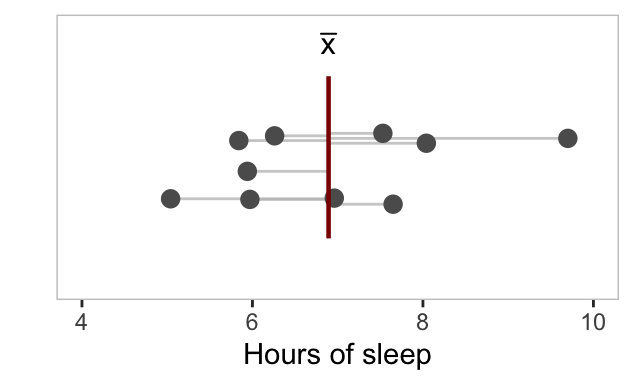

# Univariate Description {#univariate-description}


<!-- include libraries -->


<!-- kableExtra bootstrap css 
https://haozhu233.github.io/kableExtra/bookdown/use-bootstrap-tables-in-gitbooks-epub.html
-->


<!-- knit_hook: collapse and strip white 
this is a Blake hack -->


<!-- knit_hook: collapse and print error red
super hacky, see here: https://stackoverflow.com/a/54985678/7705429
we'll need to be careful to not string four # together anywhere
--->

<script>
$(document).ready(function() {
  window.setTimeout(function() {
    $(".co:contains('####')").css("color", "red");
    var tmp = $(".co:contains('####')").text();
    $(".co:contains('####')").text(tmp.replace("####", "##"));
  }, 15);
});
</script>


<!-- chunk options -->


<!-- miscellaneous -->


<!-- 
make error messages closer to base R 
https://github.com/hadley/adv-r/blob/master/common.R
looks like it doesn't work because R no longer
let's users override s3 methods, so I changed the s3 to "simpleError"
-->


## Overview

<table class="table-intro table table-hover table-striped" style="margin-left: auto; margin-right: auto;">
<tbody>
  <tr>
   <td style="text-align:left;border: 0 solid transparent; padding-right: 0px; vertical-align: top;"> __Goal__ </td>
   <td style="text-align:left;border: 0 solid transparent; padding-left: 9px; text-align: justify; text-justify: inter-word;"> To learn how to model an outcome using properties of the outcome itself. </td>
  </tr>
  <tr>
   <td style="text-align:left;border: 0 solid transparent; padding-right: 0px; vertical-align: top;"> __tl;dr__ </td>
   <td style="text-align:left;border: 0 solid transparent; padding-left: 9px; text-align: justify; text-justify: inter-word;"> For a single variable model, Expectation = central tendency, Error = variability. </td>
  </tr>
  <tr>
   <td style="text-align:left;border: 0 solid transparent; padding-right: 0px; vertical-align: top;"> __Outcomes__ </td>
   <td style="text-align:left;border: 0 solid transparent; padding-left: 9px; text-align: justify; text-justify: inter-word;"> Here, you will learn about<br><ol>
<li>measures of central tendency, and</li>
<li>measures of variability.</li>
</ol> </td>
  </tr>
  <tr>
   <td style="text-align:left;border: 0 solid transparent; padding-right: 0px; vertical-align: top;"> __Datasets__ </td>
   <td style="text-align:left;border: 0 solid transparent; padding-left: 9px; text-align: justify; text-justify: inter-word;"> NONE </td>
  </tr>
  <tr>
   <td style="text-align:left;border: 0 solid transparent; padding-right: 0px; vertical-align: top;"> __Requirements__ </td>
   <td style="text-align:left;border: 0 solid transparent; padding-left: 9px; text-align: justify; text-justify: inter-word;"> NONE </td>
  </tr>
  <tr>
   <td style="text-align:left;border: 0 solid transparent; padding-right: 0px; vertical-align: top;"> __Further Reading__ </td>
   <td style="text-align:left;border: 0 solid transparent; padding-left: 9px; text-align: justify; text-justify: inter-word;"> NONE </td>
  </tr>
</tbody>
</table>

As a way of priming you for the topics we'll cover here, consider this somewhat bland adaptation of an already bland scenario. You have six balls, with four of them being red, two gray, as shown in Fig. \@ref(fig:balls-and-urn). You can think of these balls as being the result of an _experiment_, with the outcome of interest being their color. Let's stipulate, as well, that you have no information about _why_ they are these colors. You don't know, for example, that the author has a preference for dark reds and grays.    

<div class="figure" style="text-align: center">

<p class="caption">(\#fig:balls-and-urn)Colored balls and urn. Outcome of an unknown process.</p>
</div>

As part of this thought experiment, suppose we plop them in a jar, shake it up, then have you select one at random. Without looking, what color do you expect to draw? The answer, I hope, is red. Why? Because there are more of them! So, you are more _likely_ to draw red just by chance. Now, think about what you just did. Lacking any information about how this particular outcome came to be, you still managed to form a pretty reasonable expectation about it solely on the basis of the value it _tends_ toward or is _more likely to take_. This value of the outcome is commonly referred to as its __central tendency__, though you will sometimes hear it described as the _location_ or the _first moment_ of some data. As the name suggests, this is the value around which observations of your outcome tend to cluster.  

Fortunately, that is not the _only_ information we can extract from this scenario, for suppose now that we had you repeat this exercise, say, a hundred times, replacing the ball each time. How often do you think, having guessed red, that gray would actually be the color to come up? Roughly a third of the time, right? And, why is that? Because the proportion of balls that are gray is one-third! That is to say, in spite of your expectation, and just by chance, you should draw a gray ball one-third of the time. Thus, you have won this additional bit of new knowledge, a precise, quantitative expectation about your own error, otherwise known as __variability__, _dispersion_ in the outcome, or your _uncertainty_, also commonly referred to as the _second moment_ of your data. This is a measure not just of the actual but of the _expected_ disagreement between your estimate and the observed outcome.  

To make this a little more tangible and perhaps a little more relevant to you, think about how many hours of sleep you _tend_ to get each night. Whatever it happens to be, this number defines your, shall we say, slumbering expectation. Obviously, this is going to be affected by a lot of variables, like the oceans of coffee you regularly consume, or the way time seems to drag you, despite your protestations, into unavoidable collisions with looming deadlines. Even without that knowledge, though, you can still get a pretty good sense of your sleep _habits_ by looking just at your sleep _tendencies_.  

<div class="figure" style="text-align: center">

<p class="caption">(\#fig:sleep-pattern)Observed hours of sleep per night over the last thirty days, relative to the expectation of seven hours of sleep per night.</p>
</div>

You can even use that expectation to measure variability in the length of "great nature's second course."^[A line from Macbeth I am using because I don't want to say the word 'sleep' five hundred times...] If you know, for example, that you tend to get seven hours of sleep each night, and you conveniently - at least for our purposes - recorded your hours of sleep over the last 30 days, your sleep pattern might look like that shown in Fig \@ref(fig:sleep-pattern). From these observations, you can see that your un-waking life tends to last between five and nine hours (nine blessed hours!) each night. This then allows you to formulate an expectation about your error, that it tends to be two hours more or two hours less than your typical night of sleep. We can actually say even more about your expected error, but we're building up to that!   

Just note for now all that you have already gleaned from these simple observations. In particular, you now have the makings of an empirical model. On the one hand, you have your expectation about the outcome, which you have identified with its central tendency. And, on the other hand, you have your expectation of the error, or uncertainty. Because these descriptions involve a single random variable, you have just engaged in what we will refer to as __univariate description__, defined as the building of a model of an outcome in terms of its central tendency and variability. Framed in terms of our fundamental formula

$$ y = E[y] + \epsilon $$
you have just specified that   

* $E[y] =$ central tendency and  
* $\epsilon \sim$ variability.

Note that both the central tendency and the variability are single values (scalars in R-speak). Specifically, they are _statistics_ that summarize properties of your sample, in this case the value the sample tends to take and the error around that value. Clearly, these are some complex ideas, so this is going to take some unpacking.

Before we get to that, however, we need to emphasize two important limitations of these very simple univariate models, both owing to the fact that the models describe a _sample_ consisting of a _single variable_. First, because they describe a sample, they can only _approximate_ the true central tendency and variability of the _population_. And second, because the sample consists of a single variable, the models cannot in any meaningful sense _explain_ variability in the outcome. Why, you might wonder, did I sleep two more hours than expected that one Monday last month? Answering with "because that's what I did," while technically true, is not terribly informative.  

That being said, univariate models offer us some powerful tools for getting a handle on our data. They'll also play an important role in how we evaluate more complex multivariate models later on, where the goal really is to explain variability in a population, so let's dive into just how exactly we generate these descriptions.  

\BeginKnitrBlock{rmdwarning}<div class="rmdwarning">Instead of using $y$ as our variable, we are going to switch to using $x$, as it is common when covering these topics to use that notation. However, nothing hangs on this, and if it helps, you can simply imagine that all the $x$'s are actually $y$'s.</div>\EndKnitrBlock{rmdwarning}


## Central tendency

Central tendency, otherwise known as the location of a variable or its first moment, refers to the expected value of a variable. The two most common measures of it are the mean and the median. Their slightly less popular cousin is the mode, which is typically reserved for categorical data. 

### Mean

If you recall, we are defining our expectation for an outcome, $x$, in terms of its central tendency. In this case, we measure the central tendency using the mean, hence our expectation is: 

$$ E[x] = \mu $$

where $\mu$ is the __population mean__. Given the practical limitations of ever measuring this value directly, we must estimate it using the __sample mean__, by convention denoted $\bar{x}$ and defined as the sum of the sample values divided by the number of values (the average, in other words). As a simple formula, that is:

$$ \bar{x} = \frac{1}{n} \sum_{i=1}^{n} x_{i} $$

where $n$ is the number of values and each $x_{i}$ is a value of an individual $i$ in the sample. 

\BeginKnitrBlock{rmdnote}<div class="rmdnote">The sample mean, $\bar{x}$, and the population mean, $\mu$, are calculated using the same function - it's just the average after all, but with slightly different notation. Where $\bar{x}$ uses small $n$ to denote the total number of individuals in a _sample_, $\mu$ uses big $N$ to denote the total number of individuals in a _population_.</div>\EndKnitrBlock{rmdnote}

Suppose we did a study of the sleep behavior of college students on US campuses, using a phone app to measure various aspects of their sleep through a normal semester. To keep this simple, we'll assume a sample size of ten. And the primary outcome we are measuring is hours of sleep per night.  


```r
x <- sample(population, size = 10)

x
##  [1] 6.96 7.53 5.04 7.65 9.70 5.97 8.04 5.84 5.94 6.26
```

Using our simple equation, we can calculate the mean of this sample using the following R code:


```r
# number of observations in the sample
n <- length(x)

# sum of the observations
Ex <- sum(x)

# mean of the sample
(1/n) * Ex
## [1] 6.893
```

We can also write that more compactly using the `mean()` function.  


```r
mean(x)
## [1] 6.893
```

This sample mean is our estimate of the population mean, it is the number of hours of sleep we expect a _typical_ college student to get. Of course, other details about a student might inform on whether they get more or less sleep than expected. You don't have to look all that hard for the usual suspects:  

* diet: are they, perhaps, subsisting on cheetos and soda?  
* exercise: or lack thereof? 
* stress: are they working two jobs? late on rent? facing important deadlines? 
* disease: are they sick or otherwise unwell?  

These are all critical factors that will affect the amount of sleep an individual is getting. I'm sure you can add to this list with a little thought. Unfortunately, our study - our overly simplistic study - didn't give us that information! All we know is the amount of sleep per night reported in our sample, so that is the only basis we have for forming any expectation about the amount of sleep a random college student should get on any given night. But, don't let that get you down! Even if we had those other variables available and wanted to use them to explain some of that variation around the mean, we would still, obviously, need the sample mean to do it!   

Note that you will on occasion encounter variables that include missing or `NA` values. Because we do not know those values, we cannot _technically_ know the mean of the variable. The function `mean()` registers this fact by returning `NA` in such cases. To avoid this, and to calculate the mean of the _known_ values of the variable, we can specify the parameter `na.rm = TRUE`, which means "remove the NA values before computing the value of the variable." 


```r
x_NA
##  [1] 6.96 5.04   NA 8.04 5.94 7.65 9.70   NA   NA 7.53 5.97 5.84 6.26   NA
mean(x_NA)
## [1] NA
mean(x_NA, na.rm = TRUE)
## [1] 6.893
```


You will sometimes hear the mean referred to as the _center of mass_ for a set of data because it divides that data into two sets of equal mass. You can thus visualize it as a fulcrum, like on a playground see-saw (or any other lever, really), with your observations piled up on either side so that they are perfectly balanced. Thinking about it this way makes it easier to see how the mean can be sensitive to outliers. That's because as one or more values get bigger and bigger (or smaller and smaller), you have to shift more and more of your observations to one side to counteract the mass of those outliers. Take, for example, income inequality in the United States, something we seem to excel at as a country, for better or worse - just worse, really. The center of mass of US income in 2018 was right around $90,000 a year. It will perhaps come as no surprise to you that most Americans, more than half, made way, way, way less than that. Or, to put that in slightly different terms, a tenth of all income flowed to the top one percent, and nearly half of all income went to the top twenty percent! Meaning, 20% of the populace brings home an income (has a mass) relatively equal to the other 80%! The consequence, of course, is that using the mean will severely over-estimate the real income of a substantial portion of the population.   

We, therefore, need another way of looking at the central tendency of a variable like income that is less sensitive to these outliers. So, let's talk about the concept of a median!  


### Median

The median is the _middle_ value of a variable, or the point that divides its values in half, meaning half the observations are less than this value and half are greater than it. Because it divides the data in this way, finding it requires ordering values of a variable from least to greatest, then looking for the halfway point, that _position_ in the data, and then identifying the value of the variable _there_. The median is that value. This is slightly complicated by the fact that an exact solution will depend on whether a variable contains an even or an odd number of observations, for when the variable has an even number of observations, the median is not the value of an observation but the value halfway between two observations. 

$$ 
med(x) =
\begin{cases}
  x\left[i = \frac{n+1}{2}\right] & \text{if n is odd} \\\\
  \frac{1}{2}\left(x\left[i = \frac{n}{2}\right] + x\left[i = \frac{n}{2}+1\right]\right) & \text{if n is even} 
\end{cases} 
$$

This set of equations might be a little intimidating for the uninitiated, but it actually uses some syntax we learned for indexing vectors in R, specifically the bracket operator, `[`, with $x$ being the vector that is subset: 


```r
x[i]
```

Thinking about it this way, the procedure really just boils down to two steps: first, find the position $i$ in your data; then, use $i$ to index $x$. If the data is even, of course, you'll have to find two positions, get the values there, then find the value halfway between them. Let's walk through an example with our college sleep data. First, note that it has an even number of observations, specifically ten, so for demonstration purposes we'll need to remove one value to get an odd number.  


```r
x_even <- x

x_odd <- x[-length(x)] # remove the last number
```

Now, let's look at our two scenarios.  

__Odd number of observations__


```r
# sort values from lowest to highest
x_odd <- sort(x_odd)

x_odd
## [1] 5.04 5.84 5.94 5.97 6.96 7.53 7.65 8.04 9.70
# count the number of values
n <- length(x_odd)

# find the middle position
i <- (n + 1)/2

# now retrieve the value at that position
x_odd[i]
## [1] 6.96
```

Voila! The median! Simple, right? Well, actually, it's even simpler than you thought, for there's an R function for that.  


```r
median(x_odd)
## [1] 6.96
```

__Even number of observations__


```r
x_even <- sort(x_even)

n <- length(x_even)

i_left <- n/2
i_right <- i_left + 1

# now we find the value half way between 
# the center left and center right positions
(x_even[i_left] + x_even[i_right])/2
## [1] 6.61
# but again, simpler this way
median(x_even)
## [1] 6.61
```


### Mode

The mode is a measure of the most frequent value in a data set. Of all the measures of central tendency, it is unique in that it can be applied to categorical data. For example, the mode of the colored balls in Fig. \@ref(fig:balls-and-urn) is _red_, as that is the value that occurs most often. On occasion, the mode may also apply to a discrete variable. For instance, the mode of the vector `c(2, 3, 3, 4, 5)` is 3, since it occurs twice and the other values only once. Technically, the mode can be used to describe continuous variables, too, though how often do you expect a number like 42.291092847123452667 to occur in your data? That is to say, for continuous data it is highly unlikely that any two values will ever be _exactly_ the same; hence, it is also unlikely for such data to have a mode.


## Variability


Variability, otherwise known as dispersion, uncertainty, or the second moment of a variable, refers to its expected error. There are two primary measures of variability, the variance and the standard deviation. Before, we get to those, however, let's think a little bit about what we mean by expected error. There are two parts to this, the _expectation_ and the _error_. The error is easy enough to explain. As we learned already, it's the difference between the observed and the expected outcome. That is,

$$ \epsilon = y - E[y] $$

where the expectation is defined by the sample mean, $E[y] = \bar{x}$. Here is how that looks in R using our college sleep data:


```r
# get sample mean
xbar <- mean(x)

# calculate errors (epsilon, e)
errors <- (x - xbar)
```

Now, what about the _expectation_ of the errors? We already have the idea of expected value, which we identified with the central tendency, typically the mean of the observations. As a first approximation then, we might try to measure variability using the mean of the errors: 

$$ \frac{1}{n} \sum_{i=1}^{n} (x - \bar{x}) $$

Let's try that approach with our sleep data.


```r
# number of errors
n_errors <- length(errors)

# calculate mean of errors
sum(errors) / n_errors
## [1] 0
```

It's zero! But, why? Let's look at the way the actual values fall out relative to the mean, as shown in Fig. \@ref(fig:center-mass).  

<div class="figure" style="text-align: center">

<p class="caption">(\#fig:center-mass)Center of mass of college sleep data.</p>
</div>

Now, let's have a look at the sum of the errors above the mean (errors greater than zero) and the sum of the errors below the mean (errors less than zero):


```r
sum(errors[errors < 0])
## [1] -5.415
sum(errors[errors > 0])
## [1] 5.415
```

They're the same, but with different signs! That means when you sum all of them together, you get zero! Hence, dividing by the number of observations, $n$, still returns zero as the mean of the errors. While that is technically correct, it is not terribly informative, especially when what we want is not just the _difference_ but the _distance_ between the observed and expected, which is always positive. Now, how do we get that? The standard solution is to square the errors first, then divide by the number of observations. This is known as the __variance__.  


### Variance

To be precise, variance is defined as the expected amount of difference between the square of errors. For discrete variables, the population variance, $\sigma^{2}$, is given by:

$$ \sigma^{2} = \frac{1}{N} \sum_{i=1}^{N} (x_{i}-\mu)^{2} $$
The sample variance, $s^{2}$, is then defined as:

$$ s^{2} = \frac{1}{n-1} \sum_{i=1}^{n} (x_{i} - \bar{x})^{2} $$


### Standard deviation


## Quantiles

median

quartiles = divide into four
quentiles = five
deciles = ten
percentiles = 100


