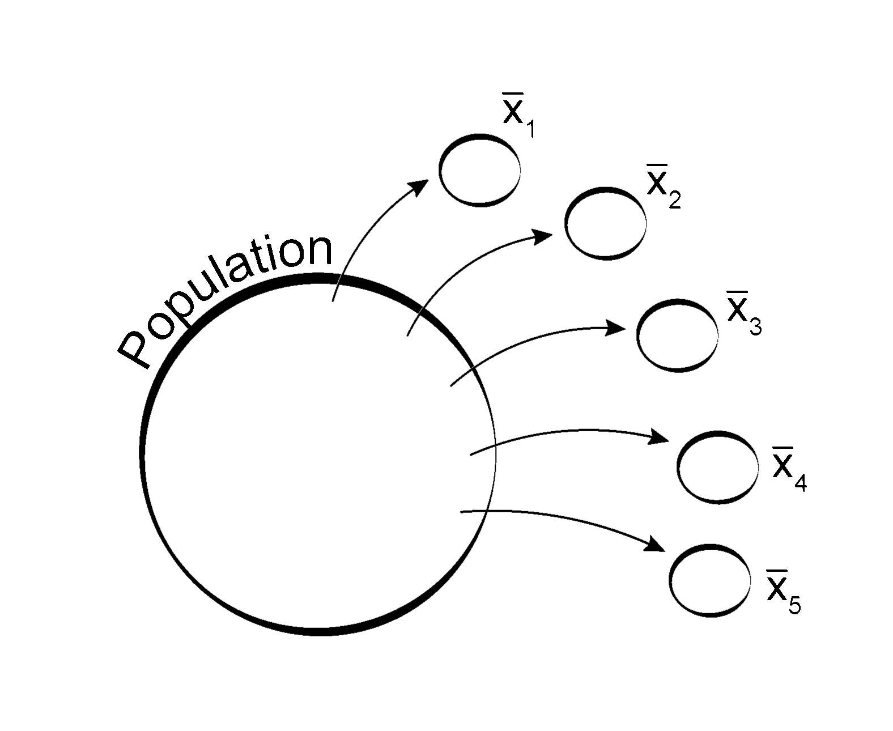

# Inference Tests {#inference-tests}

```{r, include = FALSE, echo = FALSE, child = "R/before_chunk.Rmd"}
```

```{r, echo = FALSE, out.width = '70%', fig.cap = ""}


```

## Overview

```{r, echo = FALSE, results = 'asis'}

insert_intro(
  goal = "To understand the probability of drawing a sample and how to use that to compare models.",
  tldr = "Believe truth! Shun error!",
  outcomes = c("hypotheses and models,",
               "sampling distributions,", 
               "standard errors,", 
               "Central Limit Theorem,",
               "confidence intervals,", 
               "significance levels,",
               "p-values,",
               "t-test,", 
               "f-test, and", 
               "Chi-squared tests."),
  datasets = list(),
  requirements = list(),
  readings = list()
)

```


The process of statistical inference goes something like this:

1. First, we gather observations about the outcome of some empirical process, like a sample of student grades on an exam, a sample of the heights of players in the NBA, or a sample of viewer ratings for episodes of Star Trek.  
2. Next, we use properties (or statistics) of these samples to make claims about properties (or parameters) of the population from which they are drawn. We want to know, for example, if the sample mean provides a good approximation of the population mean, or if the sample variance provides a good approximation of the population variance.   
2. Then we evaluate our claims about the population by asking how probable or likely our sample would be if those claims were true. This takes the form of a comparison: would the data be _more_ likely or _more_ probable if our claims were true rather than false? Or, to put that in another, slightly more statistically appropriate way, would the data be _less_ likely or _less_ probable if our claims were false rather than true?      

Archaeology actually provides a really great and intuitive example of this process. We know that something happened in the past, some action or actions were taken by individuals living _there_. Those actions had concrete, material consequences that we refer to collectively as the _archaeological record_. Unfortunately, the archaeological record is never a complete record. It is not a census, in other words, of everything that has ever happened with our kind, and for obvious reasons, it can never be made into one. So, it's just a sample really, though a very important one. We use it to try to make sense of where we come from. On its basis, we make claims about the past. In testing those claims, we are asking whether the archaeological record would be more or less likely to look the way that it does were those claims true. We try, in other words, to tell a story about the past that makes sense of the record as we see it now.  

There's more to statistical testing than this, of course, which we'll get to in just a moment, but this should give you some sense of the idea. 


### Statistical hypotheses  

The claims we make about a population are known as statistical hypotheses. For any statistical test, there are two such hypotheses that we are comparing. These are known as the null and alternative respectively.

1. The __null hypothesis__, often denoted $H_{0}$, is sometimes referred to as the "No Difference" hypothesis. It is typically the _safer_ and _simpler_ claim, resting on the "status quo" by asserting an equality between a population parameter and another value. You can also think of this as a claim about what would happen just by chance.  
2. The __alternative hypothesis__, often denoted $H_{1}$, is a scientific claim of interest. It is typically the _riskier_ and more _complex_ alternative, reflecting a change to the "status quo" by asserting some difference on the basis of additional evidence between a population parameter and another value.  

```{block2, type = "rmdwarning"}
For any significance test, it is the null hypothesis that is being evaluated, the thought being that if we can reject the null hypothesis, that should give us some reason to accept the alternative. Crucially, this idea requires a precise specification of the null and alternative.  
```


## Rejecting the null

How do we decide whether to accept or reject the null hypothesis? Ultimately, this comes down to whether the null hypothesis makes what we actually observe extremely unlikely. If it does, we reject it. And if it doesn't, we accept it. This is very similar to a mode of argument known as _reductio ad absurdum_ (literally, "reduction to absurdity"), which goes something like this:

1. Assume that your null hypothesis is true. 
2. Try to derive an absurd result from it.
2. If you do get an absurd result, reject the null. 

In this case, the absurd result is making what we actually observe wildly implausible. Granted, improbable events do occur, but the thought is that they should be quite rare, at least if we want to go on thinking the universe is knowable. Thus, we should consider anything that might lead us to question the testimony of our own senses as being itself implausible. Or, that's the intuition anyway. But, how do we go about conducting this _reductio_ with actual maths?

Well, let's think about this for a moment. What we are trying to do here is to infer a population parameter from a sample statistic. So, what we need to do then is find some way to quantify the probability of our finding that particular sample statistic. Or, to put that more precisely, we need to quantify the probability of randomly drawing a sample with that statistic from a population. To do that, we need to define a sampling distribution.


## Sampling distribution

Suppose you take a single random sample from a population, maybe the population of actors who auditioned for the role of Thor in the Marvel Cinematic Universe, and you measured their heights (in centimeters, naturally), then took the mean.

```{r}

sample_001 <- c(200.9, 178.0, 206.6, 207.9, 185.4, 190.8, 208.4, 197.6, 194.7, 182.4)

mean(sample_001)

```

Now, we take another sample and calculate its mean.

```{r}

sample_002 <- c(188.0, 182.4, 200.3, 194.6, 177.0, 176.0, 204.4, 187.4, 206.0, 208.2)

mean(sample_002)

```

And, then we repeat this procedure, let's say, one hundred times, so that we have one hundred samples that we have collected and one hundred sample means that we have calculated. So, we're doing something like that shown in Fig. \@ref(fig:sampling-distribution). 

```{r sampling-distribution, echo = FALSE, out.width = "60%", fig.cap = "Drawing multiple samples from a population and calculating the mean for each sample."}



```

Here is some R code to demonstrate the idea. As this is actually really informative, we will just walk through all of it, starting with an arbitrarily defined population.  

```{r}

# for demonstration purposes, arbitrarily define the population
population <- runif(1000, min = 178.01, max = 210.01)

# get the true population mean
(population_mean <- mean(population))

```

Let's visualize this population now with a histogram, showing the density rather than frequency or count.

```{r, fig.cap = "Height of actors who auditioned for the role of Thor. The dark red line represents the population mean."}

# visualize the population distribution
hist(population,
     xlab = "Height (cm)",
     ylab = "Density",
     main = "",
     freq = FALSE)

# plot population mean
abline(v = population_mean, 
       col = "darkred",
       lwd = 2)

```

Note that we have defined our population using random draws from a uniform distribution. That is why the bars of the histogram are all basically the same height. They were all equally likely to be drawn. At any rate, let's actually collect our one hundred samples from this population of actors. For this, we'll assume a sample size of ten.  

```{r}

# number of samples
n_samples <- 100

# sample size
size <- 10

# sample the population one hundred times
# collecting the mean for each sample
sample_means <- rep(NA, n_samples)

# for-loop provides a useful way of iterating code
for (i in 1:n_samples) {
  sample_i <- sample(population, size = size)
  sample_means[i] <- mean(sample_i)
}

```

Now, what is this data we have here? It is, in effect, a sample of sample means. With it, we can actually compute additional statistics, for example, the mean of these means, typically denoted $\mu_{\bar{x}}$.

```{r}

(mean_of_means <- mean(sample_means))

```

We can also visualize the distribution of these sample means.

```{r, fig.cap = "Sampling Distribution of Sampling Means. The dark red line represents the mean of means."}

hist(sample_means,
     xlab = "Sample Means (cm)",
     ylab = "Density",
     main = "",
     freq = FALSE)

abline(v = mean_of_means, 
       col = "darkred",
       lwd = 2)

```

This is known as the __sampling distribution of the sample means__. A mouthful, for sure, but it actually provides us with some really powerful statistical concepts and information. For instance, we can use it to estimate the probability of drawing a sample with a certain mean, which is what we wanted all along! Before we get to that, however, let's dwell on some features of this distribution for a moment, in particular its central tendency, variability, and shape.  

### Variability of the sampling distribution

First, note the variability or spread in our sampling distribution. Some estimates are quite large, and others fairly small. That means, if we had just naively embraced one of our sample statistics, treating it as if it is the true population mean, we could be way off! Or, if we're lucky, you know just by chance, maybe we would get it just right. But, that is not guaranteed! So, here is an important lesson about sampling and why we need to think hard about the probability of getting a certain value of our sample statistic. Even a random sample, just by chance, could lead us astray.  

You might then want to ask yourself: how can I keep this from happening? Or, to put that slightly differently, how can I reduce the difference between an individual sample mean and the true population mean? The answer, it turns out, is quite simple and thankfully intuitive! You just have to increase the size of the sample! Watch what happens to our sampling distribution as we increase the sample size:

```{r, echo = FALSE, animation.hook = "gifski", fig.cap = "Reducing variability in sampling distribution by increasing sample size."}

sample_size <- c(10, 25, 50, 100, 250, 500)

df <- lapply(1:length(sample_size), 
             function(x) {
               
               n <- sample_size[x]
               
               sims <- rep(NA, n_samples)
               
               for (i in 1:n_samples) {
                 sample_i <- sample(population, size = n)
                 sims[i] <- mean(sample_i)
               }
               
               bob <- hist(sims, plot = FALSE)
               
               max_dens <- max(bob$density)
               
               xmin <- min(bob$breaks)
               xmax <- max(bob$breaks)
               
               data.frame(sim  = x, 
                          size = n,
                          vals = I(list(sims)),
                          mean = mean(sims),
                          dens = max_dens,
                          xmin = xmin,
                          xmax = xmax)
               
             })

df <- do.call("rbind", df)

ylims <- c(0, max(df$dens))
xlims <- c(min(df$xmin), max(df$xmax))

for (i in 1:length(sample_size)) {
  
  bill <- df[i,]
  
  bob <- bill$vals[[1]]
  
  hist(bob,
       freq = FALSE,
       xlab = "Sample Means (cm)",
       ylab = "Density",
       main = "",
       xlim = xlims,
       ylim = ylims)
  
  abline(v = bill$mean, 
         col = "darkred",
         lwd = 2)
  
  text(x = min(xlims),
       y = max(ylims) - 0.02,
       label = paste0("Sample size = ", bill$size),
       adj = 0)
  
}


```

It clusters more and more tightly around the mean of the sample means. More precisely, variability in the sampling distribution decreases as sample size increases. Formally, we say that the variance of the sampling distribution, denoted $\sigma_{\bar{x}}^{2}$, is inversely proportional to the sampling size:

$$ \sigma_{\bar{x}}^{2} = \frac{\sigma^{2}}{n} $$
where, you will recall, $\sigma^{2}$ is the variance of the population. Thus, the standard deviation of the sampling distribution is just the square root of this, or:

$$ \sigma_{\bar{x}} = \frac{\sigma}{\sqrt{n}} $$

This is also known as the __standard error of the mean__ (or __SEM__). You will see this value come up again and again in many of the inference tests we cover. Unfortunately, R does not actually provide a function to calculate this value, but it's fairly straightforward to do manually. 

```{r}

# calculate sample size
sample_size <- length(sample_means)

sample_var <- var(sample_means)

sqrt( sample_var/sample_size )

```

If you are going to calculate the standard error a lot in whatever analysis you are working on, you may consider writing this as a function:

```{r}

# see https://stackoverflow.com/a/2677859
se <- function(x, ...) sqrt( var(x, ...)/length(x) )

se(sample_means)

```


### Central tendency of the sampling distribution

Now, what about the central tendency of the sampling distribution? Well, while any individual sample mean might be off, taken together the means of the samples appear to converge on the true population mean. The population mean is their central tendency, in other words, which is just a way of saying that the mean of the sampling means is, or at least very closely approximates, the true population mean!  

* Mean of population:     `r round(population_mean, digits = 2)` cm.  
* Mean of sampling means: `r round(mean_of_means, digits = 2)` cm.  
* Mean of sample 42:      `r round(sample_means[42], digits = 2)` cm.  


### Shape of the sampling distribution

Sampling distribution more and more closely approximates normal distribution as sample size increases to infinity. This is known as the Central Limit Theorem.


## Test statistic

A sample statistic used to test a hypothesis. 

Question: what is the probability of randomly drawing that statistic from a distribution? 

## Critical value

One-sided vs two-sided tests

$\alpha$


## P-value


$p < \alpha$


### Getting it wrong

William James, The Will to Believe, and our twin duties in the matter of opinion: Believe truth! Shun error!

Type I and Type II errors. 

Where we set the critical value, $\alpha$, for rejecting or accepting the null hypothesis is intended to minimize Type I and Type II errors.


## T-test

Motivation.

Hypotheses. One-sided v two-sided.

### T-statistic  

$$t = \frac{\bar{x}-\mu_{0}}{s/\sqrt{n}}$$
Easier to see what this is if we re-write it:

$$\bar{x} - \mu_{0} = t \left( \frac{s}{\sqrt{n}} \right)$$

The left-hand side is just the difference between our sample mean and the population mean _under the null hypothesis_, which we have denoted $\mu_{0}$. The right-hand side is known as the t-interval.  


### Assumptions

Easily extended to two samples.


## F-test

Motivation.


### F-statistic


### Assumptions  


## Chi-squared test

Motivation.

Hypotheses  

Significance threshold  

### Chi-squared statistic  


### 


### Assumptions  

